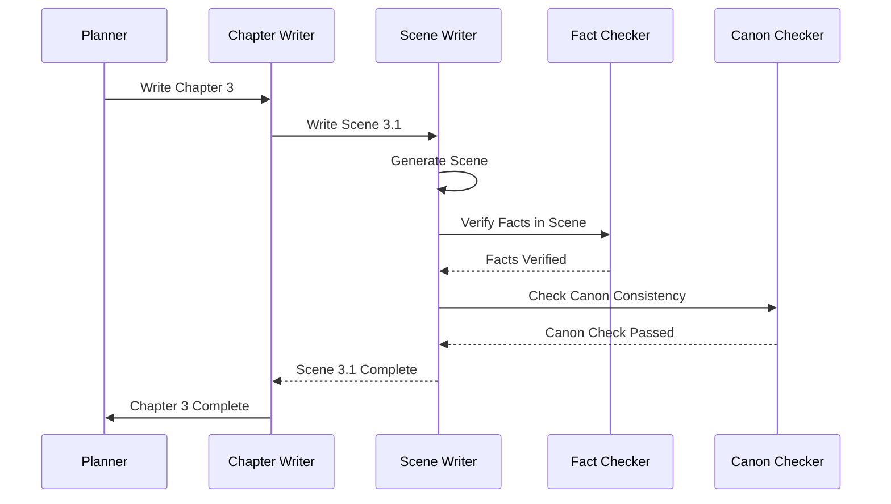
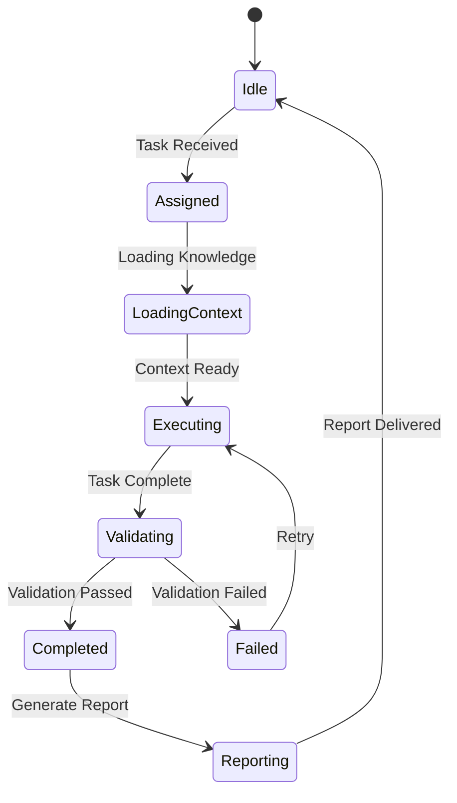

# AI Agents

## Purpose
Defines the modular AI Agent system — specialized AI modules with defined roles, responsibilities, inputs, outputs, and behaviors.

---

## 1. Agent Architecture

```mermaid
graph TB
    subgraph "Agent Manager"
        AM[Agent Registry]
        AS[Agent Scheduler]
        AMC[Agent Monitor]
    end

    subgraph "Story Agents"
        WB[World Builder]
        CB[Character Builder]
        TB[Timeline Builder]
        OP[Outline Planner]
    end

    subgraph "Writing Agents"
        CW[Chapter Writer]
        SW[Scene Writer]
        DW[Dialogue Writer]
        ED[Editor]
    end

    subgraph "Quality Agents"
        RV[Reviewer]
        FC[Fact Checker]
        CC[Canon Checker]
        RV2[Relationship Validator]
        CTC[Continuity Checker]
        SC[Style Checker]
    end

    subgraph "Support Agents"
        SE[Suggestion Engine]
        PB[Prompt Builder]
        MG[Metadata Generator]
        SS[Search Specialist]
    end

    AM --> WB
    AM --> CB
    AM --> TB
    AM --> OP
    AM --> CW
    AM --> SW
    AM --> DW
    AM --> ED
    AM --> RV
    AM --> FC
    AM --> CC
    AM --> RV2
    AM --> CTC
    AM --> SC
    AM --> SE
    AM --> PB
    AM --> MG
    AM --> SS
```

---

## 2. Story Agents

### World Builder
| Property | Value |
|----------|-------|
| **Purpose** | Creates and maintains world/geography entities |
| **Input** | World description, genre, inspiration |
| **Output** | World entity JSON files |
| **Knowledge** | Geography rules, naming conventions, physics |
| **Validation** | Schema validation, relationship validation |

### Character Builder
| Property | Value |
|----------|-------|
| **Purpose** | Creates and maintains character entities |
| **Input** | Role, archetype, traits, relationships |
| **Output** | Character entity JSON files |
| **Knowledge** | Character archetypes, psychology, naming | 
| **Validation** | Schema, relationship, canon consistency |

### Timeline Builder
| Property | Value |
|----------|-------|
| **Purpose** | Manages timeline events and chronology |
| **Input** | Event descriptions, dates, participants |
| **Output** | Timeline entity JSON files |
| **Knowledge** | Chronological rules, calendar systems |
| **Validation** | Temporal consistency, cause-effect chains |

### Outline Planner
| Property | Value |
|----------|-------|
| **Purpose** | Plans story outlines and narrative structure |
| **Input** | Story premise, genre, length targets |
| **Output** | Chapter outlines, plot structure |
| **Knowledge** | Story structure, pacing, plot devices |
| **Validation** | Structural completeness, pacing targets |

---

## 3. Writing Agents

### Chapter Writer
| Property | Value |
|----------|-------|
| **Purpose** | Writes chapter content from outline |
| **Input** | Chapter outline, character states, previous chapter |
| **Output** | Chapter content, scene sequence |
| **Knowledge** | Writing style, pacing, chapter structure |
| **Validation** | Word count, tone consistency, plot progression |

### Scene Writer
| Property | Value |
|----------|-------|
| **Purpose** | Writes individual scene content |
| **Input** | Scene outline, POV character, location, goals |
| **Output** | Scene content with dialogue and description |
| **Knowledge** | Scene structure, dialogue, description, pacing |
| **Validation** | Scene goals met, character voice, continuity |

### Dialogue Writer
| Property | Value |
|----------|-------|
| **Purpose** | Writes character dialogue |
| **Input** | Scene context, characters present, conversation goals |
| **Output** | Dialogue lines with attribution |
| **Knowledge** | Character voices, speech patterns, subtext |
| **Validation** | Character voice consistency, tone appropriateness |

### Editor
| Property | Value |
|----------|-------|
| **Purpose** | Edits and refines written content |
| **Input** | Draft content, editing goals |
| **Output** | Revised content, change log |
| **Knowledge** | Grammar, style, pacing, show-don't-tell |
| **Validation** | Quality metrics met, word count targets |

---

## 4. Quality Agents

### Reviewer
| Property | Value |
|----------|-------|
| **Purpose** | Reviews content quality and completeness |
| **Input** | Content to review, review criteria |
| **Output** | Review report with scores and suggestions |
| **Knowledge** | Writing craft, quality standards, best practices |
| **Validation** | N/A (this is the validator) |

### Fact Checker
| Property | Value |
|----------|-------|
| **Purpose** | Verifies factual accuracy against knowledge base |
| **Input** | Content with factual claims |
| **Output** | Fact-check report with verified/false/unverified |
| **Knowledge** | Complete knowledge base, entity data |
| **Validation** | N/A (this is the validator) |

### Canon Checker
| Property | Value |
|----------|-------|
| **Purpose** | Validates canon consistency |
| **Input** | Entity data or narrative content |
| **Output** | Canon validation report |
| **Knowledge** | Canon records, locked entities |
| **Validation** | N/A (this is the validator) |

### Continuity Checker
| Property | Value |
|----------|-------|
| **Purpose** | Ensures narrative continuity across chapters |
| **Input** | Current and previous chapter/scene data |
| **Output** | Continuity report with gaps and inconsistencies |
| **Knowledge** | Story state, character states, timeline |
| **Validation** | N/A (this is the validator) |

### Style Checker
| Property | Value |
|----------|-------|
| **Purpose** | Validates writing style consistency |
| **Input** | Written content, style guide |
| **Output** | Style report with deviations |
| **Knowledge** | Style rules, tone guidelines, POV rules |
| **Validation** | N/A (this is the validator) |

---

## 5. Support Agents

### Suggestion Engine
| Property | Value |
|----------|-------|
| **Purpose** | Generates context-aware suggestions |
| **Input** | Current context, knowledge base, gaps |
| **Output** | Ranked suggestion list |
| **Knowledge** | Patterns, conventions, possibilities |
| **Validation** | Relevance, originality, feasibility |

### Prompt Builder
| Property | Value |
|----------|-------|
| **Purpose** | Assembles optimized prompts for AI models |
| **Input** | Task, context, model identifier |
| **Output** | Assembled prompt string |
| **Knowledge** | Prompt engineering, model capabilities |
| **Validation** | Token count, completeness, clarity |

### Metadata Generator
| Property | Value |
|----------|-------|
| **Purpose** | Generates metadata for entity files |
| **Input** | Entity content, type, relationships |
| **Output** | Complete entity JSON with metadata |
| **Knowledge** | METADATA_STANDARD, ID_STANDARD |
| **Validation** | Schema conformance, complete metadata |

### Search Specialist
| Property | Value |
|----------|-------|
| **Purpose** | Handles complex search queries |
| **Input** | Complex or multi-part search request |
| **Output** | Search results with paths |
| **Knowledge** | Search strategies, indexes, graph |
| **Validation** | Result relevance, completeness |

---

## 6. Agent Communication

---

## 7. Agent State Machine

