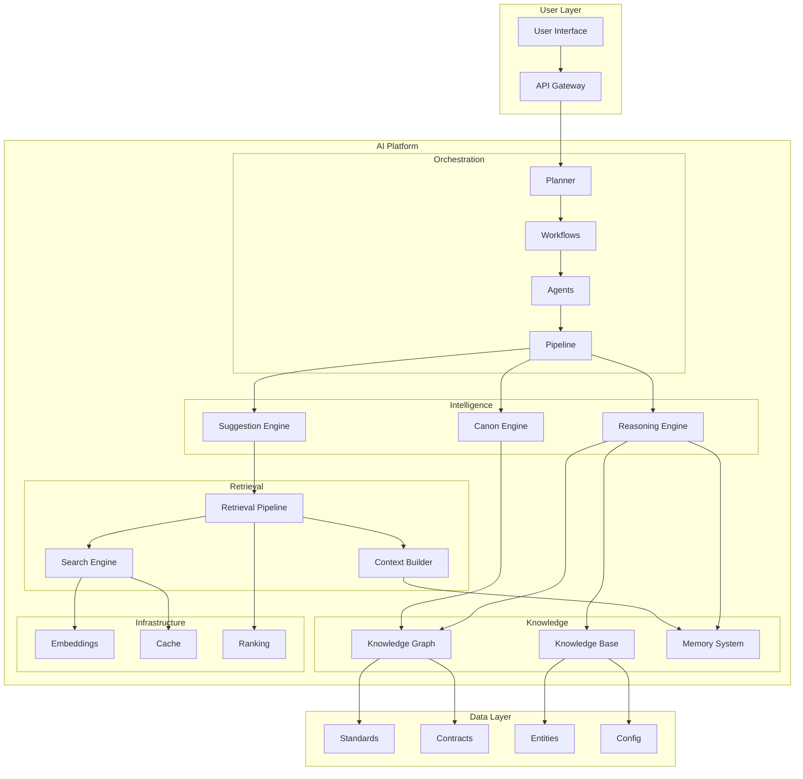
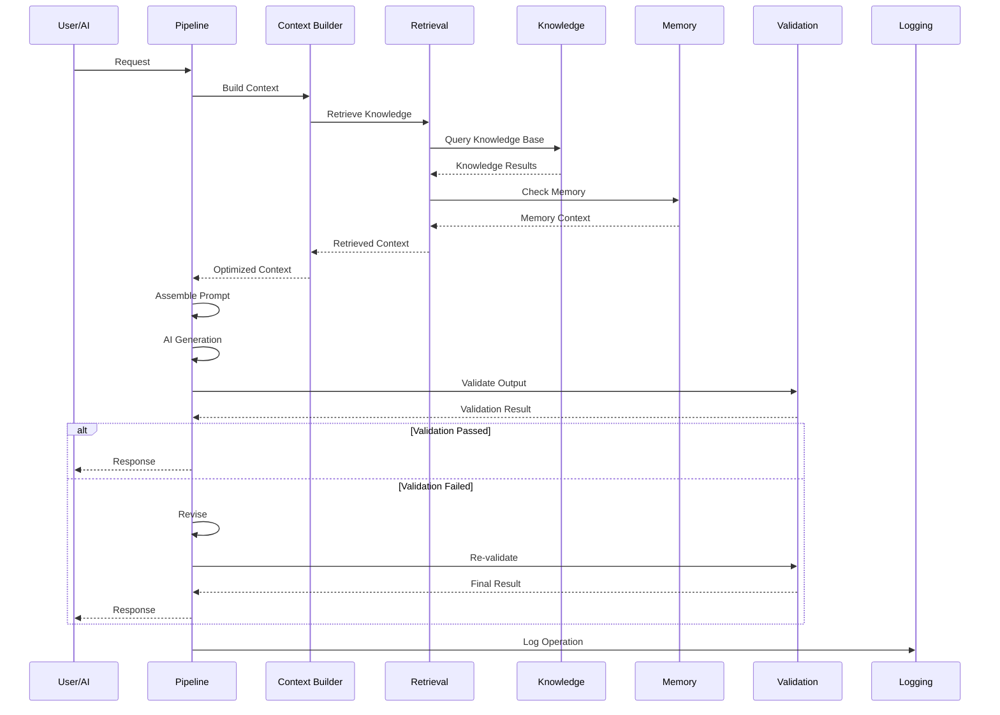
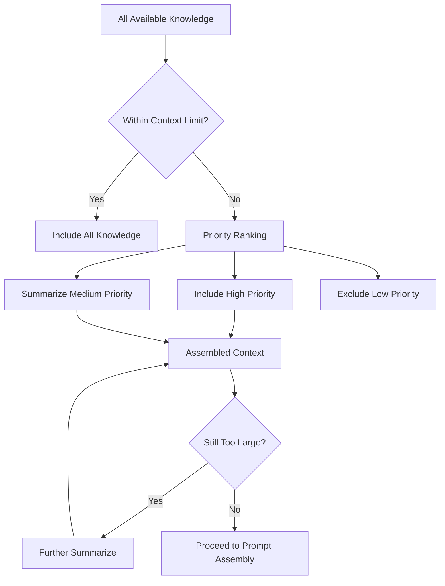
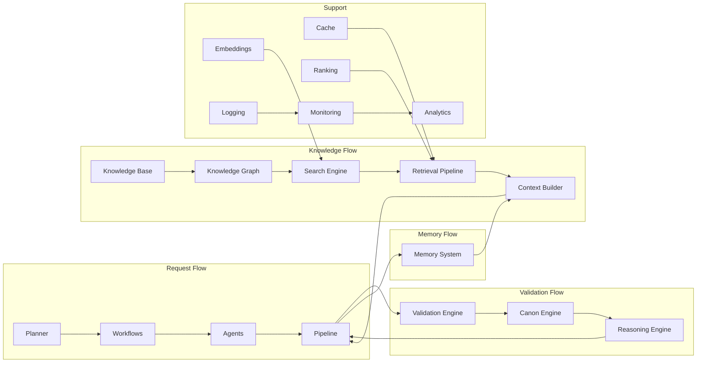

# AI Knowledge Architecture

## System Architecture Document

**Version:** 0.1.0 | **Last Updated:** 2026-07-17

---

## 1. Architectural Overview

The AI Knowledge Architecture is the brain of Storynaram — a modular, scalable system that enables AI to understand, retrieve, reason about, and assist with story creation.

---

## 2. Core Principles

### 2.1 Modularity
Every component is a self-contained module with a single responsibility. Components communicate through well-defined interfaces.

### 2.2 Composability
Components can be composed into larger workflows. The pipeline orchestrates components into end-to-end processes.

### 2.3 Context-Awareness
Every AI operation is grounded in context. The Context Builder ensures the AI has the right information at the right time.

### 2.4 Validation-First
Every piece of AI-generated content is validated before acceptance. Validation is not an afterthought — it is a pipeline stage.

### 2.5 Knowledge-Grounded
The AI does not invent facts. All generated content is grounded in the knowledge base. Hallucination is minimized through rigorous reference resolution.

### 2.6 Canon-Protected
Canon is immutable once locked. The Canon Engine prevents accidental or unauthorized changes to established truth.

---

## 3. System Components

### 3.1 Orchestration Layer

| Component | Responsibility |
|-----------|---------------|
| **Planner** | Decomposes tasks into actionable plans |
| **Workflows** | Orchestrates multi-step, multi-agent processes |
| **Agents** | Specialized AI modules for specific tasks |
| **Pipeline** | End-to-end request-to-response orchestration |

### 3.2 Intelligence Layer

| Component | Responsibility |
|-----------|---------------|
| **Reasoning Engine** | Logical reasoning, planning, fact verification |
| **Canon Engine** | Canon maintenance, conflict detection, locking |
| **Suggestion Engine** | Context-aware content suggestions |

### 3.3 Knowledge Layer

| Component | Responsibility |
|-----------|---------------|
| **Knowledge Graph** | Entity relationship graph |
| **Knowledge Base** | Structured entity knowledge |
| **Memory System** | Short-term, long-term, working memory |

### 3.4 Retrieval Layer

| Component | Responsibility |
|-----------|---------------|
| **Search Engine** | Multi-index search across all data |
| **Retrieval Pipeline** | Multi-strategy retrieval orchestration |
| **Context Builder** | Context selection and optimization |

### 3.5 Infrastructure Layer

| Component | Responsibility |
|-----------|---------------|
| **Embeddings** | Vector representation of knowledge |
| **Cache** | Performance optimization through caching |
| **Ranking** | Result relevance ranking |

---

## 4. Data Flow

---

## 5. Context Window Management

When available knowledge exceeds the model's context window:

**Priority Order:**
1. Current task entities
2. Directly related entities
3. Recent changes
4. Active memory
5. Standards and rules
6. Related lore
7. Historical context
8. Broad knowledge

---

## 6. Component Relationships

---

## 7. Scalability Design

| Scale Level | Knowledge Size | Memory Strategy | Retrieval Strategy |
|-------------|---------------|-----------------|-------------------|
| Small | < 10K entities | File-based memory | Keyword search |
| Medium | 10K-100K entities | Cached file memory | Hybrid search |
| Large | 100K-1M entities | Database-backed | Indexed hybrid |
| Enterprise | 1M+ entities | Distributed memory | Vector + graph |

---

## 8. AI Model Compatibility

The architecture is model-agnostic:
- **Small models** (7B-13B): Use focused context, simplified prompts
- **Medium models** (34B-70B): Standard context, standard prompts
- **Large models** (GPT-4, Claude): Full context, complex prompts
- **Future models**: Extensible through modular prompt assembly

---

## 9. Error Handling

| Error Type | Handling Strategy |
|------------|-------------------|
| Context Overflow | Summarize and retry |
| Validation Failure | Revise with feedback |
| Knowledge Gap | Request clarification |
| Canon Conflict | Flag for human review |
| Model Error | Retry with fallback model |
| Timeout | Reduce context and retry |

---

## 10. Security Model

- **Read-only** knowledge access for standard AI operations
- **Protected** canon data requires approval for modification
- **Audit trail** for all AI operations
- **Permission levels** for user access control
- **No secrets** in prompts or logs

---

*This architecture document evolves with the AI platform. Major changes are recorded in CHANGELOG.md.*
