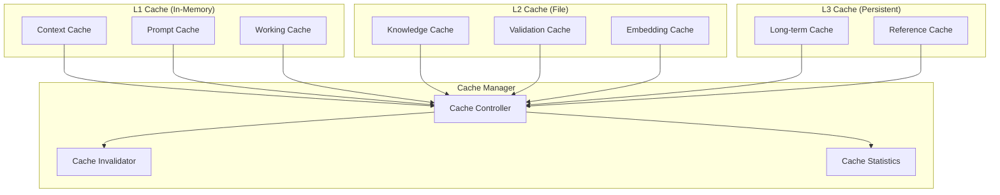

# Cache Architecture

## Purpose
Defines the multi-level caching system for optimizing AI performance and reducing redundant operations.

---

## 1. Cache Architecture



---

## 2. Cache Types

### Context Cache
| Property | Value |
|----------|-------|
| **Purpose** | Cache built context packets for reuse |
| **TTL** | Session duration |
| **Size** | 50 context packets |
| **Invalidation** | Entity modification, context change |

### Knowledge Cache
| Property | Value |
|----------|-------|
| **Purpose** | Cache frequently accessed entity data |
| **TTL** | 1 hour (or until entity modification) |
| **Size** | 500 entities |
| **Invalidation** | Entity file change, schema change |

### Prompt Cache
| Property | Value |
|----------|-------|
| **Purpose** | Cache assembled prompt strings |
| **TTL** | 10 minutes |
| **Size** | 100 prompts |
| **Invalidation** | Template change, context change |

### Validation Cache
| Property | Value |
|----------|-------|
| **Purpose** | Cache recent validation results |
| **TTL** | 30 minutes |
| **Size** | 200 validation results |
| **Invalidation** | Entity modification, rule change |

### Embedding Cache
| Property | Value |
|----------|-------|
| **Purpose** | Cache computed embeddings |
| **TTL** | 24 hours |
| **Size** | 10,000 embeddings |
| **Invalidation** | Re-indexing, model change |

---

## 3. Cache Key Format

```
{type}:{domain}:{entity_id}:{version}
```

Examples:
- `context:scene:scene_000001:v1`
- `knowledge:character:hero_000001:v3`
- `prompt:scene_writer:book_000001:v2`
- `validation:canon:hero_000001:v3`

---

## 4. Cache Invalidation

### Invalidation Triggers
| Trigger | Action |
|---------|--------|
| Entity file modified | Invalidate entity's cache entries |
| Entity file deleted | Remove entity's cache entries |
| Schema version changed | Invalidate all schema-dependent caches |
| Template changed | Invalidate prompt caches |
| Manual | Explicit invalidate command |
| TTL expired | Automatic expiration |
| Cache full | LRU eviction |

### Invalidation Strategy
```text
1. Identify trigger source (which entity/event)
2. Find all cache entries referencing that source
3. Invalidate matching entries
4. Cascade to dependent entries (optional)
5. Log invalidation event
```

---

## 5. Cache Performance Targets

| Metric | L1 (Memory) | L2 (File) | L3 (Persistent) |
|--------|-------------|-----------|-----------------|
| Hit rate target | > 80% | > 60% | > 90% |
| Access time | < 1ms | < 10ms | < 50ms |
| Max size | 50 MB | 500 MB | 5 GB |
| Eviction | LRU | LRU | LRU + TTL |

---

## 6. Cache Statistics

```json
{
  "cacheId": "knowledge_cache",
  "type": "L2",
  "hits": 1452,
  "misses": 387,
  "hitRate": 0.79,
  "size": "234 MB",
  "entries": 389,
  "avgAccessTime": "4.2ms",
  "topEntities": [
    "hero_000001 (42 hits)",
    "city_000001 (38 hits)"
  ]
}
```
