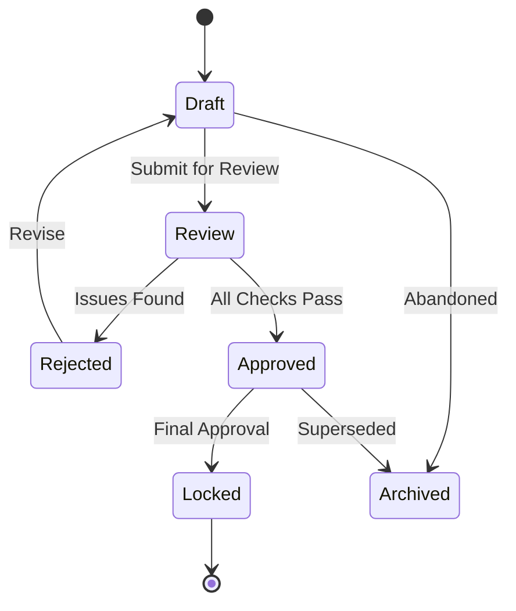
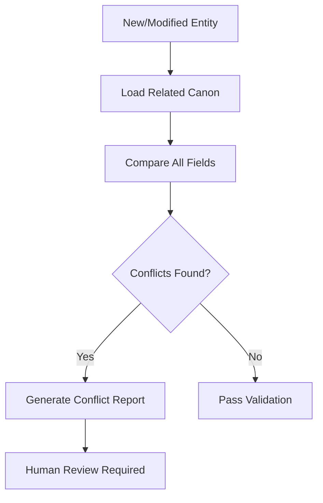
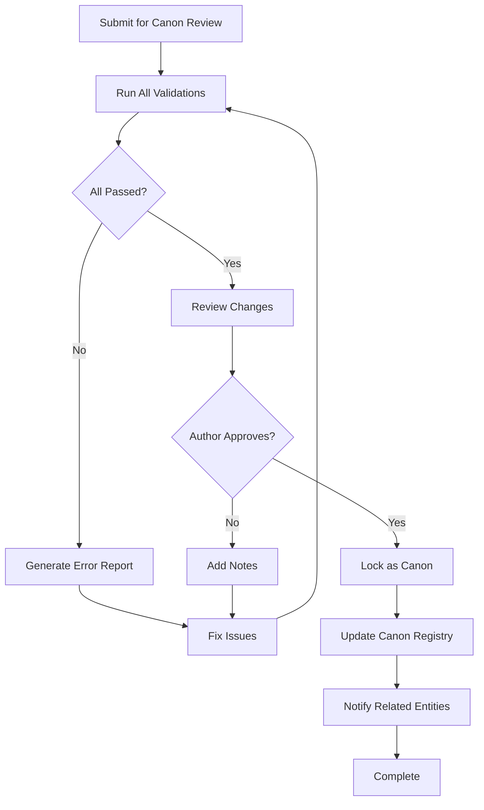

# Canon Engine

## Purpose
Defines the immutable Canon Engine that maintains, validates, and protects canonical truth across the entire story universe.

---

## 1. Canon States



| State | Description | Modifiable | Validated |
|-------|-------------|------------|-----------|
| Draft | Initial creation | Yes | Basic |
| Review | Under review | No | Full |
| Approved | Approved | No | Full |
| Locked | Immutable canon | Never | Full |
| Rejected | Rejected | Yes (revise) | N/A |
| Archived | Historical record | No | N/A |

---

## 2. Canon Engine Capabilities

### 2.1 Conflict Detection


**Conflict Types:**
| Type | Example |
|------|---------|
| Factual | Character has two different birth dates |
| Temporal | Event occurs before it was caused |
| Spatial | Character is in two places at once |
| Relational | Character is both alive and dead |
| Rule | Violates a writing/story rule |

### 2.2 Contradiction Resolution
When contradictions are detected:
1. Identify all conflicting entities
2. Determine canon status of each (draft < review < approved < locked)
3. Higher-status entity wins
4. Equal status → flag for human review
5. Suggest resolution steps

### 2.3 Relationship Validation
- Every relationship reference must point to an existing entity
- Bidirectional references must be consistent
- Relationship types must match valid types

### 2.4 Timeline Validation
- Events must have valid chronological order
- Character birth must precede death
- Kingdom must exist before its ruler's reign
- No temporal paradoxes

### 2.5 Age Validation
- Character age must be consistent with timeline
- Parent must be older than child (unless time travel/magic)
- Age must progress forward in time

### 2.6 Location Validation
- Location must exist in parent hierarchy
- Character cannot be in a location that doesn't exist yet
- Location status must be valid for the timeline

---

## 3. Canon Lock

### Locking Process
```text
1. Entity enters "approved" state
2. All validations pass
3. Author confirms final approval
4. Status changes to "locked"
5. Write protection enabled
6. Canon record created in memory/canon/
```

### Lock Protection
- Locked entities cannot be modified directly
- To update a locked entity:
  1. Create new version in archive/
  2. Document the reason for change
  3. Follow canon update workflow
  4. Obtain explicit author approval

---

## 4. Canon Approval Workflow



---

## 5. Canon Update Workflow

When canon must be updated:
```text
1. Create RFC (Request for Change) document
2. Identify all affected entities
3. Assess impact on related canon
4. Submit for author review
5. If approved:
   a. Create archive copy of current canon
   b. Apply changes to entity
   c. Run full validation
   d. Update canon registry
   e. Re-validate related entities
   f. Update all dependent references
```

---

## 6. Canon Registry

```json
{
  "canonId": "canon_000001",
  "entityId": "hero_000001",
  "entityType": "character",
  "canonStatus": "locked",
  "lockedAt": "2026-07-17T12:00:00Z",
  "lockedBy": "author",
  "version": 3,
  "previousCanon": "canon_000000",
  "validations": [
    { "type": "factual", "passed": true },
    { "type": "temporal", "passed": true },
    { "type": "relational", "passed": true }
  ]
}
```

---

## 7. Canon Validation Result

```json
{
  "entityId": "hero_000001",
  "validationTimestamp": "2026-07-17T12:00:00Z",
  "overallStatus": "failed",
  "checks": [
    {
      "check": "factual_consistency",
      "status": "passed",
      "details": "All factual fields consistent with canon"
    },
    {
      "check": "temporal_consistency",
      "status": "failed",
      "details": "Character age (34) inconsistent with event_000005 which occurred 35 years ago",
      "conflictingEntity": "event_000005",
      "severity": "error"
    },
    {
      "check": "relationship_integrity",
      "status": "passed",
      "details": "All relationship references valid"
    }
  ],
  "recommendations": [
    "Update character age to 35",
    "OR update event_000005 date to be > 34 years ago"
  ]
}
```
