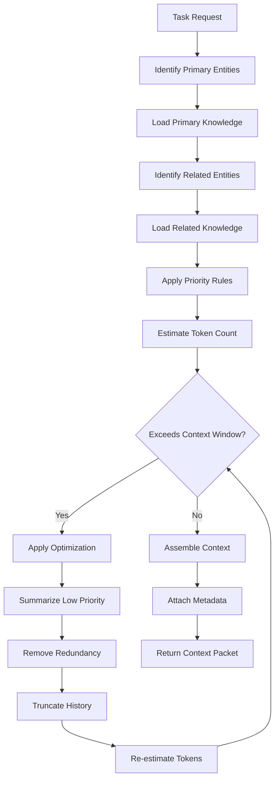

# Context Builder

## Purpose
Defines how the AI Context Builder selects, prioritizes, and packages knowledge for AI model context windows.

---

## 1. Context Builder Pipeline



---

## 2. Context Priority Hierarchy

```
Priority 1 — Current Task
  The entities directly being worked on
  Example: Current scene, its characters, its location

Priority 2 — Direct Relationships
  Entities directly related to current task entities
  Example: Scene's chapter, character's organization, location's region

Priority 3 — Recent Changes
  The last 5 entities modified in the session
  Ensures continuity across edits

Priority 4 — Active Memory
  Short-term memory from current session
  Previous interactions, decisions, revisions

Priority 5 — Project Standards
  Relevant standards from core/standards/
  Writing rules, naming rules, AI rules

Priority 6 — Domain Knowledge
  Broader context about relevant domains
  Magic systems, world rules, cultural context

Priority 7 — Historical Context
  Past events, character history, lore
  Summarized for relevance

Priority 8 — Encyclopedic Knowledge
  Broad reference knowledge
  Included only when context allows
```

---

## 3. Context Optimization Strategies

### 3.1 Priority-Based Truncation
When context exceeds limits, remove lowest-priority items first.

### 3.2 Summarization
Summarize entities instead of including full content:
- Full entity: ~200 tokens
- Summarized entity: ~50 tokens
- Savings: ~75%

### 3.3 Deduplication
Remove entities already included via other paths.

### 3.4 Reference Compression
Replace full entity data with ID references when the entity is unlikely to be needed.

### 3.5 History Truncation
Keep only the most recent N interactions from session history.

---

## 4. Context Packet Structure

```json
{
  "task": {
    "type": "write_scene",
    "target": "scene_000001",
    "instructions": "Write the opening scene"
  },
  "primary": [
    { "id": "scene_000001", "content": "...", "priority": 1 },
    { "id": "chapter_000001", "content": "...", "priority": 1 }
  ],
  "related": [
    { "id": "hero_000001", "content": "...", "priority": 2 },
    { "id": "location_000001", "content": "...", "priority": 2 }
  ],
  "memory": [
    { "type": "recent_change", "entity": "hero_000001", "time": "..." }
  ],
  "standards": [
    "JSON_STANDARD.md", "WRITING_RULES.md"
  ],
  "metadata": {
    "totalTokens": 4096,
    "contextLimit": 8192,
    "utilization": "50%",
    "optimizations": ["summarized location_000001", "truncated history to 5 items"]
  }
}
```

---

## 5. Token Budget Allocation

| Context Component | Budget % | Notes |
|-------------------|----------|-------|
| Task instructions | 10% | User/agent task specification |
| Primary entities | 30% | Full content of focused entities |
| Related entities | 25% | Summarized related context |
| Active memory | 15% | Recent decisions and changes |
| Standards/rules | 10% | Relevant project standards |
| Historical context | 10% | Background and history |

---

## 6. Specialized Context Builders

### Scene Writer Context
- Current scene full content
- Previous scene summary
- Current chapter outline
- Characters in scene
- Location details
- Recent plot developments

### Character Builder Context
- Character's existing data
- Related characters (family, friends, enemies)
- Character's timeline events
- World rules affecting character
- Organization context

### World Builder Context
- World entity data
- Parent geography
- Related geographical entities
- Historical events at location
- Cultural context

---

## 7. Context Freshness

| Context Type | Refresh Policy |
|--------------|----------------|
| Primary entities | Always reload from source |
| Related entities | Cache per task, refresh on task change |
| Memory | Maintained across session |
| Standards | Load once per session type |
| History | Appended each interaction |
