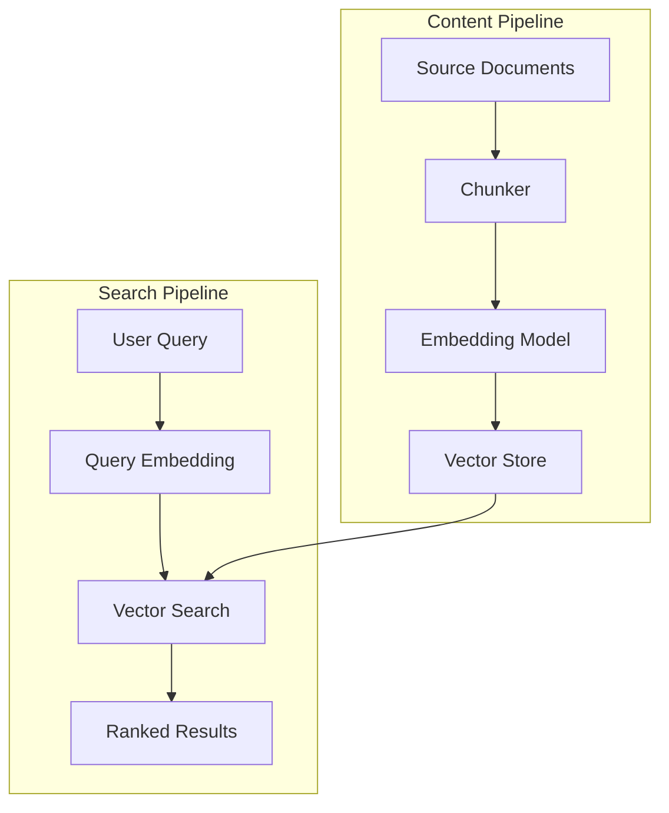

# Embeddings Architecture

## Purpose
Defines the future-ready architecture for vector embeddings and semantic search in Storynaram AI. This is a design blueprint — not an implementation.

---

## 1. Embedding Architecture Overview



---

## 2. Embedding Sources

| Source | Content Type | Chunk Strategy |
|--------|-------------|----------------|
| Character entities | Full character data per entity | Entity-level |
| Location entities | Full location data per entity | Entity-level |
| Scene content | Written scene text | Section-level |
| Chapter content | Full chapter text | Section-level |
| Lore documents | Mythological/lore text | Semantic-level |
| World descriptions | World rules and physics | Entity-level |
| Timeline events | Event descriptions | Entity-level |
| Item descriptions | Item data | Entity-level |

---

## 3. Chunking Strategy

### Entity-Level Chunking
- One chunk per entity
- Includes: name, description, type, tags
- Token size: ~200-500 tokens
- Best for: exact entity lookup and comparison

### Section-Level Chunking
- Divide documents by sections/paragraphs
- Chunk size: ~500-1000 tokens
- Overlap: 50 tokens between chunks
- Best for: narrative content, lore documents

### Semantic Chunking
- Chunk at natural semantic boundaries
- Sentence/paragraph boundaries
- Chunk size: ~300-800 tokens
- Best for: maintaining context coherence

### Overlap Strategy
```text
Chunk 1: [Paragraph 1][Paragraph 2][Paragraph 3]
Chunk 2:           [Paragraph 3][Paragraph 4][Paragraph 5]
Chunk 3:                         [Paragraph 5][Paragraph 6]
```

---

## 4. Embedding Models (Future)

| Model | Dimensions | Use Case |
|-------|-----------|----------|
| text-embedding-3-small | 1536 | General purpose |
| text-embedding-3-large | 3072 | High precision |
| Multilingual | Variable | Multi-language projects |
| Custom fine-tuned | Variable | Domain-specific |

### Selection Criteria
- Accuracy on domain-specific content
- Latency requirements
- Cost per query
- Dimension size vs. storage

---

## 5. Vector Storage

### Phase 1: File-Based
```json
{
  "entityId": "hero_000001",
  "embeddingVersion": "1.0",
  "model": "text-embedding-3-small",
  "dimensions": 1536,
  "chunks": [
    {
      "chunkId": "hero_000001_0",
      "text": "King Aldric Stormwind III...",
      "tokens": 245,
      "vector": [0.001, 0.002, ...]
    }
  ]
}
```

### Phase 2: Embedded Database
- SQLite with vector extension
- Supports basic vector search
- No external dependencies

### Phase 3: Dedicated Vector DB
- Pinecone, Qdrant, Weaviate, or Milvus
- Production-scale similarity search
- High availability
- Distributed indexing

---

## 6. Similarity Search

### Distance Metrics
| Metric | Use Case |
|--------|----------|
| Cosine Similarity | General text similarity |
| Dot Product | Normalized vectors |
| Euclidean | Geometric distance |

### Search Algorithm
```text
1. Encode query as vector
2. Search vector index for nearest neighbors
3. Return top K results (default: 10)
4. Apply metadata filters (type, status, tags)
5. Rank by similarity score
6. Return results with source references
```

---

## 7. Re-indexing Strategy

| Trigger | Action | Scope |
|---------|--------|-------|
| Entity modification | Re-embed single entity | Single |
| Bulk import | Full re-index | All |
| Model upgrade | Full re-embed | All |
| Scheduled | Incremental check | Changed since last |
| Manual | On-demand | Specified |

---

## 8. Versioning

### Embedding Version Format
`{major}.{minor}` — `v1.0`, `v1.1`, `v2.0`

### Version Rules
- Major: Breaking model change (new dimensions)
- Minor: Non-breaking update (better chunking)
- Version stored with every vector
- Search can filter by version

---

## 9. Migration Plan

### Current → Phase 1
- No migration needed (no embeddings exist)

### Phase 1 → Phase 2
- Export file-based vectors
- Import to SQLite extension
- Verify index completeness
- Deactivate file-based lookup
- Rollback path: revert to file-based

### Phase 2 → Phase 3
- Export vectors from SQLite
- Bulk import to vector DB
- Parallel run both systems
- Cut over when confident
- Keep SQLite as backup

---

## 10. Performance Targets

| Metric | Phase 1 | Phase 2 | Phase 3 |
|--------|---------|---------|---------|
| Index size | File-based | DB-based | Distributed |
| Query latency | < 5s | < 500ms | < 100ms |
| Dataset capacity | 100K | 1M | 100M+ |
| Concurrent queries | 1 | 10 | 1000+ |
| Accuracy | Medium | High | Highest |
