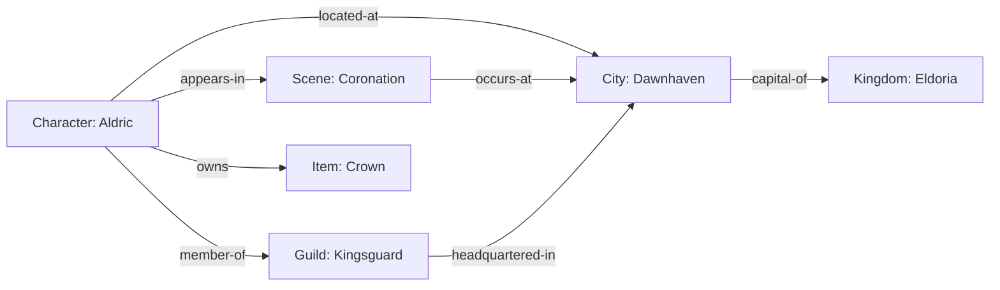
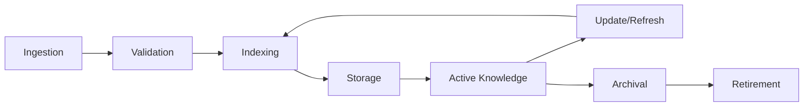

# Knowledge Architecture

## Purpose
Defines the complete knowledge management system for Storynaram AI — how knowledge is ingested, indexed, stored, resolved, cached, synchronized, and retired.

---

## 1. Knowledge Base

The Knowledge Base is the complete corpus of all story knowledge. It includes every entity, relationship, rule, and piece of metadata in the project.

### Knowledge Sources
| Source | Format | Update Frequency |
|--------|--------|-----------------|
| Entity JSON files | JSON | On file change |
| Core standards | Markdown | On standard update |
| Core contracts | Markdown | On contract update |
| Config rules | JSON | On config change |
| User input | Text | On user interaction |
| AI-generated content | JSON | On generation |

### Knowledge Record Structure
```json
{
  "id": "knowledge_000001",
  "sourceId": "hero_000001",
  "sourceType": "character",
  "sourceFile": "characters/heroes/hero_000001.json",
  "content": { "name": "Aldric", "age": 34, "occupation": "King" },
  "metadata": {
    "indexed": "2026-07-17T12:00:00Z",
    "version": 1,
    "status": "active"
  },
  "relationships": [
    { "target": "city_000001", "type": "located-at" },
    { "target": "guild_000003", "type": "member-of" }
  ]
}
```

---

## 2. Knowledge Index

The Knowledge Index provides fast lookup by multiple keys.

### Index Types
| Index | Key | Purpose |
|-------|-----|---------|
| Primary Index | Entity ID | O(1) entity lookup |
| Secondary Index | Entity name | Name-based search |
| Type Index | Entity type | Type-based filtering |
| Tag Index | Tags | Tag-based filtering |
| Relationship Index | Related entity IDs | Graph traversal |

---

## 3. Knowledge Graph

The Knowledge Graph maps all entities and their relationships as a directed, attributed graph.



### Graph Operations
| Operation | Description |
|-----------|-------------|
| Node Lookup | Find entity by ID |
| Edge Traversal | Follow relationships |
| Path Finding | Find connection between entities |
| Subgraph Extraction | Extract connected subgraph |
| Community Detection | Identify entity clusters |

---

## 4. Knowledge Store

The Knowledge Store manages persistent storage of knowledge artifacts.

### Storage Layers
| Layer | Technology | Purpose |
|-------|------------|---------|
| Primary | File system | JSON entity files |
| Index | File/database | Search indexes |
| Cache | In-memory | Frequently accessed knowledge |

---

## 5. Knowledge Registry

The Knowledge Registry catalogs all registered knowledge sources and their status.

### Registry Entry
```json
{
  "sourceId": "characters",
  "type": "domain",
  "entityCount": 42,
  "lastIndexed": "2026-07-17T12:00:00Z",
  "indexStatus": "complete",
  "version": 3
}
```

---

## 6. Knowledge Resolver

The Knowledge Resolver resolves references to knowledge entities.

### Resolution Process
```text
Input Reference: "hero_000001"
1. Lookup in Primary Index → Found
2. Load Entity Data → hero_000001.json
3. Resolve Relationships → Follow edges
4. Return Knowledge Packet
```

### Resolution Strategies
| Strategy | Description |
|----------|-------------|
| Direct | O(1) ID lookup |
| Indirect | Name/alias resolution |
| Fuzzy | Approximate match |
| Graph | Relationship-based resolution |

---

## 7. Knowledge Loader

The Knowledge Loader loads knowledge from storage into memory or context.

### Loading Modes
| Mode | Description |
|------|-------------|
| Lazy | Load on demand |
| Eager | Pre-load for current task |
| Batch | Load multiple entities |
| Incremental | Load only changed entities |

---

## 8. Knowledge Cache

The Knowledge Cache provides fast access to frequently used knowledge.

### Cache Tiers
| Tier | Storage | TTL |
|------|---------|-----|
| L1 | In-memory | Session |
| L2 | File cache | 1 hour |
| L3 | Persistent | 24 hours |

---

## 9. Knowledge References

Knowledge References track cross-references between knowledge nodes.

### Reference Types
| Type | Description |
|------|-------------|
| Direct | Entity A → Entity B |
| Inverse | Entity B → Entity A (bidirectional) |
| Transitive | Entity A → Entity B → Entity C |
| Weighted | Relationship with strength/importance |

---

## 10. Knowledge Lifecycle



### Stages
1. **Ingestion**: Load source data
2. **Validation**: Validate against schemas
3. **Indexing**: Build search indexes
4. **Storage**: Persist to knowledge store
5. **Active**: Available for retrieval
6. **Update**: Refresh on source change
7. **Archival**: Move to long-term storage
8. **Retirement**: Remove from active knowledge

---

## 11. Knowledge Synchronization

Synchronization keeps knowledge in sync across storage layers.

### Sync Triggers
| Trigger | Action |
|---------|--------|
| Entity file change | Update knowledge record |
| Schema change | Re-validate all knowledge |
| Timed refresh | Periodic consistency check |
| Manual request | Explicit sync command |
