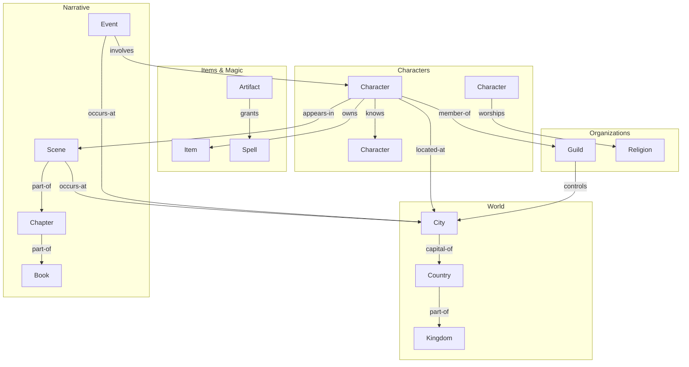

# Knowledge Graph

## Purpose
Defines the entity relationship graph architecture for Storynaram AI — how entities connect, how the graph is traversed, and how relationships are queried.

---

## 1. Graph Model



---

## 2. Node Types

| Node Type | ID Prefix | Properties |
|-----------|-----------|------------|
| Character | `hero_`, `villain_`, etc. | name, age, status, gender |
| Location | `city_`, `country_`, etc. | name, population, coordinates |
| Scene | `scene_` | name, chapter, POV |
| Chapter | `chapter_` | name, book, number |
| Book | `book_` | title, series, status |
| Event | `event_` | name, date, significance |
| Item | `item_weapon_`, `armor_`, etc. | name, type, rarity |
| Organization | `guild_`, `religion_`, etc. | name, type, leader |
| Magic | `spell_`, `artifact_`, etc. | name, type, power |

---

## 3. Edge Types

### Character Edges
| Edge | Target | Description |
|------|--------|-------------|
| `appears-in` | Scene | Character appears in scene |
| `located-at` | Location | Character current location |
| `originates-from` | Location | Character birthplace |
| `member-of` | Organization | Organization membership |
| `owns` | Item | Item ownership |
| `knows` | Character | Character relationship |
| `related-to` | Character | Familial relationship |
| `participates-in` | Event | Event participation |
| `worships` | Religion | Religious affiliation |
| `speaks` | Language | Language proficiency |

### Location Edges
| Edge | Target | Description |
|------|--------|-------------|
| `contains` | Location | Geographic containment |
| `capital-of` | Location | Political capital |
| `located-in` | Location | Parent location |
| `connected-to` | Location | Transportation link |

### Narrative Edges
| Edge | Target | Description |
|------|--------|-------------|
| `part-of` | Narrative | Narrative hierarchy |
| `occurs-at` | Location | Event/scene location |
| `follows` | Narrative | Chronological sequence |
| `advances` | Plot | Plot progression |

---

## 4. Graph Traversal Strategies

### 4.1 Breadth-First Search (BFS)
**Purpose**: Find all entities within N hops
**Use Case**: "Find all characters in Dawnhaven"
**Complexity**: O(V + E)

### 4.2 Depth-First Search (DFS)
**Purpose**: Explore deep relationship chains
**Use Case**: "Trace the lineage of the crown"
**Complexity**: O(V + E)

### 4.3 Shortest Path
**Purpose**: Minimum relationship chain
**Use Case**: "How is Aldric connected to the Guild Master?"
**Algorithm**: Dijkstra / A*

### 4.4 Subgraph Extraction
**Purpose**: Extract connected subgraph for context
**Use Case**: "Get all entities related to this scene"
**Method**: BFS with depth limit

### 4.5 Community Detection
**Purpose**: Identify clusters of related entities
**Use Case**: "Find all characters in the royal circle"
**Method**: Connected components

---

## 5. Graph Query Examples

### Query: "Find all characters in a location"
```text
Start: location_000001 (Dawnhaven)
Traverse: ← located-at
Result: [hero_000001, support_000002, civilian_000005]
```

### Query: "Find all scenes with a character"
```text
Start: hero_000001 (Aldric)
Traverse: → appears-in
Result: [scene_000001, scene_000005, scene_000012]
```

### Query: "Find all items owned by characters in a guild"
```text
Start: guild_000001 (Kingsguard)
Traverse: ← member-of (find members)
Traverse: → owns (find items)
Result: [item_weapon_000001, item_weapon_000003, armor_000001]
```

### Query: "Find the connection path between two characters"
```text
Start: hero_000001 (Aldric)
Goal: villain_000001 (Malakar)
Traverse: bidirectional
Path: Aldric → appears-in → scene_000001 → appears-in ← Malakar
Connection: Both appear in the Coronation scene
```

---

## 6. Graph Index

### Adjacency List
```json
{
  "hero_000001": {
    "edges": [
      { "target": "scene_000001", "type": "appears-in", "direction": "out" },
      { "target": "city_000001", "type": "located-at", "direction": "out" },
      { "target": "guild_000001", "type": "member-of", "direction": "out" }
    ],
    "inbound": [
      { "source": "event_000001", "type": "involves" }
    ]
  }
}
```

### Edge Index
```json
{
  "appears-in": {
    "hero_000001": ["scene_000001", "scene_000005"],
    "villain_000001": ["scene_000001", "scene_000007"]
  }
}
```

---

## 7. Graph Performance

| Operation | File-Based | Database (Future) |
|-----------|------------|-------------------|
| Node lookup | O(1) | O(1) |
| Edge traversal | O(E) | O(1) |
| BFS (depth 3) | O(V + E) | O(V + E) |
| Shortest path | O(V + E) | O(V + E) |
| Subgraph extraction | O(V + E) | O(V + E) |
| Community detection | O(V + E) | O(V + E) |
