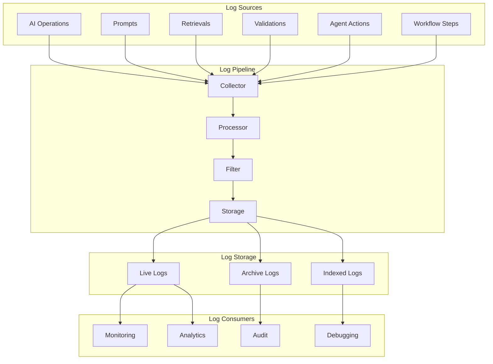

# Logging Architecture

## Purpose
Defines the comprehensive logging system for all AI operations in Storynaram.

---

## 1. Logging Architecture



---

## 2. Log Event Types

| Event Type | Description | Example |
|------------|-------------|---------|
| `request` | AI request received | User asked to write a scene |
| `retrieval` | Knowledge retrieved | Loaded character data |
| `context` | Context built | Context assembled for scene |
| `prompt` | Prompt assembled | Prompt sent to model |
| `generation` | AI generation | AI generated scene content |
| `response` | Response received | AI response parsed |
| `validation` | Validation performed | Output validated |
| `decision` | AI decision made | Chose scene structure |
| `error` | Error occurred | Model timeout |
| `warning` | Warning generated | Missing reference |

---

## 3. Log Entry Format

```json
{
  "timestamp": "2026-07-17T12:00:00.000Z",
  "logId": "log_000001",
  "sessionId": "session_000001",
  "eventType": "generation",
  "agent": "scene_writer",
  "severity": "info",
  "context": {
    "model": "gpt-4",
    "tokens": {
      "prompt": 4096,
      "completion": 1024,
      "total": 5120
    },
    "entities": ["hero_000001", "scene_000001"],
    "taskId": "wf_000001_step_003"
  },
  "result": {
    "success": true,
    "duration": 2340,
    "validationPassed": true
  },
  "metadata": {
    "version": "1.0",
    "source": "ai_pipeline"
  }
}
```

---

## 4. Log Retention Policy

| Log Type | Storage Duration | Archive After |
|----------|-----------------|---------------|
| Live logs | 7 days | Compressed to analytics |
| Debug logs | 30 days | Deleted |
| Audit logs | 1 year | Permanent archive |
| Error logs | 90 days | Summarized |
| Performance logs | 30 days | Aggregated |

---

## 5. Log Levels

| Level | Usage | Example |
|-------|-------|---------|
| `debug` | Development debugging | Detailed step-by-step |
| `info` | Normal operations | "Scene written successfully" |
| `warning` | Non-critical issues | "Missing optional reference" |
| `error` | Operation failures | "Model returned invalid JSON" |
| `critical` | System failures | "Knowledge base unavailable" |

---

## 6. Audit Logging

Audit logs track all operations that modify state:
- Entity creation, modification, deletion
- Canon status changes
- Configuration changes
- User permission changes
- AI configuration changes

```json
{
  "auditId": "audit_000001",
  "action": "entity_update",
  "entityId": "hero_000001",
  "changes": [
    { "field": "name", "oldValue": "Aldric", "newValue": "King Aldric III" },
    { "field": "age", "oldValue": 33, "newValue": 34 }
  ],
  "performedBy": "ai_agent_scene_writer",
  "approvedBy": "user_author",
  "timestamp": "2026-07-17T12:00:00Z"
}
```
