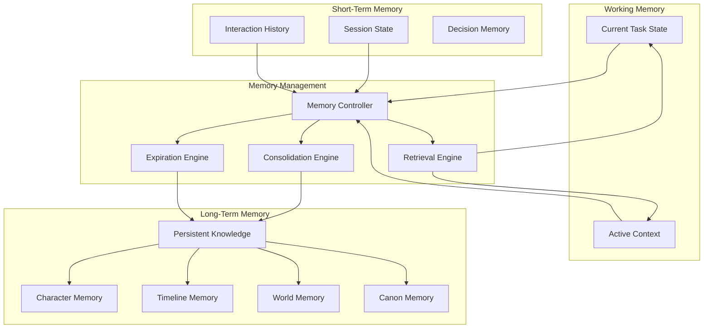
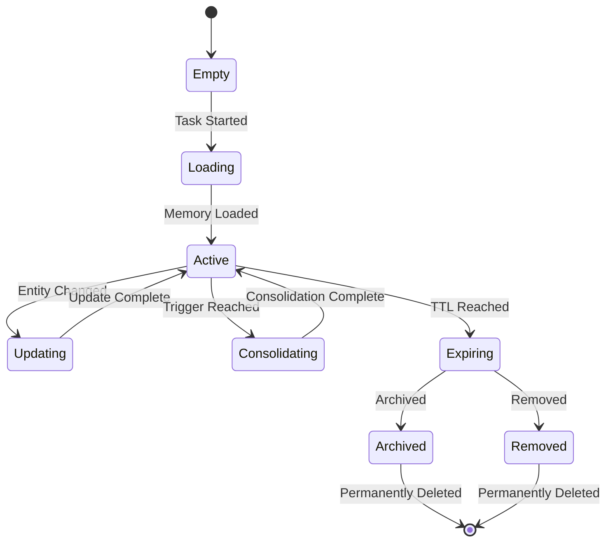

# Memory System

## Purpose
Defines the multi-tier memory system that enables AI to persist and recall information across sessions, tasks, and interactions.

---

## 1. Memory Architecture



---

## 2. Memory Types

### 2.1 Working Memory
| Property | Value |
|----------|-------|
| Duration | Current task |
| Capacity | Limited by context window |
| Storage | In-memory |
| Persistence | None — lost after task |
| Content | Current entities, active decisions, pending actions |

### 2.2 Short-Term Memory
| Property | Value |
|----------|-------|
| Duration | Current session |
| Capacity | Configurable (default: 100 interactions) |
| Storage | Session state |
| Persistence | Session duration |
| Content | Interaction history, recent decisions, session state |

### 2.3 Long-Term Memory
| Property | Value |
|----------|-------|
| Duration | Permanent |
| Capacity | Unlimited |
| Storage | Entity files + indexes |
| Persistence | Until entity archived |
| Content | Character knowledge, timeline, world state, canon |

---

## 3. Domain-Specific Memory

### Character Memory
What each character knows:
- Events they witnessed
- People they've met
- Information they've learned
- Secrets they know
- Relationships they have

```json
{
  "characterId": "hero_000001",
  "knowledge": {
    "knownEvents": ["event_000001", "event_000005"],
    "knownCharacters": ["villain_000001", "support_000002"],
    "knownLocations": ["city_000001", "city_000042"],
    "secrets": ["secret_000001"],
    "currentAwareness": "Aldric knows the usurper is in Dawnhaven"
  }
}
```

### Timeline Memory
Complete chronological context:
- Event sequence
- Temporal relationships
- Era context
- Calendar system

### World Memory
World state tracking:
- Current state of locations
- Political boundaries
- Season and weather
- Active conflicts

### Canon Memory
Canon decisions:
- Approved entity states
- Canon conflict records
- Approval history

---

## 4. Memory Consolidation

Consolidation moves information from short-term to long-term memory.

### Consolidation Triggers
| Trigger | Action |
|---------|--------|
| Scene complete | Summarize to chapter memory |
| Chapter complete | Summarize to book memory |
| Book complete | Summarize to series memory |
| Session end | Compact interaction history |
| Memory pressure | Consolidate oldest entries |

### Consolidation Strategy
```text
1. Identify candidates (oldest, least accessed)
2. Summarize multiple entries into one
3. Extract key facts and decisions
4. Update consolidated entry timestamp
5. Remove individual source entries
```

---

## 5. Memory Expiration

### Expiration Policy
| Memory Type | TTL | Action on Expiry |
|-------------|-----|------------------|
| Working memory | Task end | Clear |
| Interaction history | Session end | Compact to summary |
| Session cache | 1 hour idle | Clear |
| Temporary context | 10 minutes | Clear |
| Long-term memory | Permanent | Archive only |

### Expiration Process
1. Check age of memory entry
2. If exceeds TTL, prepare for expiration
3. If marked for consolidation, run consolidation
4. Remove or archive expired entry
5. Log expiration event

---

## 6. Memory Retrieval

### Retrieval Strategies
| Strategy | Description |
|----------|-------------|
| Exact Match | Retrieve by memory ID |
| Semantic Match | Retrieve by similarity |
| Temporal Match | Retrieve by time range |
| Association | Retrieve by entity association |
| Priority | Retrieve highest-priority memories |

### Retrieval Ranking
| Factor | Weight |
|--------|--------|
| Recency | 0.4 |
| Relevance to current task | 0.3 |
| Frequency of access | 0.2 |
| Explicit importance | 0.1 |

---

## 7. AI Working Memory

The AI's own working memory track:
```
Current Task: Write scene_000001
Active Entities: [hero_000001, location_000001]
Pending Decisions: [Choose coronation location]
Recent Changes: [
  { entity: hero_000001, change: "Updated backstory" },
  { entity: location_000001, change: "Added cathedral" }
]
Next Actions: [Write dialogue, validate timeline]
```

---

## 8. Memory State Diagram


