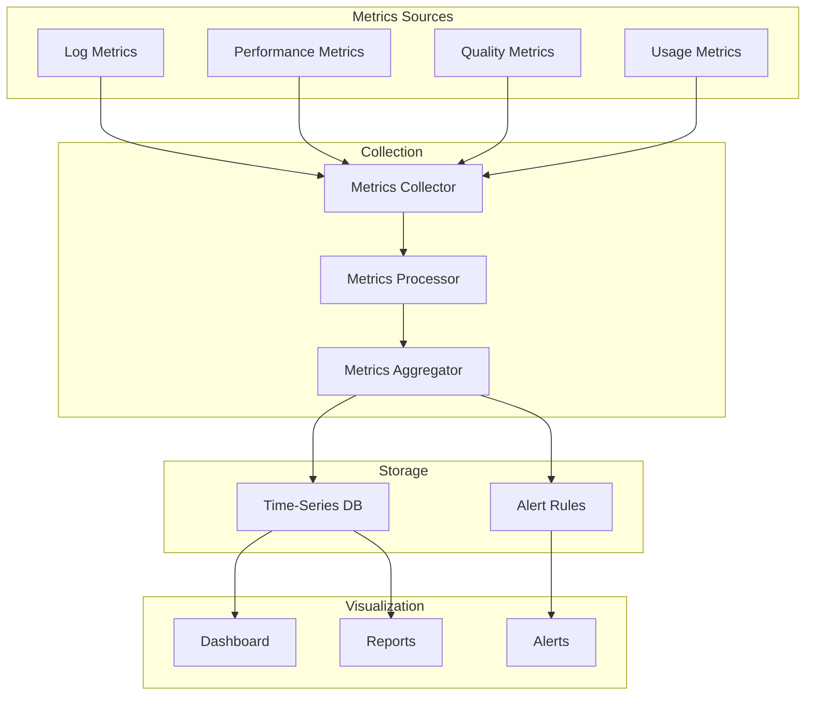

# Monitoring Architecture

## Purpose
Defines the monitoring system for tracking AI platform health, performance, and quality.

---

## 1. Monitoring Architecture



---

## 2. Key Performance Indicators

### Performance Metrics
| Metric | Target | Warning | Critical |
|--------|--------|---------|----------|
| Avg response time | < 5s | > 10s | > 30s |
| P95 response time | < 10s | > 20s | > 60s |
| Token usage per request | < 4000 | > 6000 | > 8000 |
| Cache hit rate | > 70% | < 50% | < 30% |
| Search latency | < 100ms | > 500ms | > 2s |

### Quality Metrics
| Metric | Target | Warning | Critical |
|--------|--------|---------|----------|
| Validation pass rate | > 95% | < 90% | < 80% |
| First-attempt success | > 80% | < 70% | < 50% |
| User satisfaction | > 4/5 | < 3/5 | < 2/5 |
| Suggestion acceptance | > 40% | < 25% | < 10% |

### Usage Metrics
| Metric | Description |
|--------|-------------|
| Requests per hour | AI platform load |
| Active sessions | Concurrent users |
| Entities modified per session | User engagement |
| Agent usage distribution | Which agents most used |
| Model distribution | Which AI models used |

### Health Metrics
| Metric | Description |
|--------|-------------|
| Knowledge base availability | Up/down |
| Model API availability | Up/down/error rate |
| Index freshness | Last index update time |
| Storage usage | Disk space remaining |

---

## 3. Alert Rules

| Alert | Condition | Severity |
|-------|-----------|----------|
| High error rate | > 5% errors in 5 minutes | Critical |
| Slow responses | P95 > 20s for 10 requests | Warning |
| Knowledge base down | No index for 1 minute | Critical |
| Cache thrashing | Hit rate < 30% for 10 minutes | Warning |
| Rate limit hit | > 90% of limit for 5 minutes | Warning |
| Validation cascade | > 20% failure rate for 10 minutes | Critical |

---

## 4. Dashboard

```text
┌─────────────────────────────────────────────────────┐
│  AI Platform Dashboard                    [Live]    │
├───────────────────┬─────────────────────────────────┤
│  Response Time    │  Request Volume                 │
│  ┌─────────────┐  │  ┌─────────────┐               │
│  │  4.2s avg   │  │  │  142/hr     │               │
│  │  8.7s p95   │  │  │  ↑ 12%      │               │
│  └─────────────┘  │  └─────────────┘               │
├───────────────────┼─────────────────────────────────┤
│  Validation Rate  │  Cache Hit Rate                 │
│  ┌─────────────┐  │  ┌─────────────┐               │
│  │  96.3% pass │  │  │  74% L1     │               │
│  │  3.7% fail  │  │  │  62% L2     │               │
│  └─────────────┘  │  └─────────────┘               │
├───────────────────┼─────────────────────────────────┤
│  Active Agents    │  Model Usage                    │
│  ┌─────────────┐  │  ┌─────────────┐               │
│  │ Scene: 8    │  │  │ GPT-4: 65%  │               │
│  │ Canon: 3    │  │  │ Claude: 35% │               │
│  │ Search: 2   │  │  │             │               │
│  └─────────────┘  │  └─────────────┘               │
└───────────────────┴─────────────────────────────────┘
```
