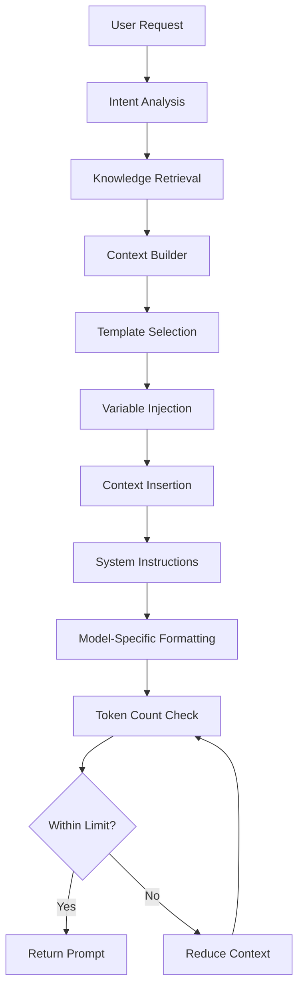

# Prompt Pipeline

## Purpose
Defines how AI prompts are assembled from user requests, knowledge context, and model requirements.

---

## 1. Prompt Assembly Pipeline



---

## 2. Prompt Structure

Every prompt follows this standardized structure:

```text
[SYSTEM]
You are Storynaram AI, a specialized story creation assistant.
You follow all rules in core/standards/AI_STANDARD.md
You must never contradict established canon.
You must validate all output against project schemas.

[CONTEXT]
Current Book: The Crystal Throne (book_000001)
Current Chapter: Chapter 3 — The Journey Begins (chapter_000003)
Current Scene: Scene 3.1 — Leaving Dawnhaven (scene_000012)

Characters Present:
- hero_000001 (Aldric Stormwind) — POV
- support_000001 (Sir Marcus) — Mentor

Location: city_000001 (Dawnhaven) — Capital of Eldoria

Recent Events:
- Aldric was crowned king (event_000001)
- Usurper fled north (event_000005)

[EXAMPLES]
Previous scene writing style:
[Example of well-written scene from chapter 2]

[TASK]
Write scene 3.2 where Aldric and Sir Marcus leave Dawnhaven
through the North Gate. The scene should establish the
journey ahead and show Aldric's determination.

[CONSTRAINTS]
- Word count: 2000-2500 words
- POV: Aldric (third person limited)
- Tone: Hopeful but tinged with uncertainty
- Include sensory details of the city at dawn
- End with Aldric looking back at the city gates

[INPUT]
Scene ID: scene_000013
Previous scene: scene_000012
Next scene outline: scene_000014 (arrival at first village)
```

---

## 3. Prompt Templates by Type

### Generation Prompt
```text
[SYSTEM] Role and rules
[CONTEXT] Relevant knowledge
[EXAMPLES] Few-shot examples
[TASK] What to generate
[CONSTRAINTS] Format and content rules
[INPUT] Source data
```

### Validation Prompt
```text
[SYSTEM] Validator role
[CONTEXT] Standards and contracts
[CONTENT] Content to validate
[RULES] Validation rules to apply
[OUTPUT_FORMAT] Expected report format
```

### Suggestion Prompt
```text
[SYSTEM] Creative assistant role
[CONTEXT] Current story state
[GAPS] Identified gaps or opportunities
[CONSTRAINTS] Must align with canon
[OUTPUT_FORMAT] Ranked suggestions
```

---

## 4. Template Selection Rules

| Task Type | Template |
|-----------|----------|
| Create entity | Generation template |
| Modify entity | Modification template |
| Write content | Generation template |
| Validate | Validation template |
| Review | Analysis template |
| Suggest | Suggestion template |
| Plan | Planning template |
| Answer | Question template |

---

## 5. Variable Injection

Variables are injected into prompt templates using `{variable_name}` syntax.

### Common Variables
| Variable | Source | Example |
|----------|--------|---------|
| `{book_id}` | Task context | `book_000001` |
| `{chapter_id}` | Task context | `chapter_000003` |
| `{scene_id}` | Task context | `scene_000012` |
| `{pov_character}` | Task context | `hero_000001` |
| `{location}` | Knowledge | `city_000001` |
| `{word_count}` | Config | `2500` |
| `{tone}` | Task context | `hopeful` |

---

## 6. Model-Specific Formatting

Different models may require different formatting:

| Model | Format | Notes |
|-------|--------|-------|
| GPT-4 | Standard roles | system/user/assistant |
| Claude | XML tags | `<system>...</system>` |
| Llama | Chat template | `<|system|>...<|user|>...<|assistant|>` |
| Custom | Configurable | Extensible format system |

---

## 7. Prompt Performance Tracking

| Metric | Description |
|--------|-------------|
| Token Count | Total tokens in prompt |
| Context Ratio | Context tokens / total tokens |
| Completion Tokens | Expected output tokens |
| Estimated Cost | Based on model pricing |
| Prompt Version | Template version used |

```json
{
  "promptId": "prompt_000001",
  "template": "scene_writer_v1",
  "model": "gpt-4",
  "tokens": {
    "system": 450,
    "context": 3200,
    "examples": 800,
    "task": 200,
    "total": 4650
  },
  "contextRatio": "0.69",
  "estimatedCost": "$0.14"
}
```
