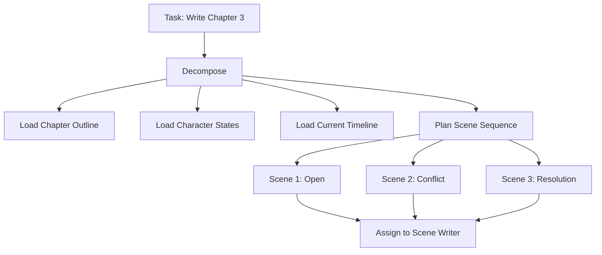
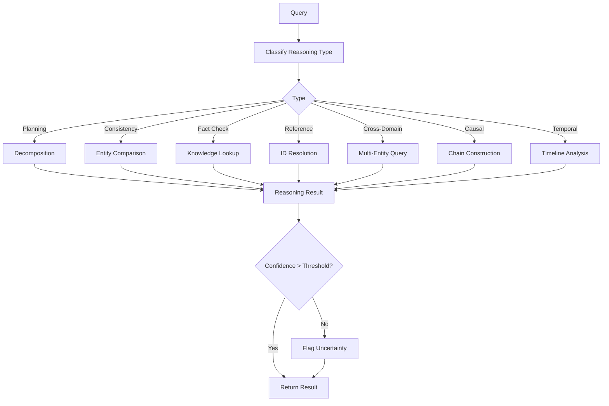
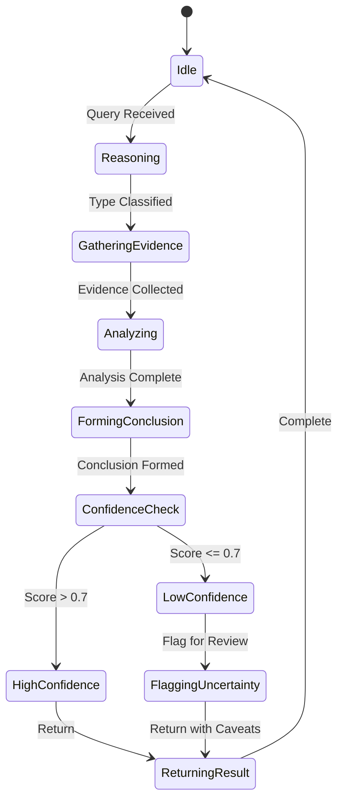

# Reasoning Engine

## Purpose
Defines the AI Reasoning Engine that enables logical planning, consistency checking, fact verification, reference resolution, and cross-domain narrative validation.

---

## 1. Reasoning Capabilities

### 1.1 Planning Strategy
Decomposes complex tasks into actionable steps.



### 1.2 Consistency Reasoning
Verifies logical consistency across entities.
- Character knowledge must match their experience
- Cause must precede effect
- Character reactions must match their personality
- World physics must remain consistent

### 1.3 Fact Verification
Checks claims against known knowledge.
```text
Claim: "Aldric was born in Dawnhaven"
Check: hero_000001.origin == city_000001.name
Result: Verified — origin matches Dawnhaven
```

### 1.4 Reference Resolution
Resolves ambiguous or indirect references.
```text
Input: "The king arrived at the capital"
Resolution: 
  1. Identify "king" → hero_000001 (King Aldric)
  2. Identify "capital" → city_000001 (Dawnhaven, capital of Eldoria)
  3. Result: hero_000001 arrived at city_000001
```

### 1.5 Cross-Domain Reasoning
Reasons across domain boundaries.
```text
Question: "Would magic work in the Northern Wastes?"
Reasoning:
  1. Check magic rules → magic_sys_000001
  2. Check location properties → location_000042
  3. Check for magic-suppressing properties → found
  4. Result: Magic is suppressed in the Northern Wastes
```

### 1.6 Causal Reasoning
Understands cause-effect chains.
```text
Scenario: "The kingdom fell after the king's death"
Causal Chain:
  1. King died → event_000005
  2. No heir → political vacuum
  3. Civil war → war_000001
  4. Economy collapsed → event_000010
  5. Kingdom fell → event_000015
  Result: Chain of 5 causal links verified
```

### 1.7 Temporal Reasoning
Reasons about time and chronology.
```text
Check: "Could Aldric have met the wizard before the war?"
Reasoning:
  1. Aldric birth: year 1213
  2. Wizard death: year 1240
  3. War start: year 1241
  4. 1213 < 1240 < 1241
  5. Result: Yes, possible — Aldric was 27 when wizard died
```

---

## 2. Reasoning Flow



---

## 3. Reasoning Confidence Scoring

| Factor | Weight | Description |
|--------|--------|-------------|
| Source Reliability | 0.3 | Canon > Draft > AI-generated |
| Evidence Count | 0.25 | Multiple sources increase confidence |
| Consistency | 0.2 | No contradictions found |
| Recency | 0.15 | Recent data more reliable |
| Specificity | 0.1 | Specific > vague information |

**Confidence Levels:**
| Score | Level | Action |
|-------|-------|--------|
| 0.9-1.0 | Certain | Proceed without review |
| 0.7-0.9 | High | Proceed, flag if critical |
| 0.5-0.7 | Medium | Flag for review |
| 0.0-0.5 | Low | Request human input |

---

## 4. Reasoning State Machine



---

## 5. Error Handling

| Error | Strategy |
|-------|----------|
| Insufficient knowledge | Request additional context |
| Conflicting evidence | Report all sides, ask for clarification |
| Ambiguous reference | List possible resolutions, ask for disambiguation |
| Circular reasoning | Break chain, report circular dependency |
| Timeout | Return partial results with completion estimate |
