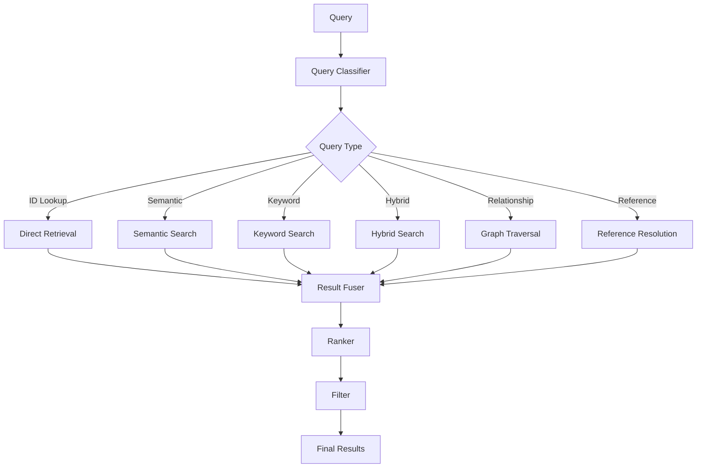

# Retrieval Architecture

## Purpose
Defines the multi-strategy retrieval pipeline that selects and executes the optimal retrieval method for every AI query.

---

## 1. Retrieval Pipeline

---

## 2. Retrieval Strategies

### 2.1 Direct Retrieval
**Purpose**: O(1) entity lookup by ID
**Method**: Primary index lookup
**Use Case**: Known entity references

### 2.2 Keyword Search
**Purpose**: Precise text matching
**Index**: Inverted index on names, descriptions, tags
**Use Case**: Name search, tag filtering, exact matches

### 2.3 Semantic Search
**Purpose**: Conceptual similarity matching
**Index**: Vector embeddings (future)
**Use Case**: "Find characters similar to X", thematic search

### 2.4 Hybrid Search
**Purpose**: Balanced precision and recall
**Method**: Combine keyword + semantic scores
**Use Case**: General knowledge queries

### 2.5 Graph Traversal
**Purpose**: Relationship-based discovery
**Method**: BFS/DFS on knowledge graph
**Use Case**: "Find all characters in Dawnhaven", influence chains

### 2.6 Reference Resolution
**Purpose**: Resolve cross-entity references
**Method**: Follow reference IDs to target entities
**Use Case**: Load character's location, organization members

---

## 3. Query Classifier

The Query Classifier determines the optimal retrieval strategy.

### Classification Rules
| Query Pattern | Strategy |
|---------------|----------|
| Starts with entity ID | Direct Retrieval |
| Contains entity name | Keyword Search |
| Conceptual question | Semantic Search |
| Relationship query | Graph Traversal |
| Reference resolution | Reference Resolution |
| Unknown | Hybrid Search |

---

## 4. Result Fuser

The Result Fuser combines results from multiple retrieval strategies.

### Fusion Strategy
1. Collect results from all executed strategies
2. Deduplicate by entity ID
3. Combine relevance scores
4. Apply weight multipliers per strategy
5. Return unified result set

### Strategy Weights
| Strategy | Weight |
|----------|--------|
| Direct Retrieval | 1.0 |
| Keyword Search | 0.8 |
| Semantic Search | 0.7 |
| Hybrid Search | 0.9 |
| Graph Traversal | 0.6 |
| Reference Resolution | 0.9 |

---

## 5. Context Window Optimization

When retrieval results exceed context window limits:

1. **Rank** results by relevance score
2. **Include** top results until token limit reached
3. **Summarize** remaining results as bullet points
4. **Link** to full content via references
5. **Log** exclusion decisions for transparency

---

## 6. Retrieval Pipeline Performance

| Metric | Target | Warning | Critical |
|--------|--------|---------|----------|
| Retrieval time | < 500ms | > 1s | > 5s |
| Result count | < 50 | > 100 | > 500 |
| Context fit | > 90% | < 70% | < 50% |
| Cache hit rate | > 60% | < 40% | < 20% |

---

## 7. Error Handling

| Error | Recovery Strategy |
|-------|-------------------|
| Entity not found | Return empty result with suggestion |
| Index unavailable | Fall back to direct file read |
| Embedding service down | Fall back to keyword search |
| Graph database unavailable | Fall back to indexed search |
