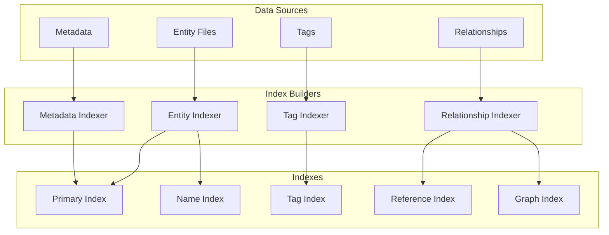

# Search Engine

## Purpose
Defines the Search Engine architecture for fast, relevant information retrieval across all story data.

---

## 1. Search Index Architecture



---

## 2. Index Definitions

### Primary Index
```json
{
  "index": "primary",
  "keyField": "id",
  "value": "file_path",
  "type": "hash",
  "example": {
    "hero_000001": "characters/heroes/hero_000001.json",
    "city_000001": "world/cities/city_000001.json"
  }
}
```

### Name Index
```json
{
  "index": "name",
  "keyField": "name (normalized)",
  "value": "entity_id",
  "type": "sorted",
  "example": {
    "aldric stormwind": "hero_000001",
    "dawnhaven": "city_000001"
  }
}
```

### Tag Index
```json
{
  "index": "tag",
  "keyField": "tag",
  "value": ["entity_id", "entity_id"],
  "type": "inverted",
  "example": {
    "protagonist": ["hero_000001", "heroine_000001"],
    "human": ["hero_000001", "support_000001"]
  }
}
```

### Reference Index
```json
{
  "index": "reference",
  "keyField": "referenced_entity_id",
  "value": ["referencing_entity_id"],
  "type": "inverted",
  "example": {
    "city_000001": ["hero_000001", "event_000001", "scene_000001"]
  }
}
```

---

## 3. Search Query Types

| Query Type | Index Used | Example |
|------------|-----------|---------|
| Exact ID | Primary | `hero_000001` |
| Name prefix | Name | `Aldr*` |
| Exact tag | Tag | `protagonist` |
| Multiple tags | Tag (intersection) | `protagonist + human` |
| Reference lookup | Reference | Entities referencing `city_000001` |
| Type filter | Primary (prefix) | All `hero_*` entities |
| Status filter | Metadata | All `draft` entities |
| Full text | Full-text | `"coronation of the king"` |

---

## 4. Search Results

```json
{
  "query": "Aldric",
  "results": [
    {
      "id": "hero_000001",
      "name": "King Aldric Stormwind III",
      "type": "character",
      "relevance": 0.95,
      "matchedField": "name",
      "snippet": "...King **Aldric** Stormwind III, the rightful heir..."
    },
    {
      "id": "event_000001",
      "name": "Coronation of King Aldric III",
      "type": "event",
      "relevance": 0.75,
      "matchedField": "name",
      "snippet": "The coronation of King **Aldric** III at the Crystal Cathedral"
    }
  ],
  "total": 5,
  "time": "12ms"
}
```

---

## 5. Search Performance

| Index Type | Lookup | Memory | Build Time |
|------------|--------|--------|------------|
| Primary (hash) | O(1) | O(n) | O(n) |
| Name (sorted) | O(log n) | O(n) | O(n log n) |
| Tag (inverted) | O(1) per tag | O(t * e) | O(t * e) |
| Reference (inverted) | O(1) | O(r) | O(r) |
| Full-text | O(n) | O(c) | O(c) |

*Where: n = entities, t = tags, e = entities per tag, r = references, c = content size*

---

## 6. Search Ranking

Results are ranked by:
1. **Match type**: ID match > name match > description match > tag match
2. **Entity priority**: Character > Location > Event > Item > Organization
3. **Canon status**: Locked > Approved > Review > Draft
4. **Recency**: Recently modified entities rank higher

---

## 7. Caching

Search results are cached with a TTL of:
- ID lookups: 1 hour
- Name searches: 10 minutes
- Tag queries: 30 minutes  
- Full-text: 5 minutes

Cache is invalidated when entities are modified.
