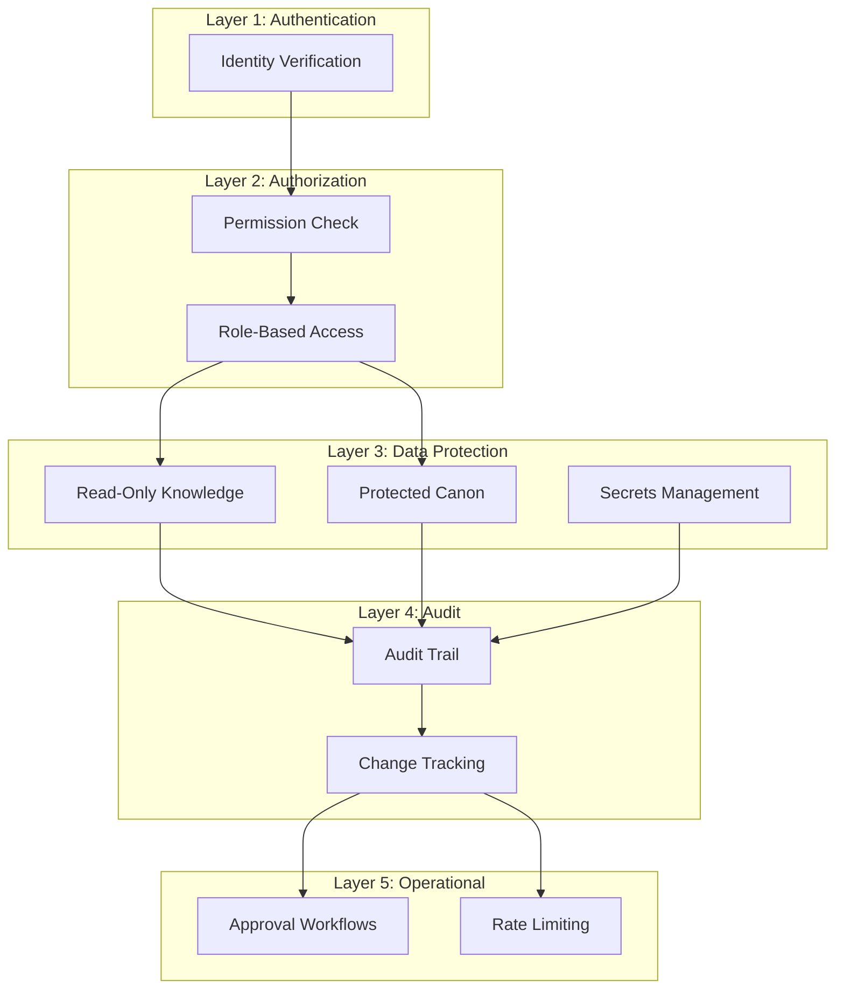

# Security Architecture

## Purpose
Defines the security architecture for all AI operations — permissions, audit, data protection, and access control.

---

## 1. Security Layers



---

## 2. Permission Levels

| Level | Label | Capabilities |
|-------|-------|-------------|
| 0 | Reader | Read knowledge, view suggestions |
| 1 | Writer | Read/write entities, generate content |
| 2 | Editor | Read/write, approve changes, modify canon |
| 3 | Admin | Full access, manage permissions, configure system |

### Capability Matrix

| Capability | Reader | Writer | Editor | Admin |
|------------|--------|--------|--------|-------|
| View knowledge | ✓ | ✓ | ✓ | ✓ |
| Create entities | | ✓ | ✓ | ✓ |
| Modify draft entities | | ✓ | ✓ | ✓ |
| Modify approved entities | | | ✓ | ✓ |
| Lock/unlock canon | | | ✓ | ✓ |
| Approve canon changes | | | ✓ | ✓ |
| Manage permissions | | | | ✓ |
| Configure system | | | | ✓ |
| Delete entities | | | | ✓ |
| View audit logs | | | ✓ | ✓ |

---

## 3. Operational Security Rules

### 3.1 Read-Only Knowledge
- AI has read-only access to source entity files
- AI never directly modifies source files
- AI output is written through controlled pipelines
- Exceptions require explicit authorization

### 3.2 Protected Canon
- Locked canon entities are write-protected
- Modification requires approval workflow
- All changes are logged and audited
- Reverting canon requires author approval

### 3.3 Approval Workflow
- Destructive operations require approval
- Batch operations (>10 files) require approval
- Canon changes require editor+ approval
- Config changes require admin approval

### 3.4 Audit Trail
All operations are logged with:
- Who performed the operation
- What was changed
- When it was changed
- Why it was changed
- Who approved the change

---

## 4. Data Protection

### 4.1 Secrets Management
- No API keys in repository
- Secrets in environment variables
- Encrypted secret store for production
- Key rotation policy enforced

### 4.2 Data Classification
| Classification | Examples | Handling |
|----------------|----------|----------|
| Public | Story content | No restrictions |
| Internal | Project structure | Project access |
| Confidential | Plot twists, secrets | Author only |
| Restricted | API keys, credentials | Encrypted, never logged |

### 4.3 Content Safety
- Input filtering for prohibited content
- Output scanning for sensitive data
- PII detection and redaction
- Content rating enforcement

---

## 5. Audit Log Entry

```json
{
  "auditId": "audit_000001",
  "timestamp": "2026-07-17T12:00:00Z",
  "user": {
    "id": "user_author",
    "role": "editor"
  },
  "agent": "scene_writer",
  "action": "scene_write",
  "target": {
    "type": "scene",
    "id": "scene_000001"
  },
  "operation": "create",
  "entities": ["hero_000001", "location_000001"],
  "changes": "Created scene from chapter outline",
  "approval": {
    "required": false,
    "status": "auto-approved"
  },
  "result": "success"
}
```

---

## 6. Security Incident Response

| Incident | Response |
|----------|----------|
| Unauthorized access attempt | Log, alert admin, block |
| Data corruption detected | Restore from backup, audit trail |
| API key exposure | Rotate keys, audit usage |
| Permission escalation | Revoke, audit, review |
| Rate limit abuse | Throttle, alert, block if persistent |
