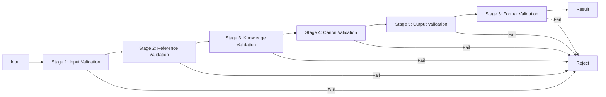

# Validation Pipeline

## Purpose
Defines the multi-stage validation pipeline for AI operations — from input validation through output validation.

---

## 1. Validation Pipeline Architecture



---

## 2. Validation Stages

### Stage 1: Input Validation
**Purpose**: Validate the AI request is well-formed and permitted.

| Check | Description |
|-------|-------------|
| Request format | Valid JSON or text |
| Required fields | All required parameters present |
| Permission | User has permission for this operation |
| Rate limit | Not exceeding rate limits |
| Content safety | No prohibited content |

### Stage 2: Reference Validation
**Purpose**: Validate all entity references are valid.

| Check | Description |
|-------|-------------|
| Entity exists | Referenced IDs exist in project |
| Entity active | Entity not archived/deleted |
| Type match | Reference type matches entity type |
| Bidirectional | Inverse references exist (when expected) |
| No duplicates | No duplicate references in arrays |

### Stage 3: Knowledge Validation
**Purpose**: Validate facts against the knowledge base.

| Check | Description |
|-------|-------------|
| Fact accuracy | Facts match knowledge base |
| No hallucination | Claims are grounded in knowledge |
| Source citation | Facts have traceable sources |
| Temporal accuracy | Dates and sequences are correct |

### Stage 4: Canon Validation
**Purpose**: Validate no contradiction with established canon.

| Check | Description |
|-------|-------------|
| Canon consistency | No contradiction with locked canon |
| Status check | Canon status allows modification |
| Conflict detection | No conflicts with related entities |

### Stage 5: Output Validation
**Purpose**: Validate AI-generated output.

| Check | Description |
|-------|-------------|
| Schema conformance | Valid JSON structure |
| Required fields | All required fields present |
| Field types | Correct data types |
| Value ranges | Values within allowed ranges |
| ID format | IDs match ID_STANDARD |

### Stage 6: Format Validation
**Purpose**: Validate output formatting.

| Check | Description |
|-------|-------------|
| JSON formatting | 2-space indent, UTF-8 |
| Markdown formatting | Valid markdown |
| Trailing newline | File ends with newline |
| No trailing whitespace | Clean formatting |

---

## 3. Validation Result

```json
{
  "validationId": "val_000001",
  "timestamp": "2026-07-17T12:00:00Z",
  "pipeline": "full",
  "overallStatus": "warning",
  "stages": [
    {
      "stage": "input",
      "status": "passed",
      "checks": 5,
      "errors": 0,
      "warnings": 0
    },
    {
      "stage": "reference",
      "status": "passed",
      "checks": 12,
      "errors": 0,
      "warnings": 1,
      "warnings": [
        {
          "code": "W3001",
          "message": "Missing inverse reference from city_000001 to hero_000001",
          "severity": "warning"
        }
      ]
    },
    {
      "stage": "canon",
      "status": "passed",
      "checks": 8,
      "errors": 0,
      "warnings": 0
    },
    {
      "stage": "output",
      "status": "passed",
      "checks": 6,
      "errors": 0,
      "warnings": 0
    }
  ],
  "summary": {
    "totalChecks": 31,
    "passed": 30,
    "errors": 0,
    "warnings": 1
  }
}
```

---

## 4. Error Handling

| Stage Failure | Recovery |
|---------------|----------|
| Input invalid | Return error to caller |
| Reference broken | Auto-fix if possible, else flag |
| Knowledge conflict | Flag for human review |
| Canon conflict | Block operation, notify author |
| Output invalid | Regenerate with feedback |
| Format invalid | Auto-format |

---

## 5. Validation Pipeline Configuration

| Setting | Default | Description |
|---------|---------|-------------|
| `failFast` | true | Stop on first error |
| `autoFix` | true | Auto-fix formatting issues |
| `requireCanonCheck` | true | Always run canon validation |
| `maxWarnings` | 10 | Maximum warnings before flagging |
| `logLevel` | `info` | Minimum log level |
