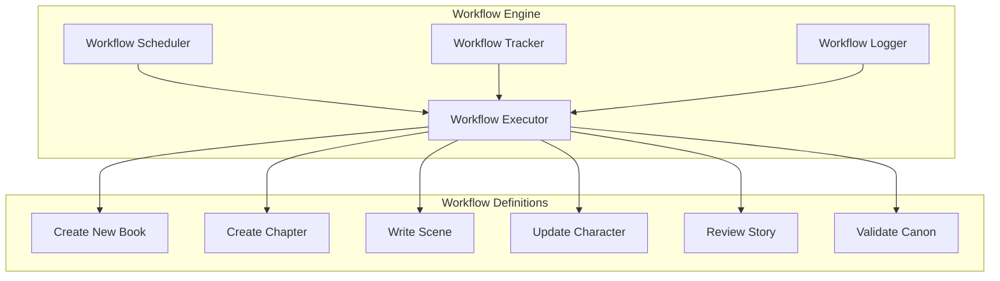
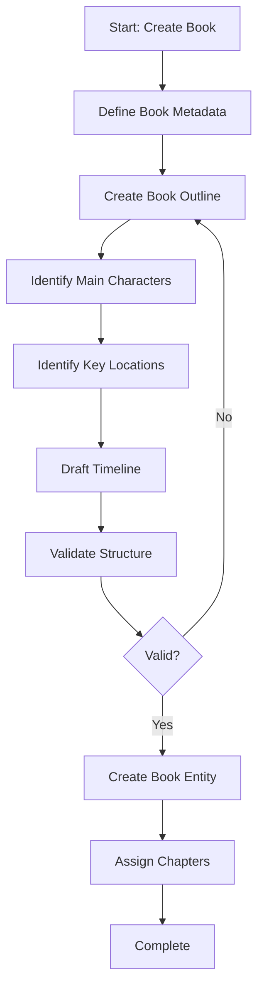
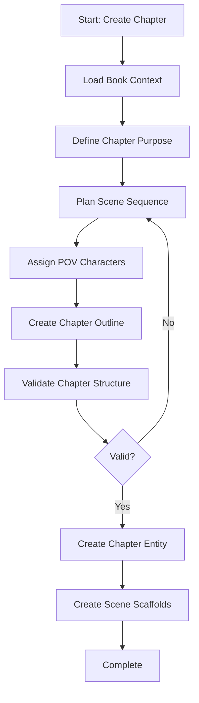
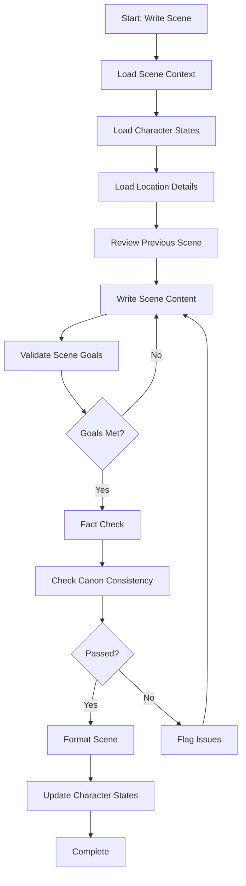
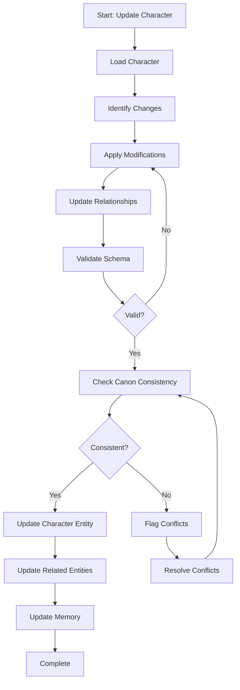
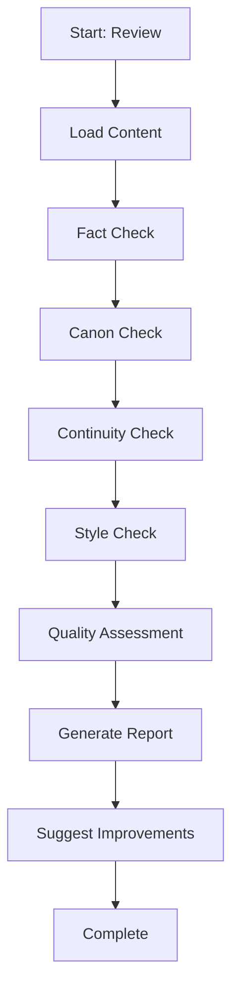
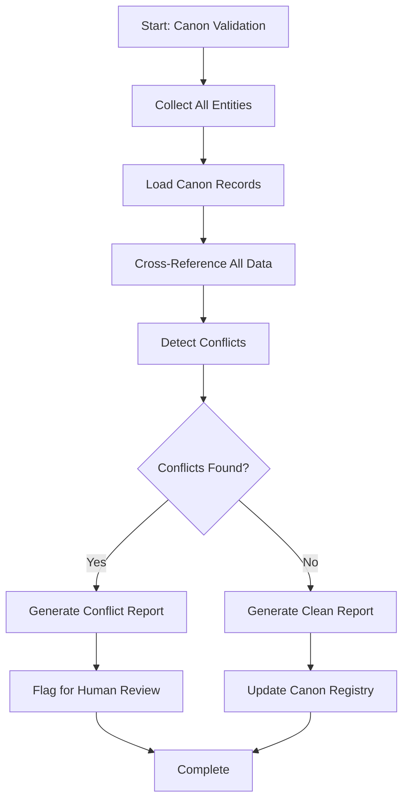

# Workflows

## Purpose
Defines the multi-step, multi-agent workflows for complex story creation tasks.

---

## 1. Workflow Engine



---

## 2. Workflow: Create New Book



**Steps:**
1. Define title, series, genre, word count target
2. Create chapter-by-chapter outline
3. List protagonist, antagonist, major supporting characters
4. Define primary setting and key locations
5. Map major timeline events
6. Validate narrative structure completeness
7. Create book entity JSON
8. Create empty chapter scaffolds

**Duration:** Full workflow
**Agents:** Outline Planner, Character Builder, World Builder, Timeline Builder
---

## 3. Workflow: Create Chapter



---

## 4. Workflow: Write Scene



**Steps:**
1. Load chapter context, previous scene
2. Load POV character current state
3. Load location description and properties
4. Review previous scene for continuity
5. Write scene following scene contract
6. Validate scene goals are accomplished
7. Verify facts against knowledge base
8. Check canon consistency
9. Format scene per MARKDOWN_STANDARD
10. Update character location/knowledge states

**Agents:** Scene Writer, Fact Checker, Canon Checker, Metadata Generator
---

## 5. Workflow: Update Character



---

## 6. Workflow: Review Story



---

## 7. Workflow: Validate Canon



---

## 8. Workflow Execution Model

| Property | Value |
|----------|-------|
| Execution | Sequential or parallel steps |
| Validation Gates | After each step |
| Error Handling | Retry, skip, or abort |
| Rollback | Reverse completed steps |
| Logging | Every step is logged |

### Step Structure
```json
{
  "stepId": "wf_000001_step_001",
  "name": "Load Book Context",
  "agent": "Outline Planner",
  "input": { "bookId": "book_000001" },
  "output": { "bookContext": "..." },
  "validationGate": {
    "rules": ["context_loaded", "book_exists"]
  },
  "handling": {
    "onError": "retry",
    "maxRetries": 3
  }
}
```
