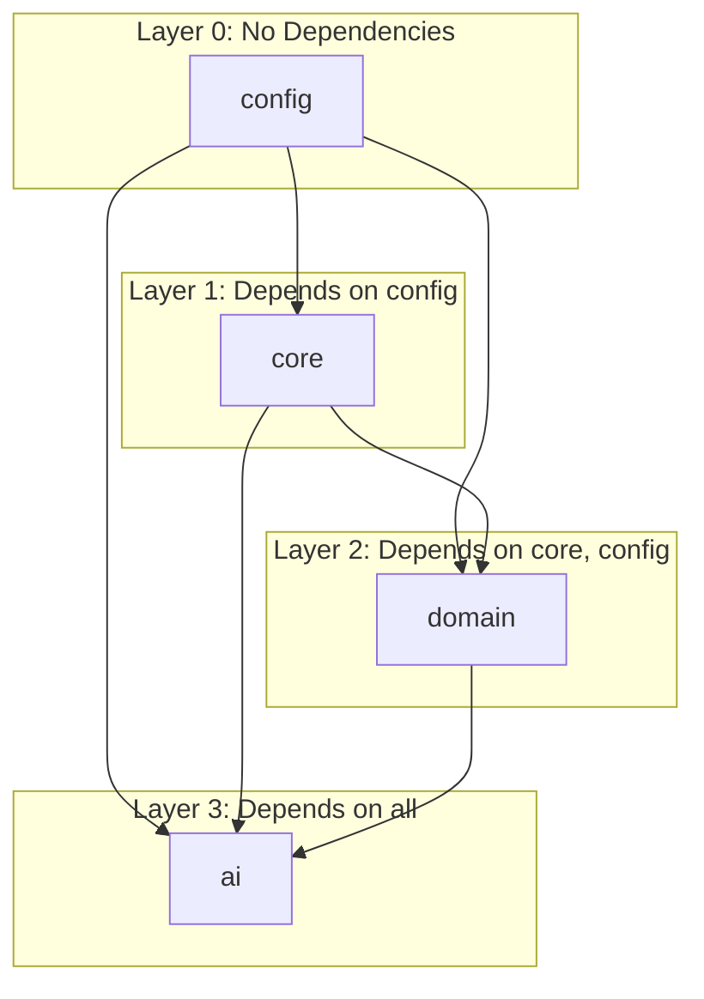

# Dependency Report

## Inter-module Dependency Analysis

---

## 1. Dependency Direction

**Direction:** ✅ All dependencies flow inward (config → core → domain → ai)

---

## 2. Cross-Module Dependencies

| Source Module | Depends On | Dependency Type | Strength |
|-------------|-----------|-----------------|----------|
| config/ | (none) | — | — |
| core/standards/ | config/ | Reference | Weak (standards reference naming rules) |
| core/contracts/ | config/ | Reference | Weak (contracts reference ID rules) |
| core/enums/ | config/ | Reference | Weak |
| core/constants/ | config/ | Reference | Weak |
| domain/entities/ | core/contracts/ | Conforms-to | Strong |
| domain/aggregates/ | domain/entities/ | Contains | Strong |
| domain/relationships/ | domain/entities/ | References | Medium |
| domain/lifecycles/ | domain/entities/ | Applies-to | Medium |
| domain/events/ | domain/entities/ | References | Medium |
| domain/commands/ | domain/entities/ | References | Medium |
| domain/queries/ | domain/entities/ | References | Medium |
| domain/repositories/ | domain/aggregates/ | Persists | Strong |
| domain/services/ | domain/aggregates/ | Orchestrates | Strong |
| ai/knowledge/ | domain/entities/ | Reads | Strong |
| ai/canon/ | domain/entities/ | Validates | Strong |
| ai/retrieval/ | domain/entities/ | Queries | Strong |
| ai/context/ | domain/entities/ | Packages | Strong |
| ai/memory/ | domain/entities/ | Records | Medium |

---

## 3. Dependency Violations

| Violation | Description | Severity |
|-----------|-------------|----------|
| ai/agents/ uses domain/entities/ | Correct direction | ✅ None |
| domain/entities/ uses core/contracts/ | Correct direction | ✅ None |
| No circular dependencies detected | All dependencies are acyclic | ✅ None |
| No upward dependencies | Lower layers don't depend on higher layers | ✅ None |

---

## 4. Dependency Counts

| Module | Outgoing Dependencies | Incoming Dependencies |
|--------|---------------------|----------------------|
| config/ | 0 | 4 |
| core/ | 1 | 2 |
| domain/ | 2 | 5 |
| ai/ | 4 | 0 |

**Verdict:** ✅ Clean dependency graph. No violations.

---

## 5. External Dependencies (Planned)

| Dependency | Phase | Purpose |
|-----------|-------|---------|
| JSON Schema validator | Phase 2 | Contract conformance |
| File system | Current | All persistence |
| SQLite/PostgreSQL | Phase 9 | Database storage |
| Neo4j driver | Phase 9 | Graph storage |
| Vector DB client | Phase 5 | Embedding storage |
| OpenAI/Claude API | Phase 4 | AI model access |
| Python/Node.js runtime | Phase 3 | Script execution |

---

## 6. Recommendations

| Issue | Recommendation | Priority |
|-------|---------------|----------|
| No formal dependency injection | Define interface boundaries in core/interfaces/ | Low |
| No version compatibility matrix | Add compatibility matrix for external tools | Low |
| No build system | No build dependencies currently (pure docs) | None |
