# Migration Plan

## Evolution Path from File-Based to Database-Backed

---

## 1. Migration Phases

```mermaid
graph LR
    A[Phase 1: File-Based] --> B[Phase 2: Schema + Templates]
    B --> C[Phase 3: Validation + Scripts]
    C --> D[Phase 4: AI Prompt Library]
    D --> E[Phase 5: Memory + Canon]
    E --> F[Phase 6: Narrative Tools]
    F --> G[Phase 7: Export Pipeline]
    G --> H[Phase 8: AI Integration]
    H --> I[Phase 9: Database]
    I --> J[Phase 10: Collaboration]
```

---

## 2. Phase-to-Phase Migration Risks

| Transition | Risk Level | Key Risks | Mitigation |
|-----------|-----------|-----------|------------|
| Phase 1 → Phase 2 | Low | Schema changes may require doc updates | All docs in markdown, easy to update |
| Phase 2 → Phase 3 | Low | Validation rules may conflict with existing docs | Validate against frozen architecture |
| Phase 3 → Phase 4 | Low | AI prompts reference out-of-date schemas | Keep schemas and prompts in sync |
| Phase 4 → Phase 5 | Medium | Memory models depend on AI model capabilities | Model-agnostic design |
| Phase 5 → Phase 6 | Low | Tooling layer on existing data model | Domain model is stable |
| Phase 6 → Phase 7 | Medium | Export format compatibility | Design export templates early |
| Phase 7 → Phase 8 | Medium | AI models change capabilities over time | Abstraction layer |
| Phase 8 → Phase 9 | **High** | Data migration from files to database | DB_READINESS.md prepared |
| Phase 9 → Phase 10 | Medium | Concurrency and auth challenges | Security model prepared |

---

## 3. File-to-Database Migration (Phase 9)

### Pre-Migration
- [ ] All entity JSON files validated against schemas
- [ ] Referential integrity verified
- [ ] Backup of all data completed
- [ ] Database schema generated from DB_READINESS.md

### Migration Steps
1. Create database tables per DB_READINESS.md mapping
2. Export all entity files to JSON array per table
3. Import JSON data into database tables
4. Validate row counts match file counts
5. Verify relationships via foreign keys
6. Create indexes per INDEXING_STRATEGY.md
7. Create full-text search indexes
8. Update config to point to database
9. Run parallel read tests (file vs database)
10. Cut over writes to database
11. Keep file system as read-only fallback

### Rollback Plan
- Keep all original JSON files unmodified during migration
- Switch config back to file-based storage
- No data loss — files are source of truth until cutover

---

## 4. AI Model Migration

### Model Upgrade Process
1. Test new model on frozen test prompts
2. Compare output quality against baseline
3. A/B test on a subset of entities
4. Update prompt templates for new model
5. Regenerate embeddings (if model changed)
6. Full validation pass
7. Cut over with fallback

---

## 5. Contract Schema Migration

### Schema Version Upgrade
1. Update core/contracts/ documentation
2. Update domain/ entity definitions
3. Generate new JSON Schema files
4. Run validation on existing data
5. Identify and fix violations
6. Update validation scripts
7. Update AI prompt templates
8. Update export templates

---

## 6. Migration Readiness Checklist

| Criterion | Phase 1 | Phase 2-8 | Phase 9 |
|-----------|---------|-----------|---------|
| Stable data model | ✅ | ✅ | ✅ |
| Schema definitions | ❌ | ✅ | ✅ |
| Validation engine | ❌ | ✅ | ✅ |
| Backup system | ✅ | ✅ | ✅ |
| Rollback capability | N/A | ✅ | ✅ |
| DB schema ready | ❌ | ❌ | ✅ |
| Migration scripts | ❌ | ❌ | ✅ |
| Parallel run support | ❌ | ❌ | ✅ |
