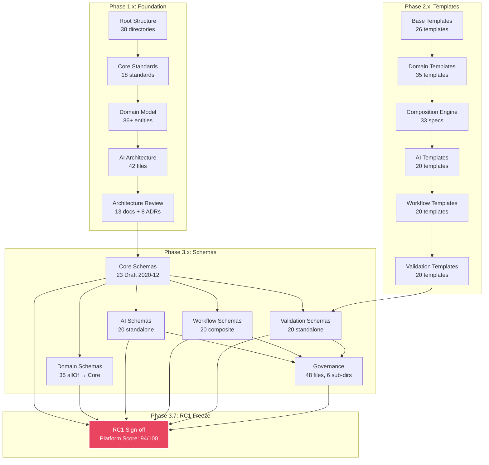
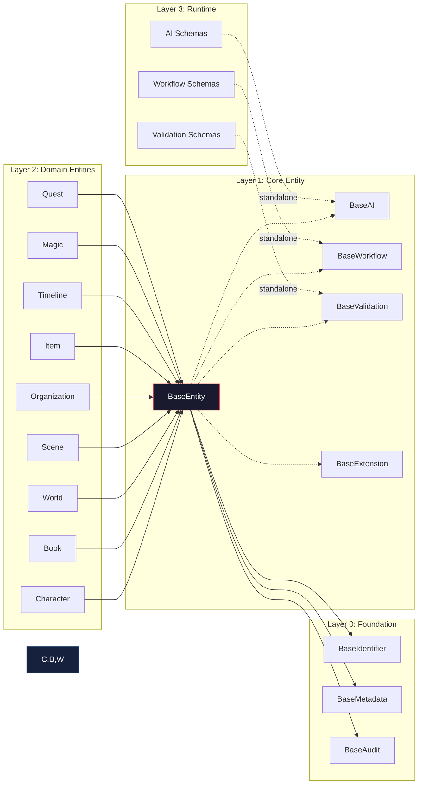
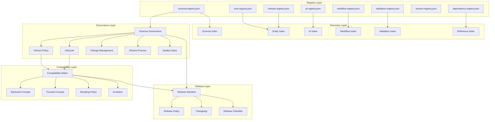
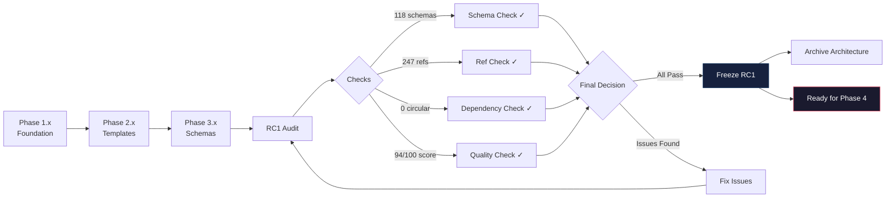

# RC1 Architecture Overview Diagrams

## 1. Complete Platform Overview

```mermaid
graph TB
    subgraph "Phase 1.x: Foundation"
        ROOT[Root Structure<br/>38 directories]
        CORE_STD[Core Standards<br/>18 standards]
        DOMAIN_MODEL[Domain Model<br/>86+ entities]
        AI_ARCH[AI Architecture<br/>42 files]
        ARCH_REVIEW[Architecture Review<br/>13 docs + 8 ADRs]
    end

    subgraph "Phase 2.x: Templates"
        BASE_TPL[Base Templates<br/>26 templates]
        DOMAIN_TPL[Domain Templates<br/>35 templates]
        COMP_ENG[Composition Engine<br/>33 specs]
        AI_TPL[AI Templates<br/>20 templates]
        WF_TPL[Workflow Templates<br/>20 templates]
        VAL_TPL[Validation Templates<br/>20 templates]
    end

    subgraph "Phase 3.x: Schemas"
        CORE_SCH[Core Schemas<br/>23 Draft 2020-12]
        DOMAIN_SCH[Domain Schemas<br/>35 allOf → Core]
        AI_SCH[AI Schemas<br/>20 standalone]
        WF_SCH[Workflow Schemas<br/>20 composite]
        VAL_SCH[Validation Schemas<br/>20 standalone]
        GOV[Governance<br/>48 files, 6 sub-dirs]
    end

    subgraph "Phase 3.7: RC1 Freeze"
        RC1[RC1 Sign-off<br/>Platform Score: 94/100]
    end

    ROOT --> CORE_STD
    CORE_STD --> DOMAIN_MODEL
    DOMAIN_MODEL --> AI_ARCH
    AI_ARCH --> ARCH_REVIEW

    BASE_TPL --> DOMAIN_TPL
    DOMAIN_TPL --> COMP_ENG
    COMP_ENG --> AI_TPL
    AI_TPL --> WF_TPL
    WF_TPL --> VAL_TPL

    CORE_SCH --> DOMAIN_SCH
    CORE_SCH --> AI_SCH
    CORE_SCH --> WF_SCH
    CORE_SCH --> VAL_SCH
    AI_SCH --> GOV
    WF_SCH --> GOV
    VAL_SCH --> GOV

    ARCH_REVIEW --> CORE_SCH
    VAL_TPL --> VAL_SCH

    CORE_SCH --> RC1
    DOMAIN_SCH --> RC1
    AI_SCH --> RC1
    WF_SCH --> RC1
    VAL_SCH --> RC1
    GOV --> RC1

    style RC1 fill:#e94560,color:#fff,stroke:#fff,stroke-width:2px
```

## 2. Dependency Overview

```mermaid
graph LR
    subgraph "Layer 0: Foundation"
        ID[BaseIdentifier]
        MD[BaseMetadata]
        AU[BaseAudit]
    end

    subgraph "Layer 1: Core Entity"
        BE[BaseEntity] --> ID
        BE --> MD
        BE --> AU
        BE -.-> AI[BaseAI]
        BE -.-> WV[BaseWorkflow]
        BE -.-> VA[BaseValidation]
        BE -.-> EXT[BaseExtension]
    end

    subgraph "Layer 2: Domain Entities"
        C[Character] --> BE
        B[Book] --> BE
        W[World] --> BE
        S[Scene] --> BE
        O[Organization] --> BE
        I[Item] --> BE
        T[Timeline] --> BE
        M[Magic] --> BE
        Q[Quest] --> BE
    end

    subgraph "Layer 3: Runtime"
        AI_S[AI Schemas] -.->|standalone| AI
        WF_S[Workflow Schemas] -.->|standalone| WV
        VAL_S[Validation Schemas] -.->|standalone| VA
    end

    style BE fill:#1a1a2e,stroke:#e94560,color:#fff
    style C,B,W fill:#16213e,stroke:#0f3460,color:#fff
```

## 3. Governance Overview

```mermaid
flowchart TD
    subgraph "Registry Layer"
        SR[schema-registry.json]
        CR[core-registry.json]
        DR[domain-registry.json]
        AR[ai-registry.json]
        WR[workflow-registry.json]
        VR[validation-registry.json]
        VER[version-registry.json]
        DEP[dependency-registry.json]
    end

    subgraph "Governance Layer"
        GOV[Schema Governance]
        VP[Version Policy]
        LC[Lifecycle]
        CM[Change Management]
        RP[Review Process]
        QG[Quality Gates]
    end

    subgraph "Compatibility Layer"
        COMPAT[Compatibility Matrix]
        BC[Backward Compat]
        FC[Forward Compat]
        BP[Breaking Policy]
        EVO[Evolution]
    end

    subgraph "Discovery Layer"
        SI[Schema Index]
        EI[Entity Index]
        AI_IDX[AI Index]
        WI[Workflow Index]
        VI[Validation Index]
        RI[Reference Index]
    end

    subgraph "Release Layer"
        RM[Release Manifest]
        RPOL[Release Policy]
        CL[Changelog]
        RC[Release Checklist]
    end

    SR --> GOV
    GOV --> VP
    GOV --> LC
    GOV --> CM
    GOV --> RP
    GOV --> QG

    VP --> COMPAT
    LC --> COMPAT
    COMPAT --> BC
    COMPAT --> FC
    COMPAT --> BP
    COMPAT --> EVO

    SR --> SI
    CR --> EI
    DR --> EI
    AR --> AI_IDX
    WR --> WI
    VR --> VI
    DEP --> RI

    COMPAT --> RM
    GOV --> RM
    RM --> RPOL
    RM --> CL
    RM --> RC
```

## 4. Release Readiness Flow

```mermaid
flowchart LR
    PHASE1[Phase 1.x<br/>Foundation] --> PHASE2[Phase 2.x<br/>Templates]
    PHASE2 --> PHASE3[Phase 3.x<br/>Schemas]
    
    PHASE3 --> AUDIT[RC1 Audit]
    
    AUDIT --> CHECKS{Checks}
    CHECKS -->|118 schemas| SCHEMA_OK[Schema Check ✓]
    CHECKS -->|247 refs| REF_OK[Ref Check ✓]
    CHECKS -->|0 circular| DEP_OK[Dependency Check ✓]
    CHECKS -->|94/100 score| QUALITY_OK[Quality Check ✓]
    
    SCHEMA_OK --> DECISION{Final Decision}
    REF_OK --> DECISION
    DEP_OK --> DECISION
    QUALITY_OK --> DECISION
    
    DECISION -->|All Pass| FREEZE[Freeze RC1]
    DECISION -->|Issues Found| FIX[Fix Issues]
    FIX --> AUDIT

    FREEZE --> ARCHIVE[Archive Architecture]
    FREEZE --> READY[Ready for Phase 4]
    
    style FREEZE fill:#16213e,stroke:#0f3460,color:#fff
    style READY fill:#1a1a2e,stroke:#e94560,color:#fff
```
