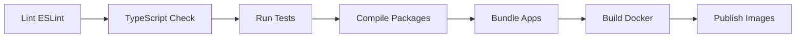
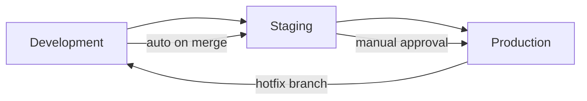

# Build & Release Guide

## Build System

**Tool:** TypeScript Compiler (tsc) via `pnpm build`

Each package is compiled independently:
```bash
pnpm --filter @storynaram/{name} build
```

Full workspace build:
```bash
pnpm build
```

## Build Pipeline



## Versioning

All packages follow SemVer 2.0.0, versioned independently:

```bash
# Version a single package
pnpm version patch --filter @storynaram/core

# Version all packages
pnpm version minor
```

Using `changesets` for changelog generation:
```bash
pnpm changeset add     # Add change entry
pnpm changeset version # Apply versions + generate changelog
pnpm publish           # Publish all
```

## CI/CD Strategy

### CI (Continuous Integration) — Every PR

| Step | Tool | Duration |
|------|------|----------|
| Lint | ESLint | 1 min |
| Type check | tsc --noEmit | 2 min |
| Unit tests | Vitest | 3 min |
| Integration tests | Vitest + test containers | 5 min |
| Build | pnpm build | 3 min |
| Bundle size check | size-limit | 30s |
| Dependency check | madge | 30s |

### CD (Continuous Deployment) — Main branch merge

1. Run full CI
2. Version packages (if changed)
3. Build Docker images
4. Push to registry
5. Deploy to staging
6. Run smoke tests
7. Deploy to production (manual gate)

## Environment Promotion



## Docker

```dockerfile
FROM node:22-alpine AS builder
WORKDIR /app
COPY pnpm-lock.yaml ./
COPY pnpm-workspace.yaml ./
RUN pnpm install --frozen-lockfile
COPY . .
RUN pnpm build

FROM node:22-alpine AS runner
WORKDIR /app
COPY --from=builder /app/apps/api/dist ./dist
COPY --from=builder /app/node_modules ./node_modules
EXPOSE 3000
CMD ["node", "dist/main.js"]
```

## Artifacts

| Artifact | Format | Registry |
|----------|--------|----------|
| NPM packages | .tgz | Private npm registry |
| Docker images | OCI | Docker registry |
| API docs | OpenAPI JSON | Docs site |
| Schema packages | .tgz | npm registry |
