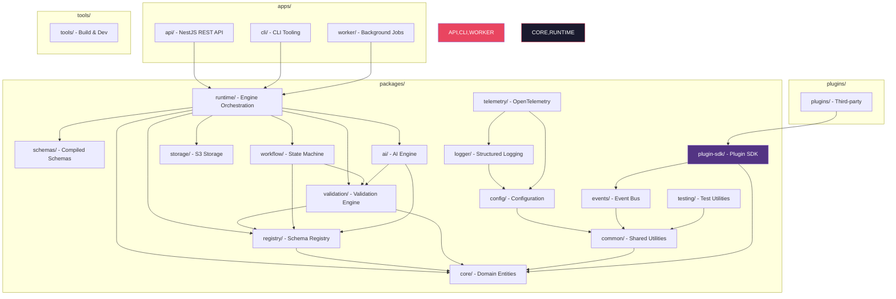
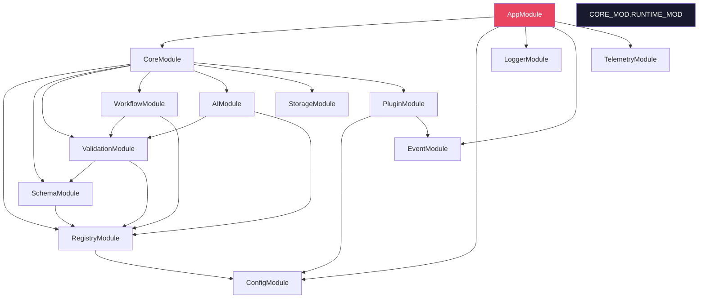
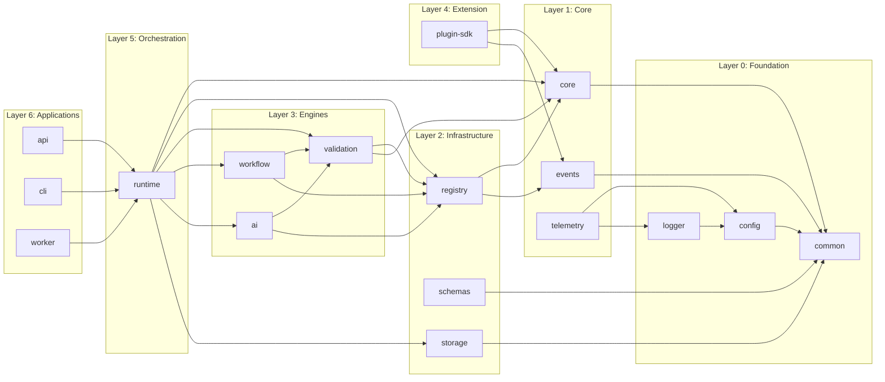
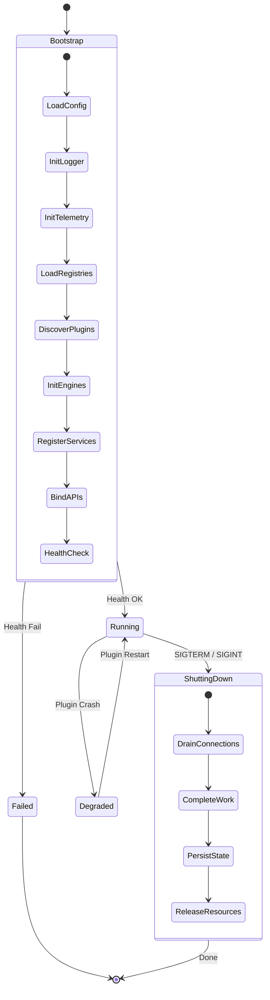
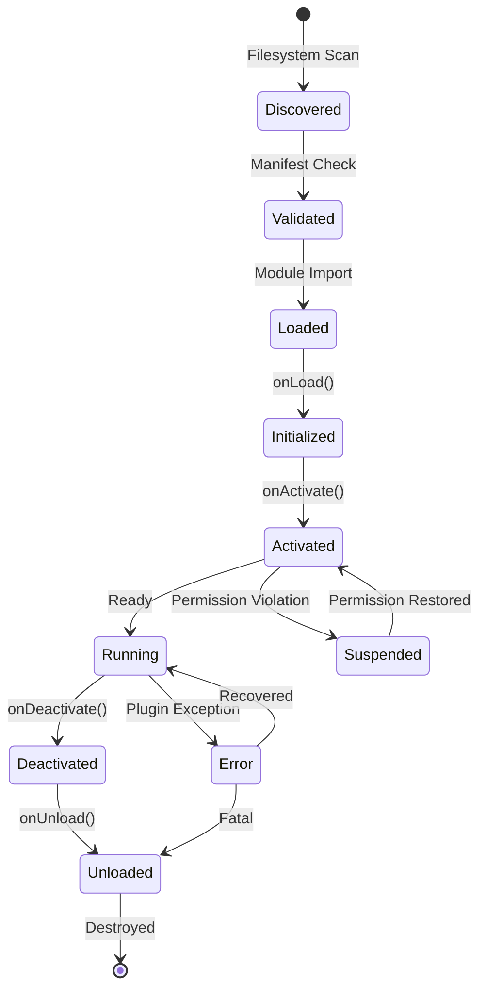
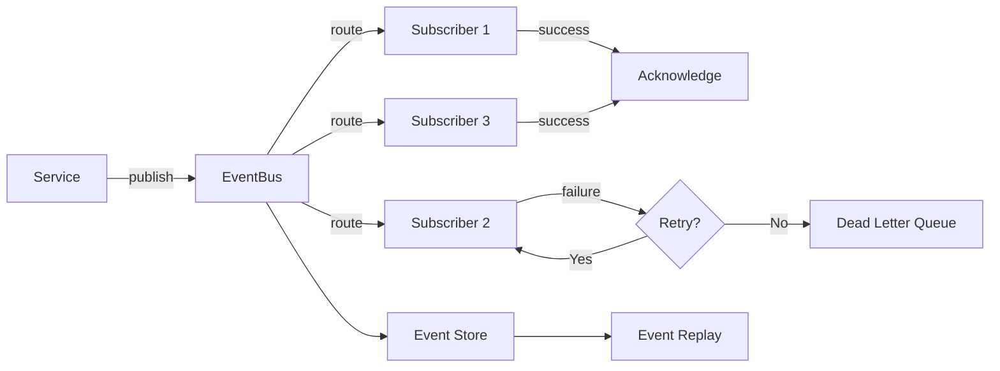
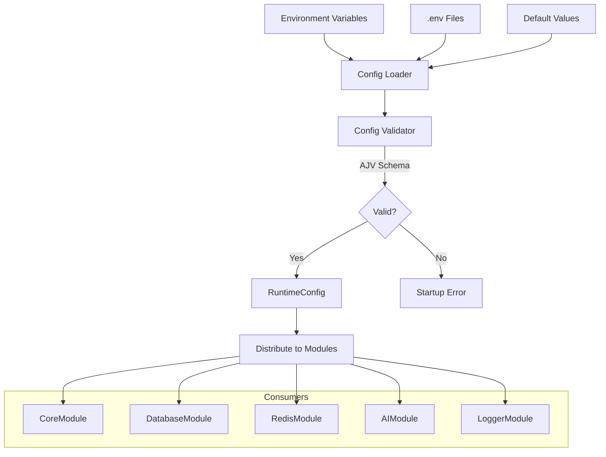
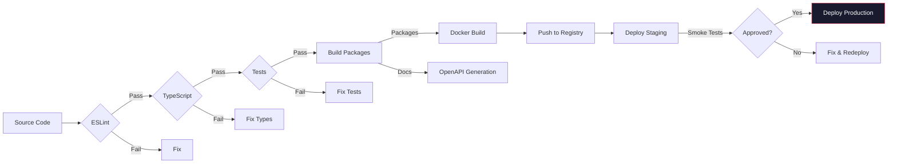

# Runtime Architecture Diagrams

## 1. Monorepo Structure

## 2. NestJS Module Graph

## 3. Package Dependency Graph

## 4. Runtime Lifecycle

## 5. Plugin Lifecycle

## 6. Event Flow

## 7. Configuration Flow

## 8. Build Pipeline

