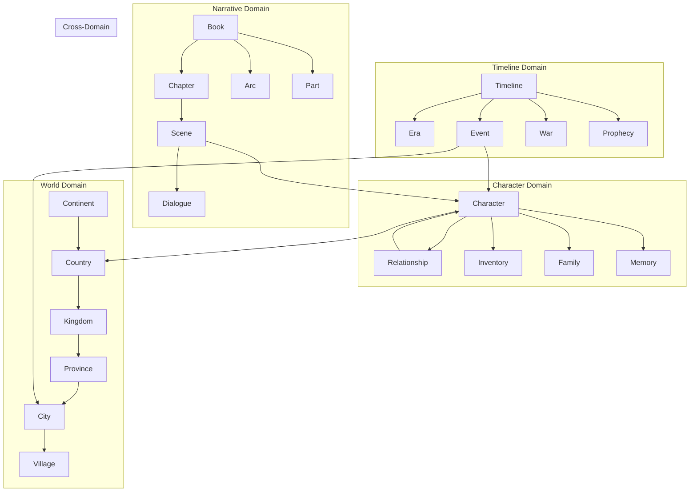
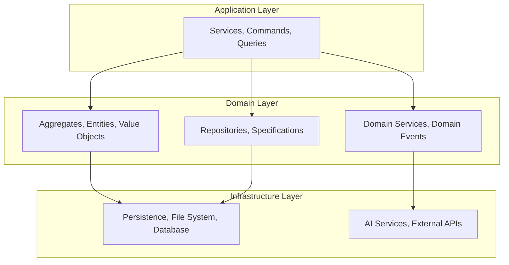
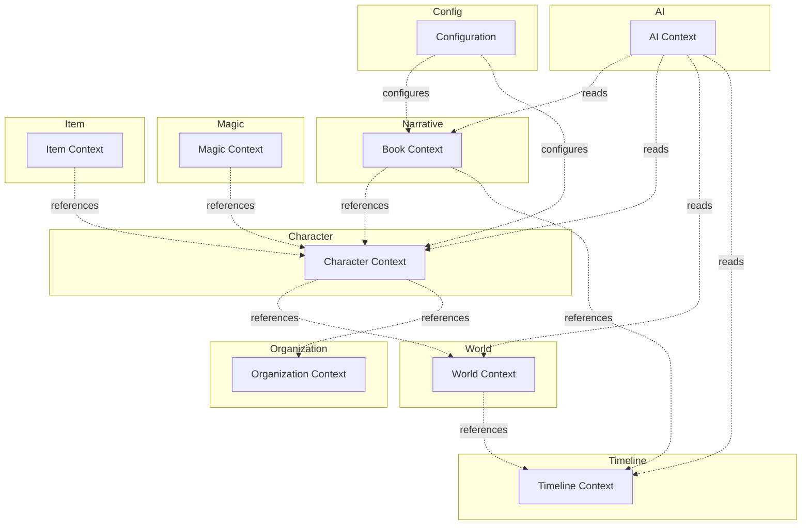
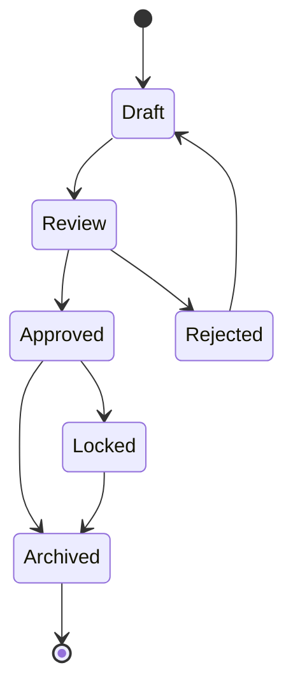

# Domain Model Architecture

## System Architecture Document

**Version:** 0.1.0 | **Last Updated:** 2026-07-17

---

## 1. Domain Overview

The Storynaram Domain Model defines every entity, relationship, behavior, and rule in the Story Operating System. Built on Domain-Driven Design principles, it is the authoritative blueprint for all data structures and business logic.



---

## 2. Design Principles

| Principle | Application |
|-----------|-------------|
| **Domain-Driven Design** | Bounded contexts, ubiquitous language, aggregates |
| **Entity Identity** | Every entity has a globally unique ID |
| **Aggregate Consistency** | Aggregates are transactional boundaries |
| **Reference by ID** | Cross-aggregate references use IDs only |
| **Event-Driven** | State changes produce domain events |
| **Read/Write Separation** | Commands and queries are separated |
| **Layered Architecture** | Domain is isolated from infrastructure |
| **Persistence Ignorance** | Domain model is independent of storage |

---

## 3. Layer Architecture



### 3.1 Application Layer
- **Services**: Orchestrate application workflows
- **Commands**: Encapsulate write operations
- **Queries**: Encapsulate read operations
- **DTOs**: Data transfer objects

### 3.2 Domain Layer
- **Aggregates**: Consistency boundaries
- **Entities**: Objects with identity
- **Value Objects**: Immutable descriptive objects
- **Domain Services**: Stateless domain logic
- **Domain Events**: Significant occurrences
- **Repositories**: Collection-like persistence access

### 3.3 Infrastructure Layer
- **Persistence**: File system, database adapters
- **AI Services**: AI model integration
- **External APIs**: Third-party integrations

---

## 4. Bounded Contexts



---

## 5. Aggregate Design

| Aggregate Root | Entities | Value Objects |
|---------------|----------|---------------|
| **Project** | Project, Series | Metadata, Config |
| **Book** | Book, Part, Arc, Chapter, Scene, Dialogue | Metadata, Outline |
| **Character** | Character, Hero, Villain, NPC | Name, Description, Stats |
| **World** | Continent, Country, City, Location | Coordinates, Geography |
| **Timeline** | Timeline, Era, Event, War | DateRange, Duration |
| **Organization** | Organization, Guild, Army | Hierarchy, Membership |
| **Magic** | Magic, Spell, Skill | Power, Element |
| **Item** | Item, Weapon, Armor | Value, Weight |

---

## 6. Entity Identity

Every entity has a globally unique identifier:

```
{prefix}_{sequence}
```

- **Prefix**: 2-5 character domain prefix (hero_, city_, event_)
- **Sequence**: Zero-padded decimal, minimum 6 digits
- **Example**: `hero_000001`, `city_000042`

### Identity Rules
1. IDs are permanent — never change or reuse
2. IDs are globally unique across all entities
3. IDs are assigned at creation, never modified
4. Cross-entity references always use IDs

---

## 7. Relationship Types

| Type | Symbol | Semantics | Example |
|------|--------|-----------|---------|
| **Composition** | ◆— | Parent owns child; child cannot exist without parent | Book ◆— Chapter |
| **Aggregation** | ◇— | Parent contains child; child can exist independently | Guild ◇— Member |
| **Association** | — | Entities know about each other | Character — Scene |
| **Dependency** | - - > | Entity depends on another | Scene - - > Location |
| **Inheritance** | —▷ | Type specialization | Character —▷ Hero |

---

## 8. Domain Events

Domain events capture significant occurrences:

```
CharacterCreated
CharacterUpdated
CharacterDeleted
BookPublished
ChapterCompleted
SceneWritten
TimelineUpdated
CanonChanged
RelationshipCreated
RelationshipRemoved
MagicUnlocked
LocationChanged
ValidationFailed
ExportComplete
```

---

## 9. Lifecycle

All entities follow a standard lifecycle with type-specific variations:



---

## 10. Database Readiness

The domain model is designed for storage-agnostic deployment:

| Database | Mapping Strategy | Key Strength |
|----------|-----------------|--------------|
| **SQLite** | Flat tables, JSON columns | Portability |
| **PostgreSQL** | Normalized tables, JSONB | Relational queries |
| **Neo4j** | Nodes = entities, edges = relationships | Graph traversal |
| **MongoDB** | Documents = aggregates | Flexible schema |
| **Vector DB** | Entity embeddings | Semantic search |

---

## 11. Scalability Targets

| Dimension | Target |
|-----------|--------|
| Books | 100+ |
| Characters | 100,000+ |
| Relationships | Millions |
| Timeline events | Millions |
| Concurrent users | 100+ |
| AI requests/hour | 10,000+ |
| Storage | Multi-terabyte |
