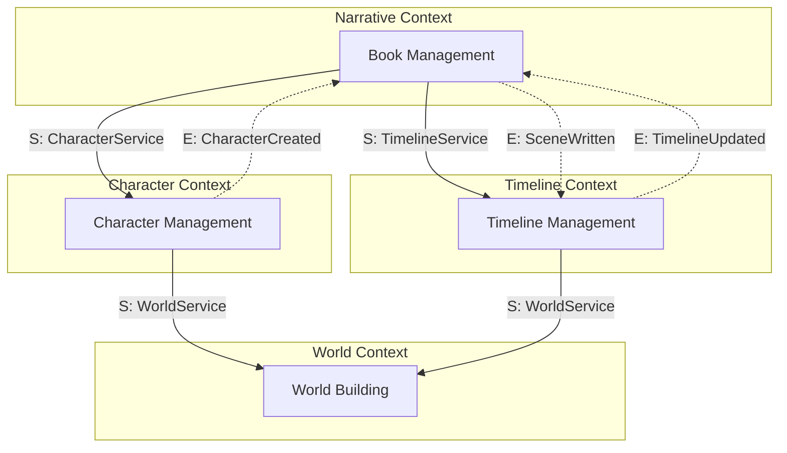

# Domain-Driven Design Patterns

## Application of DDD to the Storynaram Domain Model

---

## 1. Bounded Contexts

### Context Definitions

| Bounded Context | Domain | Ubiquitous Language | Core Entities |
|----------------|--------|---------------------|---------------|
| **Narrative** | Books, chapters, scenes, plots | Book, Chapter, Scene, Dialogue, Plot, Arc | Book, Chapter, Scene |
| **Character** | Characters, relationships, psychology | Character, Hero, Villain, Relationship, Family, Inventory | Character |
| **World** | Geography, locations, ecology | Continent, Country, City, Location, Climate | World, Location |
| **Timeline** | Chronology, events, eras | Event, Era, Calendar, War, Prophecy | Timeline, Event |
| **Organization** | Groups, societies, hierarchies | Organization, Guild, Army, Clan, Government | Organization |
| **Magic** | Magic systems, spells, artifacts | Magic, Spell, Skill, Curse, Artifact | Magic, Spell |
| **Item** | Objects, equipment, treasures | Item, Weapon, Armor, Artifact, Currency | Item |
| **AI** | Knowledge, retrieval, reasoning | Knowledge, Graph, Context, Memory, Canon | AI services |
| **Configuration** | Settings, rules, metadata | Config, Rule, Tag, Glossary | Project, Config |

### Context Relationships
| Relationship | Type | Description |
|-------------|------|-------------|
| Narrative → Character | Partnership | Characters appear in narrative |
| Narrative → Timeline | Partnership | Events occur within narrative |
| Character → World | Partnership | Characters exist in world locations |
| Character → Organization | Partnership | Characters join organizations |
| World → Timeline | Partnership | World changes over time |
| Magic → Character | Partnership | Characters use magic |
| Item → Character | Partnership | Characters own items |
| AI → All | Conformist | AI reads from all contexts |

---

## 2. Aggregate Roots

| Aggregate Root | Bounded Context | Transactional Boundary |
|---------------|----------------|----------------------|
| **Project** | Configuration | Project settings, series list |
| **Book** | Narrative | Book, parts, chapters, scenes, arcs |
| **Character** | Character | Character, relationships, inventory, family |
| **World** | World | Geography hierarchy, locations |
| **Timeline** | Timeline | Eras, calendars, events |
| **Organization** | Organization | Org hierarchy, membership |
| **Magic** | Magic | Magic system, spells, skills |
| **Item** | Item | Item data, variants |

### Aggregate Rules
1. **Identity**: Each aggregate root has a globally unique ID
2. **Consistency**: All internal state is consistent within the aggregate
3. **References**: External entities reference the aggregate root by ID only
4. **Persistence**: The aggregate root is the unit of persistence
5. **Transactions**: A transaction spans exactly one aggregate instance

---

## 3. Entities vs. Value Objects

### Entities (have identity)
| Entity | Identity | Mutable |
|--------|----------|---------|
| Character | character ID | Yes |
| Book | book ID | Yes |
| Scene | scene ID | Yes |
| Event | event ID | Yes |
| Location | location ID | Yes |
| Item | item ID | Yes |
| Organization | organization ID | Yes |

### Value Objects (no identity, immutable)
| Value Object | Attributes | Used By |
|-------------|------------|---------|
| Name | first, last, title, suffix | Character |
| Coordinates | latitude, longitude, elevation | Location, Event |
| DateRange | start, end, isApproximate | Timeline, Event |
| Money | amount, currency | Item, Economy |
| Address | street, city, country, coordinates | Location, Character |
| Measurement | value, unit | Item, World |
| Description | short, long, full | All entities |
| Metadata | identity, audit, version, status | All entities |
| Reference | id, type, role | All entities |
| Tag | name, category | All entities |
| Duration | value, unit | Timeline, Magic |
| Power | value, unit | Magic, Technology |
| Weight | value, unit | Item |
| Color | hex, rgb, name | World, Magic |

---

## 4. Domain Services

| Service | Context | Operation |
|---------|---------|-----------|
| CharacterIdentityService | Character | Ensures unique character identities across the project |
| WorldGeographyService | World | Validates that geographical hierarchies are consistent |
| TimelineValidationService | Timeline | Ensures chronological consistency of events |
| RelationshipService | Character | Manages character relationship graph integrity |
| CanonValidationService | All | Validates entity data against canon |
| NamingService | All | Ensures naming convention compliance |
| MagicConsistencyService | Magic | Ensures magic system rules are not violated |
| AgeCalculationService | Character | Calculates and validates character ages against timeline |

---

## 5. Domain Events

| Event | Source | Description |
|-------|--------|-------------|
| CharacterCreated | Character Service | A new character entity was created |
| CharacterUpdated | Character Service | A character entity was modified |
| CharacterDeleted | Character Service | A character entity was archived |
| BookPublished | Book Service | A book's status changed to published |
| ChapterCompleted | Chapter Service | A chapter was completed |
| SceneWritten | Scene Service | A scene was written/updated |
| TimelineUpdated | Timeline Service | A timeline event was added or changed |
| CanonChanged | Canon Service | An entity's canon status changed |
| RelationshipCreated | Relationship Service | A relationship between entities was created |
| RelationshipRemoved | Relationship Service | A relationship was removed |
| MagicUnlocked | Magic Service | A magic ability was unlocked for a character |
| LocationChanged | World Service | A location's state changed |
| ValidationFailed | Validation Service | A validation check failed |

---

## 6. Specifications

| Specification | Purpose | Used By |
|--------------|---------|---------|
| CharacterByTypeSpec | Filter characters by hero/villain/etc. | CharacterRepository |
| SceneByChapterSpec | Get all scenes in a chapter | SceneRepository |
| EventsByDateRangeSpec | Get events between two dates | EventRepository |
| LocationByParentSpec | Get all child locations | LocationRepository |
| EntityByStatusSpec | Filter entities by lifecycle status | All repositories |
| EntityByTagSpec | Filter entities by tag | All repositories |

---

## 7. Anti-Corruption Layer

| Translation | From | To |
|-------------|------|-----|
| AI Knowledge → Domain Entity | AI knowledge packet | Character/Book/Scene entity |
| Import Format → Domain Entity | External JSON/CSV | Domain entity |
| Export → External Format | Domain entity | Markdown/EPUB/PDF |
| Legacy → Current | Old entity version | Current entity format |

---

## 8. Context Mapping

