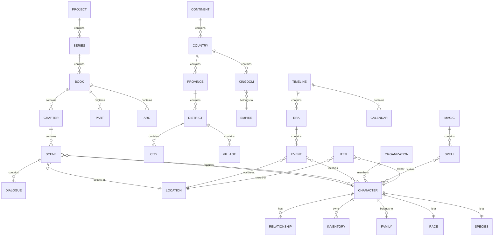
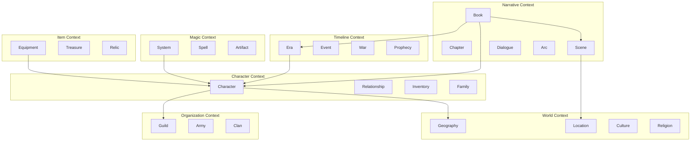
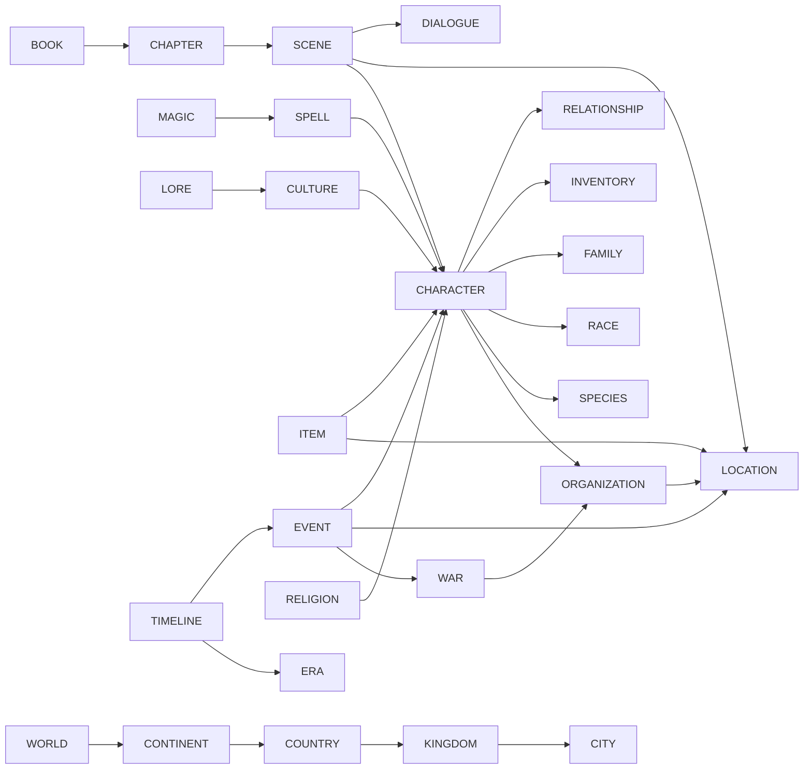
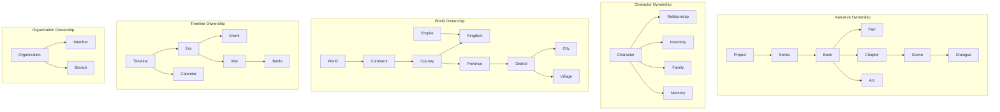
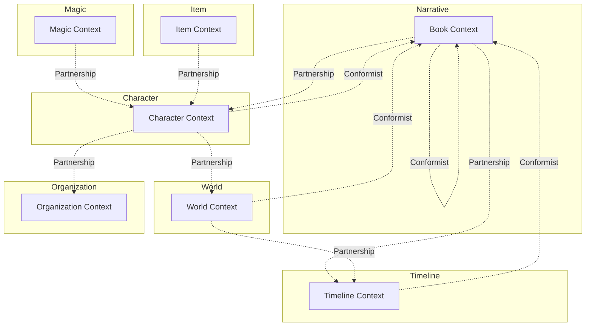
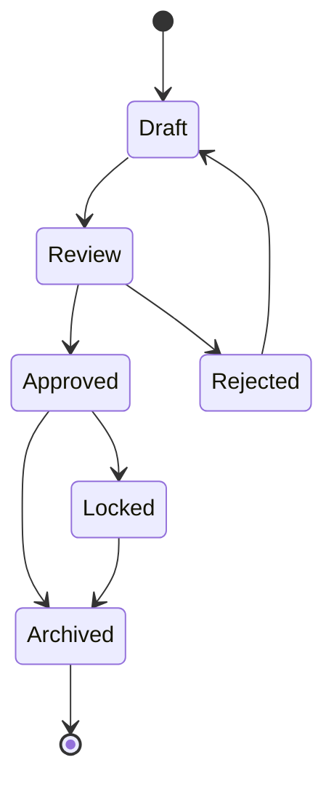
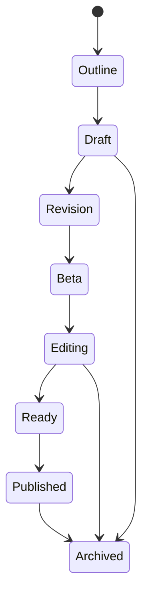
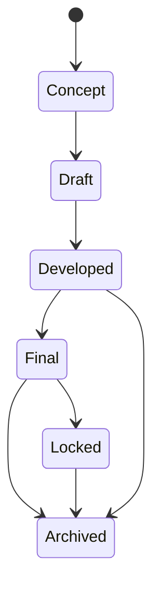

# Domain Diagrams

## Architectural and Design Visualizations

---

## 1. Entity Relationship Diagram

---

## 2. Aggregate Diagram

```mermaid
graph TB
    subgraph "Book Aggregate"
        B[Book ◆]
        B --> CH[Chapter]
        B --> P[Part]
        B --> A[Arc]
        CH --> S[Scene]
        S --> D[Dialogue]
    end

    subgraph "Character Aggregate"
        C[Character ◆]
        C --> R[Relationship]
        C --> I[Inventory]
        C --> F[Family]
        C --> M[Memory]
    end

    subgraph "World Aggregate"
        W[World ◆]
        W --> CN[Continent]
        CN --> CY[Country]
        CY --> KG[Kingdom]
        CY --> PV[Province]
        PV --> CT[City]
    end

    subgraph "Timeline Aggregate"
        T[Timeline ◆]
        T --> ER[Era]
        T --> CA[Calendar]
        ER --> EV[Event]
    end

    subgraph "Organization Aggregate"
        O[Organization ◆]
        O --> GB[Guild]
        O --> AR[Army]
        O --> CL[Clan]
    end

    subgraph "Magic Aggregate"
        M2[Magic ◆]
        M2 --> SP[Spell]
        M2 --> SK[Skill]
        M2 --> AB[Ability]
    end

    subgraph "Item Aggregate"
        I2[Item ◆]
        I2 --> WP[Weapon]
        I2 --> AM[Armor]
        I2 --> PO[Potion]
        I2 --> AR2[Artifact]
    end
```

---

## 3. Package / Context Diagram

---

## 4. Dependency Graph

---

## 5. Inheritance Hierarchy

```mermaid
graph TB
    subgraph "Character Inheritance"
        CH[Character]
        CH --> HE[Hero]
        CH --> HN[Heroine]
        CH --> VL[Villain]
        CH --> AH[AntiHero]
        CH --> SP[Supporting]
        CH --> CV[Civilian]
        CH --> RL[Ruler]
        CH --> NPC[NPC]
        CH --> CR[Creature]
        CH --> MO[Monster]
        CH --> ST[Spirit]
        CH --> GD[God]
    end

    subgraph "Location Inheritance"
        LOC[Location]
        LOC --> CT2[Continent]
        LOC --> CY2[Country]
        LOC --> KG2[Kingdom]
        LOC --> EM[Empire]
        LOC --> PR[Province]
        LOC --> DI[District]
        LOC --> CI[City]
        LOC --> VI[Village]
        LOC --> CA[Castle]
        LOC --> TE[Temple]
        LOC --> FO[Forest]
        LOC --> MT[Mountain]
        LOC --> RV[River]
        LOC --> OC[Ocean]
        LOC --> IS[Island]
        LOC --> CV2[Cave]
        LOC --> DU[Dungeon]
        LOC --> LM[Landmark]
    end

    subgraph "Organization Inheritance"
        ORG[Organization]
        ORG --> GU[Guild]
        ORG --> AR2[Army]
        ORG --> RG[Religion]
        ORG --> GV[Government]
        ORG --> SS[SecretSociety]
        ORG --> CM[Company]
        ORG --> CL2[Clan]
        ORG --> TR[Tribe]
    end

    subgraph "Magic Inheritance"
        MG[Magic]
        MG --> MS[System]
        MG --> SP2[Spell]
        MG --> SK[Skill]
        MG --> AB[Ability]
        MG --> CU[Curse]
        MG --> BL[Blessing]
        MG --> AF[Artifact]
        MG --> EL[Element]
    end

    subgraph "Item Inheritance"
        IT[Item]
        IT --> WP[Weapon]
        IT --> AM2[Armor]
        IT --> PO[Potion]
        IT --> TR2[Treasure]
        IT --> RE[Relic]
        IT --> BK[Book]
        IT --> DC[Document]
        IT --> CR2[Currency]
        IT --> FD[Food]
        IT --> MD[Medicine]
    end
```

---

## 6. Ownership / Containment Diagram

---

## 7. Context Map

---

## 8. Lifecycle State Machines

### Standard Entity Lifecycle

### Book Lifecycle

### Character Lifecycle

