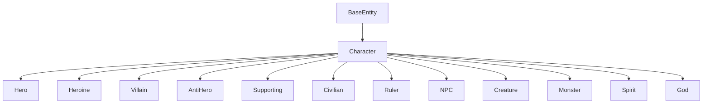
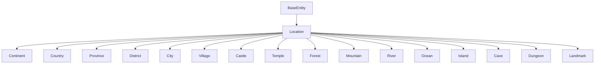
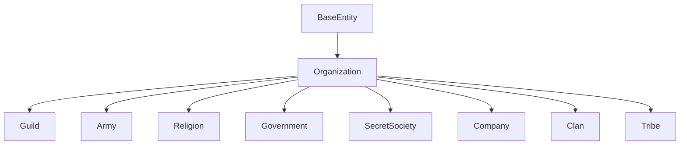
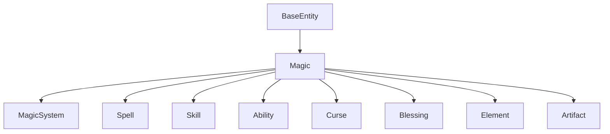
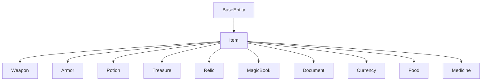

# Inheritance and Specialization

## Entity Type Hierarchies

---

## 1. Inheritance Model

The domain uses inheritance for type specialization. All entities inherit from `BaseEntity`:

```
BaseEntity
├── NarrativeEntity
│   ├── Book, Series, Chapter, Scene, Dialogue, Arc, Part
├── CharacterEntity
│   ├── Character
├── WorldEntity
│   ├── World, Continent, Country, Province, District, City, Village, Location
├── TimelineEntity
│   ├── Timeline, Era, Event, Calendar, War, Battle, Prophecy
├── OrganizationEntity
│   ├── Organization, Guild, Army, Clan, Government, SecretSociety
├── MagicEntity
│   ├── Magic, Spell, Skill, Ability, Curse, Blessing, Element
├── ItemEntity
│   ├── Item, Weapon, Armor, Potion, Artifact, Currency
├── CulturalEntity
│   ├── Lore, Culture, Religion, Language
├── ConfigEntity
│   ├── Config, Rule, Tag, Glossary
```

---

## 2. BaseEntity Components

All entities inherit:

| Component | Description |
|-----------|-------------|
| entityId | Globally unique identifier |
| entityType | Discriminator for entity type |
| metadata | Created/Updated/Version/Status |
| tags | Associative tags |
| references | Cross-entity references |
| auditTrail | Change history |

---

## 3. Character Specialization



### Character Subtype Attributes

| Subtype | Required Fields | Additional Fields |
|---------|----------------|-------------------|
| Hero | archetype, motivation, flaw | moralAlignment, questGoal |
| Heroine | archetype, motivation, flaw | moralAlignment, questGoal |
| Villain | motivation, evilAspect | masterPlan, minions |
| AntiHero | moralAmbiguity, motivation | redemptionArc, code |
| Supporting | relationToProtagonist | expertise |
| Civilian | occupation | dailyRoutine |
| Ruler | domain, title | succession, policies |
| NPC | serviceRole | shopInventory, questOffered |
| Creature | habitat, diet | packStatus, tameness |
| Monster | threatLevel, origin | weakness, lootDrop |
| Spirit | domain, supernaturalType | possessionAbility, ethereal |
| God | domain, powerLevel | worshipers, divineIntervention |

---

## 4. Location Specialization



### Location Subtype Attributes

| Subtype | Required Fields | Additional Fields |
|---------|----------------|-------------------|
| Continent | area, climateZones | tectonicActivity |
| Country | government, capital, population | exports, alliances |
| Province | ruler, resources | taxRegion |
| District | type, population | industry |
| City | population, defenses | economyLevel, districts |
| Village | population, industry | exportsTo |
| Castle | defensiveStrength, owner | siegeHistory |
| Temple | deity, religion | clergyCount |
| Forest | forestType, canopyCover | mythicalCreatures |
| Mountain | height, volcanic | peakName |
| River | length, source | navigability |
| Ocean | area, averageDepth | currents |
| Island | area, isolationLevel | endemicSpecies |
| Cave | depth, caveSystem | undergroundLake |
| Dungeon | difficulty, cleared | bosses, treasure |
| Landmark | significance, age | visitingHours |

---

## 5. Organization Specialization



### Organization Subtype Attributes

| Subtype | Required Fields | Additional Fields |
|---------|----------------|-------------------|
| Guild | trade, tier | headquarters, membersCount |
| Army | militaryType, size | rankStructure, battles |
| Religion | deity, dogma | followers, holyText |
| Government | formOfGov, ruler | branches, successionLaw |
| SecretSociety | hiddenAgenda, symbols | initiationRite |
| Company | industry, revenue | ceo, stock |
| Clan | foundingFamily, crest | bloodFeuds |
| Tribe | culture, territory | traditions |

---

## 6. Magic Specialization



### Magic Subtype Attributes

| Subtype | Required Fields | Additional Fields |
|---------|----------------|-------------------|
| System | source, cost, limitation | rules, practitioners |
| Spell | school, level, effect | components, incantation |
| Skill | type, levelRequirement | prerequisites |
| Ability | origin, cooldown | innateOrLearned |
| Curse | creator, trigger | breakingCondition |
| Blessing | giver, duration | effects |
| Element | domain, alignment | affinities |
| Artifact | power, origin | wielder, curse |

---

## 7. Item Specialization



### Item Subtype Attributes

| Subtype | Required Fields | Additional Fields |
|---------|----------------|-------------------|
| Weapon | damage, weaponType | range, material |
| Armor | defense, armorType | coverage, weight |
| Potion | effect, duration | potency, sideEffects |
| Treasure | value, rarity | historicalSignificance |
| Relic | age, origin | magicalProperty |
| Book | author, subject | knowledgeRequired |
| Document | author, date | authenticity |
| Currency | value, mint | exchangeRate |
| Food | nutrition, cuisineType | perishability |
| Medicine | healingPower, ailment | addictionRisk |

---

## 8. Inheritance Design Decisions

| Decision | Rationale |
|----------|-----------|
| Single inheritance only | Avoid ambiguity of multiple inheritance |
| Deep hierarchy (max 3 levels) | Balance specificity with maintainability |
| Discriminator pattern | `entityType` field identifies subtype at runtime |
| Optional subtype fields | Fields are added per subtype, not forced on base |
| Base entity is abstract | Core fields apply to all entities |
| Subtypes add validation | Each subtype validates its own required fields |
