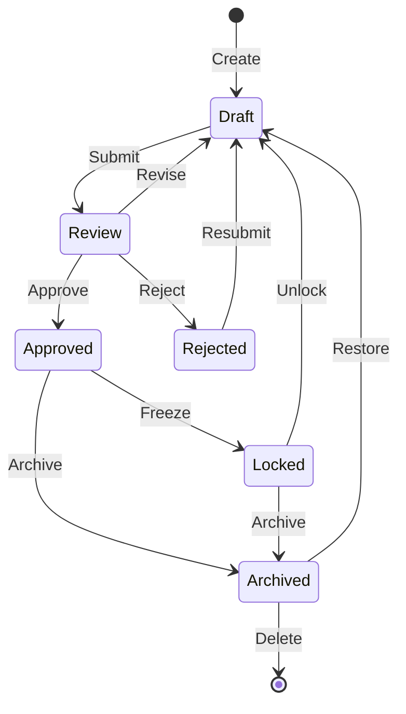
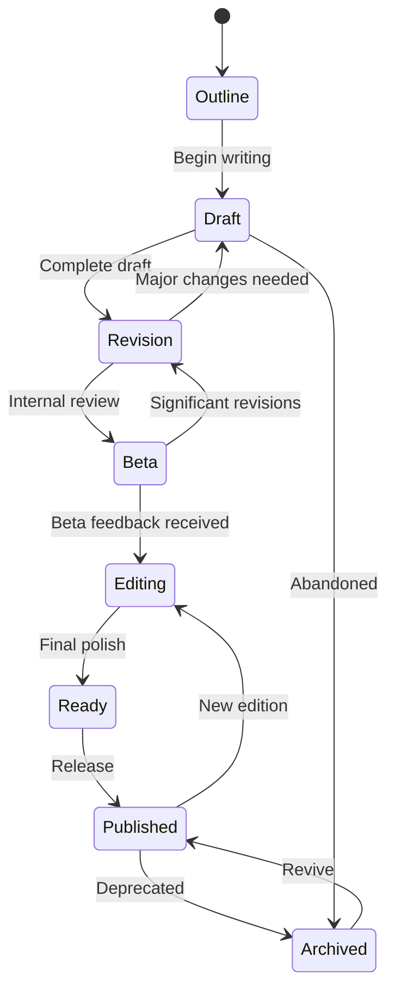
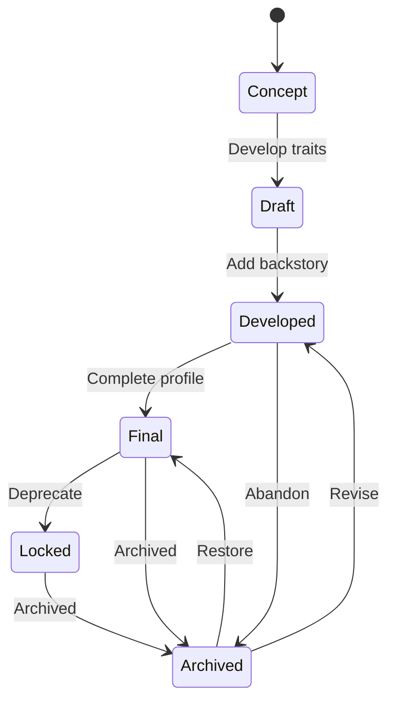
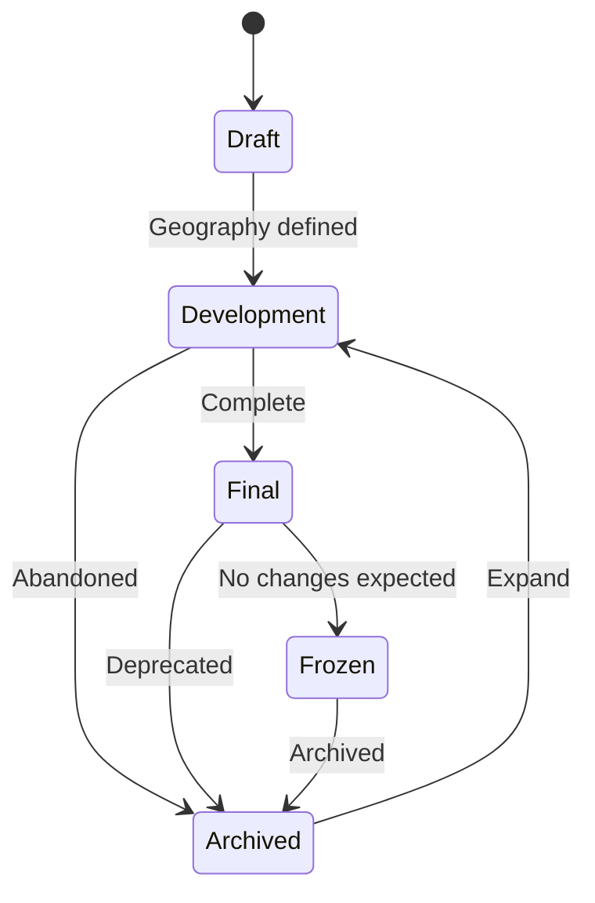
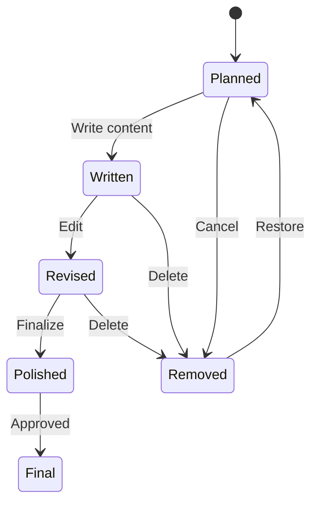
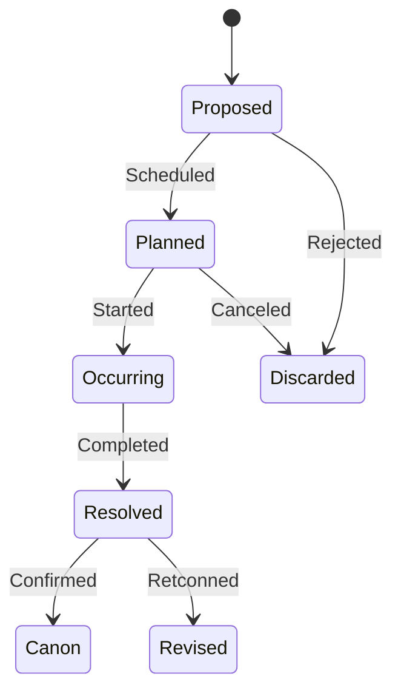

# Entity Lifecycles

## State Machines and Transitions

---

## 1. Common Base Lifecycle

| Transition | Trigger | Description |
|-----------|---------|-------------|
| Create | Entity creation | Initial draft state |
| Submit | User action | Send for review |
| Approve | Review action | Accept as final |
| Reject | Review action | Return for revision |
| Revise | User action | Modify after rejection |
| Freeze | Lock action | Prevent further edits |
| Archive | Archive action | Mark as historical |
| Unlock | Unlock action | Allow edits again |
| Restore | Restore action | Bring back from archive |
| Delete | Delete action | Permanently remove |

---

## 2. Book Lifecycle

| State | Description | Allowed Actions |
|-------|-------------|-----------------|
| Outline | Chapter-by-chapter plan | Add/edit chapters, scenes |
| Draft | First draft writing | Write/edit content |
| Revision | Self-revision | Edit, restructure |
| Beta | External feedback | Read-only + annotations |
| Editing | Line/copy editing | Edit formatting, grammar |
| Ready | Finalized | Read-only |
| Published | Released | Distribution |
| Archived | Historical record | Read-only |

---

## 3. Character Lifecycle

| State | Description | Allowed Actions |
|-------|-------------|-----------------|
| Concept | Basic idea, name, archetype | Edit basic info |
| Draft | Core traits, description | Edit traits, appearance |
| Developed | Full backstory, relationships | Edit all fields |
| Final | Complete, canon | Read-only |
| Locked | Frozen, no changes | Read-only (special override) |
| Archived | Historical | Read-only |

---

## 4. World Lifecycle

| State | Description | Allowed Actions |
|-------|-------------|-----------------|
| Draft | Initial concepts | Add continents, basic geography |
| Development | Building locations, cultures | Add all geography entities |
| Final | World complete | Read-only |
| Frozen | Locked for series canon | Read-only |
| Archived | Historical record | Read-only |

---

## 5. Scene Lifecycle

| State | Description | Allowed Actions |
|-------|-------------|-----------------|
| Planned | Outline only | Edit outline, assign characters |
| Written | First draft | Edit dialogue, narration |
| Revised | Edit pass | Edit prose, structure |
| Polished | Ready for review | Minor edits only |
| Final | Approved | Read-only |
| Removed | Soft-deleted | Restore or permanent delete |

---

## 6. Event Lifecycle

| State | Description |
|-------|-------------|
| Proposed | Suggested event |
| Planned | Added to timeline |
| Occurring | Active event in progress |
| Resolved | Event completed |
| Canon | Confirmed part of history |
| Discarded | Rejected or canceled |
| Revised | Modified after resolution |

---

## 7. Item / Magic / Organization Lifecycle

| State | Item | Magic | Organization |
|-------|------|-------|-------------|
| Draft | Conceptual | Conceptual | Conceptual |
| Available | Passive | Active | Active |
| Owned | Owned | — | — |
| Consumed | Used up | — | — |
| Restricted | — | Restricted | Inactive |
| Lost | — | Lost | Defunct |
| Destroyed | Destroyed | — | — |
| Archived | Archived | Archived | Archived |

---

## 8. State Transition Rules

| Transition Rule | Description |
|----------------|-------------|
| Sequential transitions | States normally progress forward; regression requires explicit override |
| Review gate | Draft → Approved requires review approval |
| Archive from any | Most states allow direct transition to Archived |
| Locked immutability | Locked/Frozen states require special override for any change |
| Soft deletion | Archived/Removed acts as soft delete; data is preserved |
| Immutable audit | All state transitions are logged with timestamp and actor |
