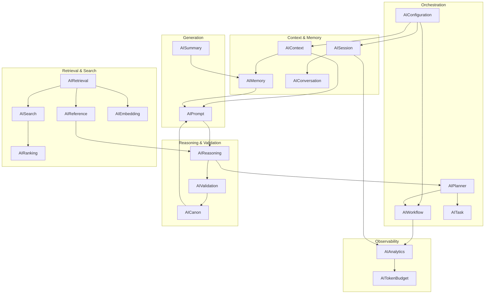
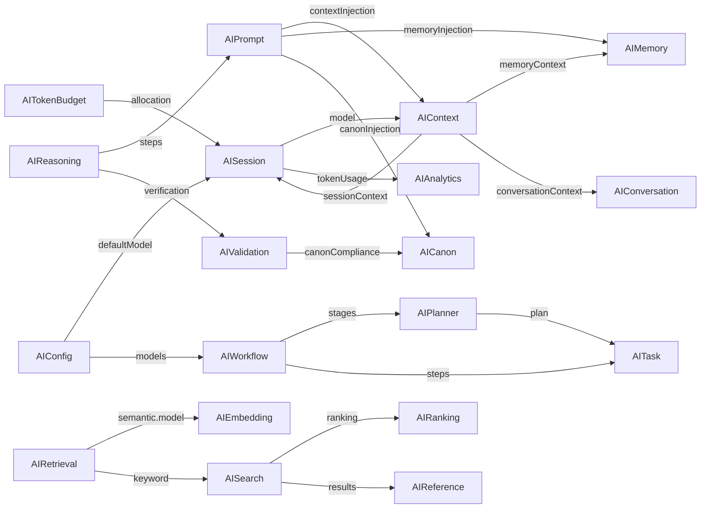
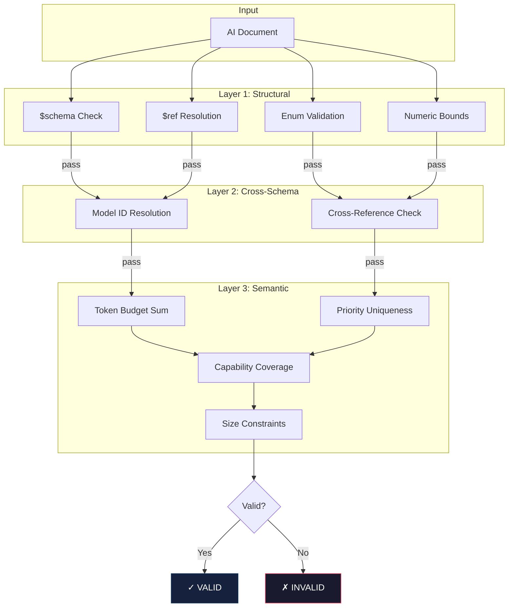
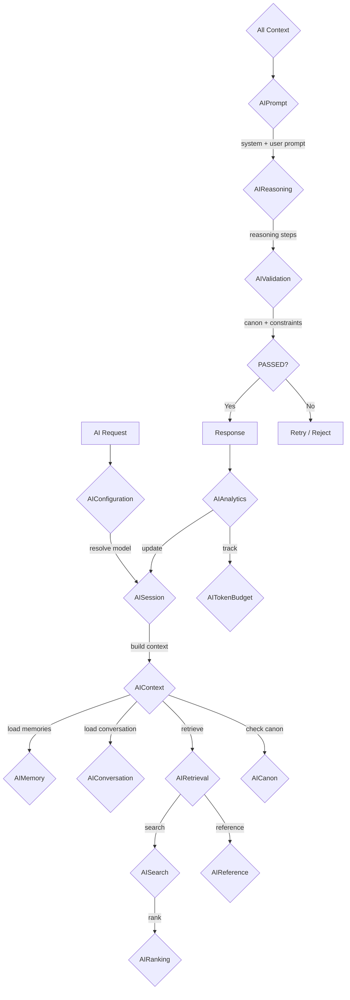
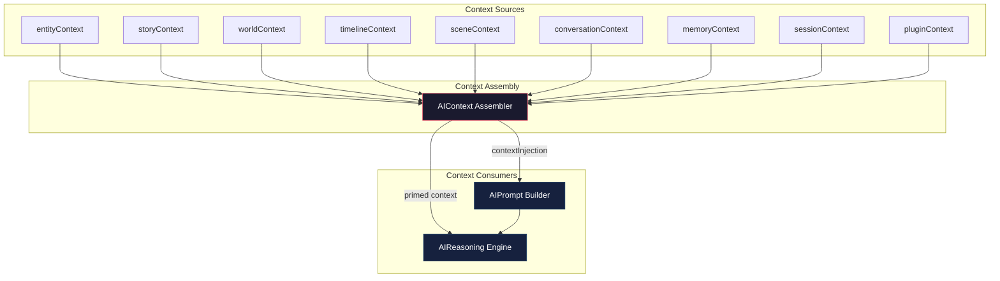
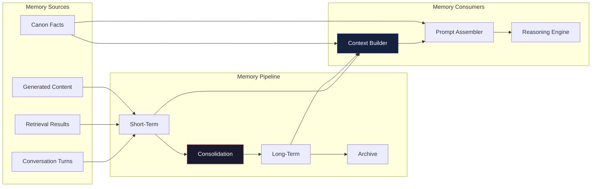

# AI Schema Diagrams

## 1. AI Schema Hierarchy

```mermaid
graph TB
    subgraph "Orchestration"
        CFG[AIConfiguration]
        WF[AIWorkflow]
        PL[AIPlanner]
        TK[AITask]
    end

    subgraph "Context & Memory"
        CTX[AIContext]
        MEM[AIMemory]
        SESS[AISession]
        CONV[AIConversation]
    end

    subgraph "Reasoning & Validation"
        REAS[AIReasoning]
        VAL[AIValidation]
        CAN[AICanon]
    end

    subgraph "Retrieval & Search"
        RET[AIRetrieval]
        SRCH[AISearch]
        RANK[AIRanking]
        REF[AIReference]
        EMB[AIEmbedding]
    end

    subgraph "Generation"
        PR[AIPrompt]
        SUM[AISummary]
    end

    subgraph "Observability"
        ANL[AIAnalytics]
        TB[AITokenBudget]
    end

    CFG --> CTX
    CFG --> SESS
    CFG --> WF
    CTX --> PR
    CTX --> MEM
    SESS --> CONV
    PR --> REAS
    REAS --> VAL
    VAL --> CAN
    REAS --> PL
    PL --> TK
    PL --> WF
    RET --> SRCH
    RET --> EMB
    SRCH --> RANK
    RET --> REF
    REF --> REAS
    MEM --> PR
    CAN --> PR
    SUM --> MEM
    WF --> ANL
    SESS --> ANL
    ANL --> TB
```

## 2. AI Reference Graph

```mermaid
graph LR
    AIConfig -->|defaultModel| AISession
    AIConfig -->|models| AIWorkflow
    AISession -->|model| AIContext
    AISession -->|tokenUsage| AIAnalytics
    AIContext -->|sessionContext| AISession
    AIContext -->|memoryContext| AIMemory
    AIContext -->|conversationContext| AIConversation
    AIPrompt -->|contextInjection| AIContext
    AIPrompt -->|memoryInjection| AIMemory
    AIPrompt -->|canonInjection| AICanon
    AIReasoning -->|steps| AIPrompt
    AIReasoning -->|verification| AIValidation
    AIValidation -->|canonCompliance| AICanon
    AIRetrieval -->|semantic.model| AIEmbedding
    AIRetrieval -->|keyword| AISearch
    AISearch -->|ranking| AIRanking
    AISearch -->|results| AIReference
    AIWorkflow -->|stages| AIPlanner
    AIWorkflow -->|steps| AITask
    AIPlanner -->|plan| AITask
    AITokenBudget -->|allocation| AISession
```

## 3. AI Validation Flow

```mermaid
flowchart TD
    subgraph "Input"
        DOC[AI Document]
    end

    subgraph "Layer 1: Structural"
        S1[$schema Check]
        S2[$ref Resolution]
        S3[Enum Validation]
        S4[Numeric Bounds]
    end

    subgraph "Layer 2: Cross-Schema"
        C1[Model ID Resolution]
        C2[Cross-Reference Check]
    end

    subgraph "Layer 3: Semantic"
        M1[Token Budget Sum]
        M2[Priority Uniqueness]
        M3[Capability Coverage]
        M4[Size Constraints]
    end

    DOC --> S1
    DOC --> S2
    DOC --> S3
    DOC --> S4

    S1 -->|pass| C1
    S2 -->|pass| C1
    S3 -->|pass| C2
    S4 -->|pass| C2

    C1 -->|pass| M1
    C2 -->|pass| M2

    M1 --> M3
    M2 --> M3
    M3 --> M4

    M4 --> RESULT{Valid?}
    RESULT -->|Yes| VALID[✓ VALID]
    RESULT -->|No| INVALID[✗ INVALID]

    style VALID fill:#16213e,stroke:#0f3460,color:#fff
    style INVALID fill:#1a1a2e,stroke:#e94560,color:#fff
```

## 4. AI Runtime Dependencies

```mermaid
graph TD
    REQ[AI Request] --> CFG{AIConfiguration}
    CFG -->|resolve model| SESS{AISession}
    SESS -->|build context| CTX{AIContext}
    CTX -->|load memories| MEM{AIMemory}
    CTX -->|load conversation| CONV{AIConversation}
    CTX -->|retrieve| RET{AIRetrieval}
    RET -->|search| SRCH{AISearch}
    SRCH -->|rank| RANK{AIRanking}
    RET -->|reference| REF{AIReference}
    CTX -->|check canon| CAN{AICanon}

    ALL{All Context} --> PR{AIPrompt}
    PR -->|system + user prompt| REAS{AIReasoning}
    REAS -->|reasoning steps| VAL{AIValidation}
    VAL -->|canon + constraints| PASS{PASSED?}
    PASS -->|Yes| RESP[Response]
    PASS -->|No| RETRY[Retry / Reject]

    RESP --> ANL{AIAnalytics}
    ANL -->|update| SESS
    ANL -->|track| TB{AITokenBudget}
```

## 5. AI Context Graph

```mermaid
graph TB
    subgraph "Context Sources"
        ECTX[entityContext]
        SCTX[storyContext]
        WCTX[worldContext]
        TCTX[timelineContext]
        SCCTX[sceneContext]
        CONVCTX[conversationContext]
        MEMCTX[memoryContext]
        SESCTX[sessionContext]
        PLGCTX[pluginContext]
    end

    subgraph "Context Assembly"
        ASSEMBLER[AIContext Assembler]
    end

    subgraph "Context Consumers"
        PROMPT[AIPrompt Builder]
        REASONER[AIReasoning Engine]
    end

    ECTX --> ASSEMBLER
    SCTX --> ASSEMBLER
    WCTX --> ASSEMBLER
    TCTX --> ASSEMBLER
    SCCTX --> ASSEMBLER
    CONVCTX --> ASSEMBLER
    MEMCTX --> ASSEMBLER
    SESCTX --> ASSEMBLER
    PLGCTX --> ASSEMBLER

    ASSEMBLER -->|contextInjection| PROMPT
    ASSEMBLER -->|primed context| REASONER
    PROMPT --> REASONER

    style ASSEMBLER fill:#1a1a2e,stroke:#e94560,color:#fff
    style PROMPT fill:#16213e,stroke:#0f3460,color:#fff
    style REASONER fill:#16213e,stroke:#0f3460,color:#fff
```

## 6. AI Memory Flow

```mermaid
flowchart LR
    subgraph "Memory Sources"
        CONV[Conversation Turns]
        RET[Retrieval Results]
        CAN[Canon Facts]
        GEN[Generated Content]
    end

    subgraph "Memory Pipeline"
        ST[Short-Term]
        CONSOL[Consolidation]
        LT[Long-Term]
        ARCH[Archive]
    end

    subgraph "Memory Consumers"
        CTX[Context Builder]
        PR[Prompt Assembler]
        RS[Reasoning Engine]
    end

    CONV --> ST
    RET --> ST
    GEN --> ST

    ST --> CONSOL
    CONSOL --> LT
    LT --> ARCH

    ST --> CTX
    LT --> CTX
    CAN --> CTX
    CTX --> PR
    PR --> RS

    CAN --> PR

    style CONSOL fill:#1a1a2e,stroke:#e94560,color:#fff
    style CTX fill:#16213e,stroke:#0f3460,color:#fff
```
