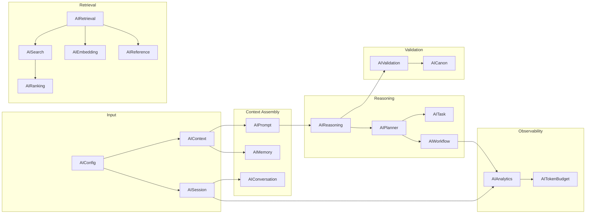

# AI Reference Model

## Cross-Schema Data Flow

## Schema Dependency Map

| Schema | Reads From | Written To | Consumed By |
|--------|-----------|------------|-------------|
| AIContext | AIConfig, AISession | AIPrompt | AIReasoning |
| AIMemory | AIContext, AIConfig | AIPrompt | AIReasoning |
| AIRetrieval | AIConfig | AISearch | AIReasoning |
| AIEmbedding | AIConfig | — | AIRetrieval, AISearch |
| AIPrompt | AIContext, AIMemory, AICanon | AIReasoning | — |
| AISummary | AIConfig | AIMemory | AIPrompt |
| AICanon | AIConfig | AIValidation | AIPrompt |
| AIReasoning | AIPrompt, AIRetrieval | AIValidation | AIPlanner |
| AIValidation | AIReasoning, AICanon | — | — |
| AISearch | AIRetrieval | AIRanking | — |
| AIRanking | AISearch | AIReference | — |
| AIReference | AIRetrieval | — | AIReasoning |
| AITokenBudget | AIConfig | — | AISession |
| AIConversation | AISession | AIMemory | — |
| AISession | AIConfig | AIContext | AIAnalytics |
| AIWorkflow | AIPlanner | AIAnalytics | AIConfig |
| AIPlanner | AIReasoning | AIWorkflow, AITask | — |
| AITask | AIPlanner | — | — |
| AIAnalytics | AISession, AIWorkflow | — | — |
| AIConfiguration | — | All | — |

## Entity AI Metadata

Entity-level AI configuration is handled by `BaseAI.schema.json` (core schemas), referenced via `BaseEntity.ai`. This covers:

- Content visibility for retrieval
- Embedding configuration (per-entity)
- Retrieval priority and weight
- Canon importance and lock status
- AI search keywords
- AI-generated notes
- Prompt overrides
