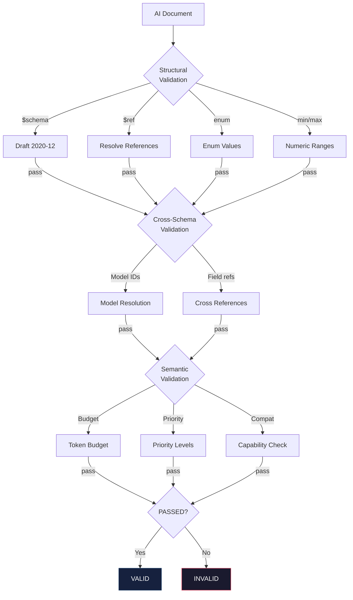

# AI Validation Guide

## Validation Layers

### Layer 1: Schema Structural Validation

Every AI schema validates:
- JSON Schema Draft 2020-12 compliance
- All `$ref` targets exist and are resolvable
- No circular `$ref` chains
- All enum values are valid
- All numeric constraints are satisfied

### Layer 2: Cross-Schema Validation

Runtime validation across schemas:
- AIConfiguration.defaultModel matches a models[].modelId
- AISession.model matches AIConfiguration.defaultModel or models[].modelId
- AIPlanner goal references valid decomposition subGoals
- AIWorkflow stages reference valid step stageIds

### Layer 3: Semantic Validation

- Token budget allocation sums do not exceed maxContextTokens
- Priority levels are unique and non-overlapping
- Model capabilities satisfy task requirements
- Chunk size < maxContextTokens
- Compression ratio between 0 and 1

## Validation Flow

## Common Validation Failures

| Error | Likely Cause | Fix |
|-------|-------------|-----|
| Unknown model ID in session | model not in AIConfiguration.models[] | Add model definition or correct modelId |
| Token budget exceeded | allocation sum > maxContextTokens | Reduce allocation or increase maxContextTokens |
| Invalid reasoning mode | typo in mode value | Use valid mode from enum |
| Missing required capability | task requires unsupported capability | Add capability or use different model |
| Compression ratio > 1 | ratio exceeds maximum | Set ratio <= 1 |
