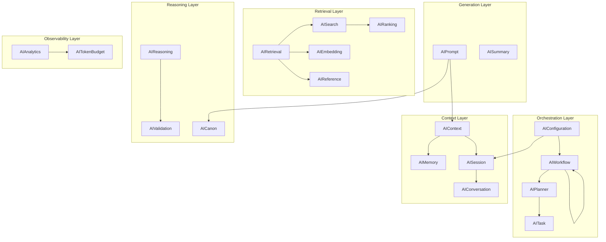

# AI Schema Framework

## Purpose

Machine-readable JSON Schema (Draft 2020-12) definitions for the Storynaram AI Runtime Engine. These schemas define the contracts for context assembly, memory management, prompt construction, retrieval, reasoning, validation, planning, workflow orchestration, analytics, and configuration.

## Design Principles

- **Model-agnostic** — No vendor-specific fields. Supports GPT, Claude, Gemini, Llama, Mistral, DeepSeek, and future models.
- **100% standalone** — AI schemas do NOT extend BaseEntity. They are runtime/config schemas, not narrative entities.
- **$defs pattern** — Reusable sub-types defined in `$defs` to avoid duplication.
- **All optional properties** — Every AI schema root property is optional, enabling partial configuration.
- **Draft 2020-12** — Uses latest JSON Schema features.

## Schema Catalog

| # | Schema | Runtime Role | Key Enums |
|---|--------|-------------|-----------|
| 1 | AIContext | Context assembly | — |
| 2 | AIMemory | Memory management | memory types |
| 3 | AIRetrieval | RAG strategy config | strategy on/off |
| 4 | AIEmbedding | Vector embedding metadata | strategy, refreshPolicy, indexStatus |
| 5 | AIPrompt | Prompt assembly | severity |
| 6 | AISummary | Auto-summarization | strategy |
| 7 | AICanon | Canon verification | verificationMode |
| 8 | AIReasoning | Reasoning engine | mode, step type, verification strategy |
| 9 | AIValidation | Output validation | strictness, method, overallResult |
| 10 | AISearch | Search configuration | strategy, operator, aggregation type |
| 11 | AIRanking | Multi-factor scoring | decayFunction |
| 12 | AIReference | Cross-reference tracking | memory type, sourceType |
| 13 | AITokenBudget | Token budget management | chunking, compression, overflow strategy |
| 14 | AIConversation | Conversation tracking | participant type, state |
| 15 | AISession | Session lifecycle | status |
| 16 | AIWorkflow | Multi-stage pipeline | stage type, step type, routing strategy |
| 17 | AIPlanner | Goal decomposition | step status, adaptation strategy, plan status |
| 18 | AITask | Task definition | type, format, backoff strategy |
| 19 | AIAnalytics | Telemetry & metrics | — |
| 20 | AIConfiguration | Root configuration | logging level, environment |

## Schema Hierarchy

