# Core Schema Framework

## Purpose

Machine-readable JSON Schema (Draft 2020-12) definitions for every base template in Storynaram. Every future JSON document must validate against these schemas. The schema layer is the single source of truth for machine validation.

## Design Principles

- **Direct mapping** — Each schema maps 1:1 to a corresponding Base Template from Phase 2.1
- **Draft 2020-12** — Uses latest JSON Schema features: $id, $ref, allOf, patternProperties, unevaluatedProperties, dependentSchemas
- **Composition via allOf** — BaseEntity composes Identifier + Metadata + Audit as required blocks; all others are optional $ref properties
- **Reuse via $ref** — No schema duplicates fields that exist in another schema
- **Versioned** — Every schema has explicit $id with version path

## Schema Catalog

| # | Schema | Template Source | Required |
|---|--------|----------------|----------|
| 1 | BaseEntity | — (composite) | identifier, metadata, audit |
| 2 | BaseIdentifier | BaseIdentifier | id, prefix, sequence, type |
| 3 | BaseMetadata | BaseMetadata | title, language |
| 4 | BaseAudit | BaseAudit | createdBy, createdAt, updatedBy, updatedAt |
| 5 | BaseVersion | BaseVersion | schemaVersion, templateVersion, entityVersion |
| 6 | BaseStatus | BaseStatus | status, state |
| 7 | BaseLifecycle | BaseLifecycle | currentState, states, transitions |
| 8 | BaseOwnership | BaseOwnership | ownerType, ownerId |
| 9 | BaseReference | BaseReference | none |
| 10 | BaseRelationship | BaseRelationship | none |
| 11 | BaseTag | BaseTag | none |
| 12 | BaseVisibility | BaseVisibility | visibility |
| 13 | BasePermission | BasePermission | none |
| 14 | BaseLocalization | BaseLocalization | none |
| 15 | BaseAttachment | BaseAttachment | none |
| 16 | BaseComment | BaseComment | none |
| 17 | BaseHistory | BaseHistory | none |
| 18 | BaseValidation | BaseValidation | none |
| 19 | BaseAI | BaseAI | none |
| 20 | BaseSearch | BaseSearch | none |
| 21 | BaseSecurity | BaseSecurity | none |
| 22 | BaseWorkflow | BaseWorkflow | none |
| 23 | BaseExtension | BaseExtension | none |

## Schema Hierarchy

```mermaid
graph TB
    BE[BaseEntity.schema.json] --> ID[BaseIdentifier.schema.json]
    BE --> MD[BaseMetadata.schema.json]
    BE --> AU[BaseAudit.schema.json]
    BE -.-> VE[BaseVersion.schema.json]
    BE -.-> ST[BaseStatus.schema.json]
    BE -.-> LC[BaseLifecycle.schema.json]
    BE -.-> OW[BaseOwnership.schema.json]
    BE -.-> RF[BaseReference.schema.json]
    BE -.-> RL[BaseRelationship.schema.json]
    BE -.-> TG[BaseTag.schema.json]
    BE -.-> VS[BaseVisibility.schema.json]
    BE -.-> PM[BasePermission.schema.json]
    BE -.-> LZ[BaseLocalization.schema.json]
    BE -.-> AT[BaseAttachment.schema.json]
    BE -.-> CM[BaseComment.schema.json]
    BE -.-> HY[BaseHistory.schema.json]
    BE -.-> VL[BaseValidation.schema.json]
    BE -.-> AI[BaseAI.schema.json]
    BE -.-> SR[BaseSearch.schema.json]
    BE -.-> SC[BaseSecurity.schema.json]
    BE -.-> WF[BaseWorkflow.schema.json]
    BE -.-> XT[BaseExtension.schema.json]

    style BE fill:#1a1a2e,stroke:#e94560,color:#fff
```



## $id Convention

```
https://storynaram.dev/schemas/core/{Name}.schema.json
```
