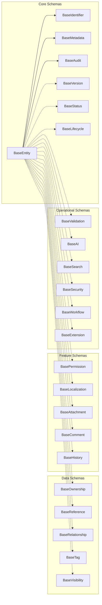
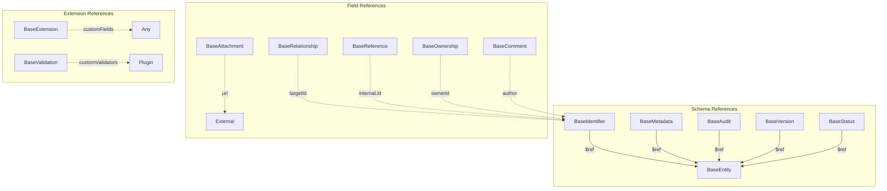
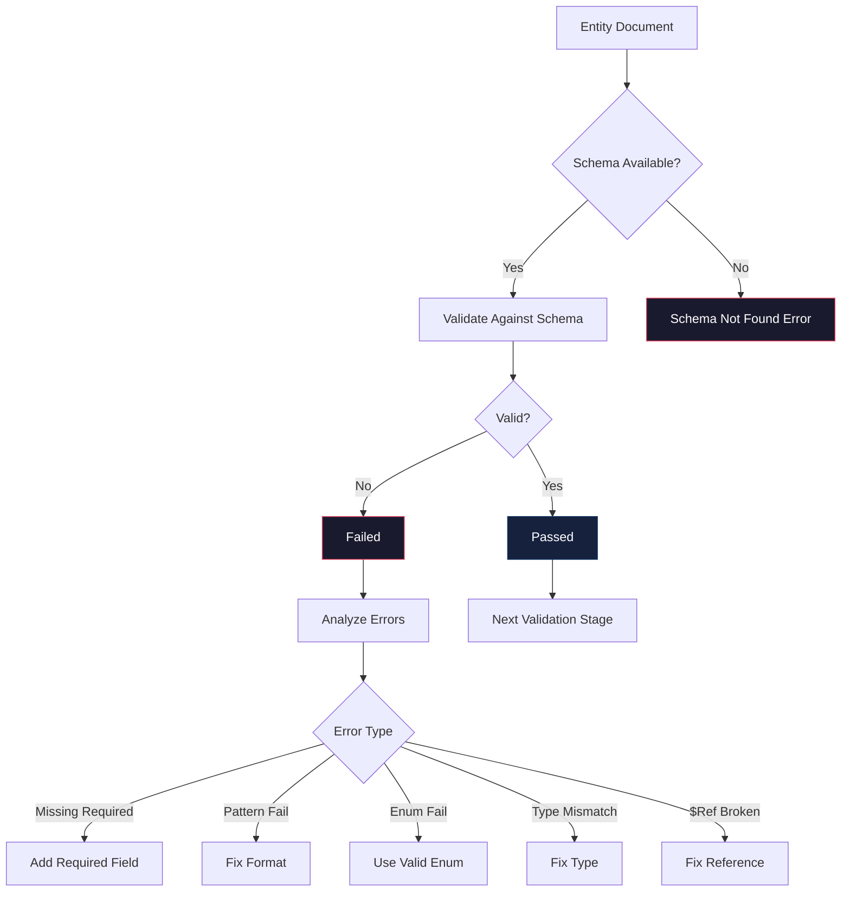

# Schema Framework Diagrams

## 1. Schema Dependency Graph

```mermaid
graph LR
    subgraph "Core Schemas"
        BE[BaseEntity]
        ID[BaseIdentifier]
        MD[BaseMetadata]
        AU[BaseAudit]
        VE[BaseVersion]
        ST[BaseStatus]
        LC[BaseLifecycle]
    end

    subgraph "Data Schemas"
        OW[BaseOwnership]
        RF[BaseReference]
        RL[BaseRelationship]
        TG[BaseTag]
        VS[BaseVisibility]
    end

    subgraph "Feature Schemas"
        PM[BasePermission]
        LZ[BaseLocalization]
        AT[BaseAttachment]
        CM[BaseComment]
        HY[BaseHistory]
    end

    subgraph "Operational Schemas"
        VL[BaseValidation]
        AI[BaseAI]
        SR[BaseSearch]
        SC[BaseSecurity]
        WF[BaseWorkflow]
        XT[BaseExtension]
    end

    BE --> ID
    BE --> MD
    BE --> AU
    BE -.-> VE
    BE -.-> ST
    BE -.-> LC
    BE -.-> OW
    BE -.-> RF
    BE -.-> RL
    BE -.-> TG
    BE -.-> VS
    BE -.-> PM
    BE -.-> LZ
    BE -.-> AT
    BE -.-> CM
    BE -.-> HY
    BE -.-> VL
    BE -.-> AI
    BE -.-> SR
    BE -.-> SC
    BE -.-> WF
    BE -.-> XT
```

## 2. Reference Graph

```mermaid
graph TB
    subgraph "Schema References"
        ID[BaseIdentifier] -->|$ref| BE[BaseEntity]
        MD[BaseMetadata] -->|$ref| BE
        AU[BaseAudit] -->|$ref| BE
        VE[BaseVersion] -->|$ref| BE
        ST[BaseStatus] -->|$ref| BE
    end

    subgraph "Field References"
        RL[BaseRelationship] -.->|targetId| ID
        RF[BaseReference] -.->|internal.id| ID
        OW[BaseOwnership] -.->|ownerId| ID
        AT[BaseAttachment] -.->|url| External
        CM[BaseComment] -.->|author| ID
    end

    subgraph "Extension References"
        XT[BaseExtension] -.->|customFields| Any
        VL[BaseValidation] -.->|customValidators| Plugin
    end
```

## 3. Validation Flow

```mermaid
graph TB
    DOC[Entity Document] --> SCHEMA{Schema Available?}
    SCHEMA -->|Yes| VALIDATE[Validate Against Schema]
    SCHEMA -->|No| ERROR[Schema Not Found Error]

    VALIDATE --> RESULT{Valid?}
    RESULT -->|Yes| PASSED[Passed]
    RESULT -->|No| FAILED[Failed]

    FAILED --> ANALYZE[Analyze Errors]
    ANALYZE --> TYPE{Error Type}
    TYPE -->|Missing Required| FIX[Add Required Field]
    TYPE -->|Pattern Fail| CORRECT[Fix Format]
    TYPE -->|Enum Fail| CHANGE[Use Valid Enum]
    TYPE -->|Type Mismatch| CONVERT[Fix Type]
    TYPE -->|$Ref Broken| RESOLVE[Fix Reference]

    PASSED --> NEXT[Next Validation Stage]

    style PASSED fill:#16213e,stroke:#0f3460,color:#fff
    style ERROR fill:#1a1a2e,stroke:#e94560,color:#fff
    style FAILED fill:#1a1a2e,stroke:#e94560,color:#fff
```

## 4. Schema Hierarchy

```mermaid
graph TB
    subgraph "Level 0: Root"
        BE[BaseEntity.schema.json]
    end

    subgraph "Level 1: Required Blocks"
        ID[BaseIdentifier.schema.json]
        MD[BaseMetadata.schema.json]
        AU[BaseAudit.schema.json]
    end

    subgraph "Level 2: Optional Metadata"
        VE[BaseVersion.schema.json]
        ST[BaseStatus.schema.json]
        LC[BaseLifecycle.schema.json]
        OW[BaseOwnership.schema.json]
        TG[BaseTag.schema.json]
    end

    subgraph "Level 2: Optional Relations"
        RF[BaseReference.schema.json]
        RL[BaseRelationship.schema.json]
    end

    subgraph "Level 2: Optional Features"
        VS[BaseVisibility.schema.json]
        PM[BasePermission.schema.json]
        LZ[BaseLocalization.schema.json]
        AT[BaseAttachment.schema.json]
        CM[BaseComment.schema.json]
        HY[BaseHistory.schema.json]
    end

    subgraph "Level 2: Optional Operations"
        VL[BaseValidation.schema.json]
        AI[BaseAI.schema.json]
        SR[BaseSearch.schema.json]
        SC[BaseSecurity.schema.json]
        WF[BaseWorkflow.schema.json]
        XT[BaseExtension.schema.json]
    end

    BE --- ID
    BE --- MD
    BE --- AU
    BE -.- VE
    BE -.- ST
    BE -.- LC
    BE -.- OW
    BE -.- TG
    BE -.- RF
    BE -.- RL
    BE -.- VS
    BE -.- PM
    BE -.- LZ
    BE -.- AT
    BE -.- CM
    BE -.- HY
    BE -.- VL
    BE -.- AI
    BE -.- SR
    BE -.- SC
    BE -.- WF
    BE -.- XT
```
