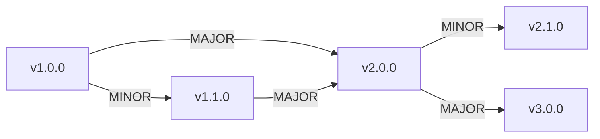

# Schema Evolution

## Evolution Strategy

Schemas evolve independently. A MINOR bump to one schema does not require bumps to others.

## Adding a New Field

```json
// Before
"properties": { "title": { "type": "string" } }

// After (MINOR bump)
"properties": {
  "title": { "type": "string" },
  "subtitle": { "type": "string" }
}
```

## Relaxing a Constraint

```json
// Before (too restrictive)
"maxLength": 128

// After (MINOR bump — widening is backward-compatible)
"maxLength": 256
```

## Tightening a Constraint

```json
// Before
"pattern": "^[a-z]+_[0-9]{6}$"

// After (MAJOR bump — existing documents may fail)
"pattern": "^[a-z]+_[0-9]{6,}$"
```

## Adding a New Schema

1. Create `BaseNew.schema.json`
2. Add optional `$ref` to BaseEntity.schema.json
3. MINOR bump to BaseEntity (new optional property)

## Schema Migration Path



## Migration Rules

1. MINOR bumps are transparent to consumers (additive changes only)
2. MAJOR bumps require explicit migration
3. Two MAJOR versions back are supported (v4 → v3 → v2; v1 requires migration)
4. Migration scripts live in `schemas/migrations/`
