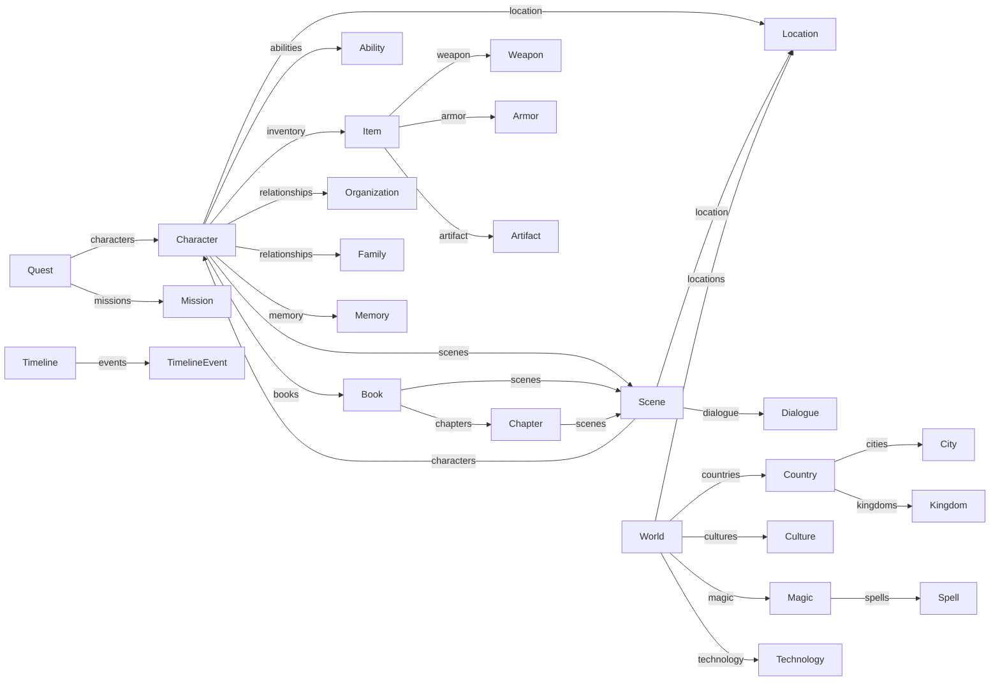
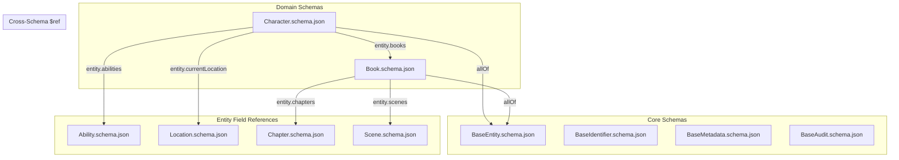
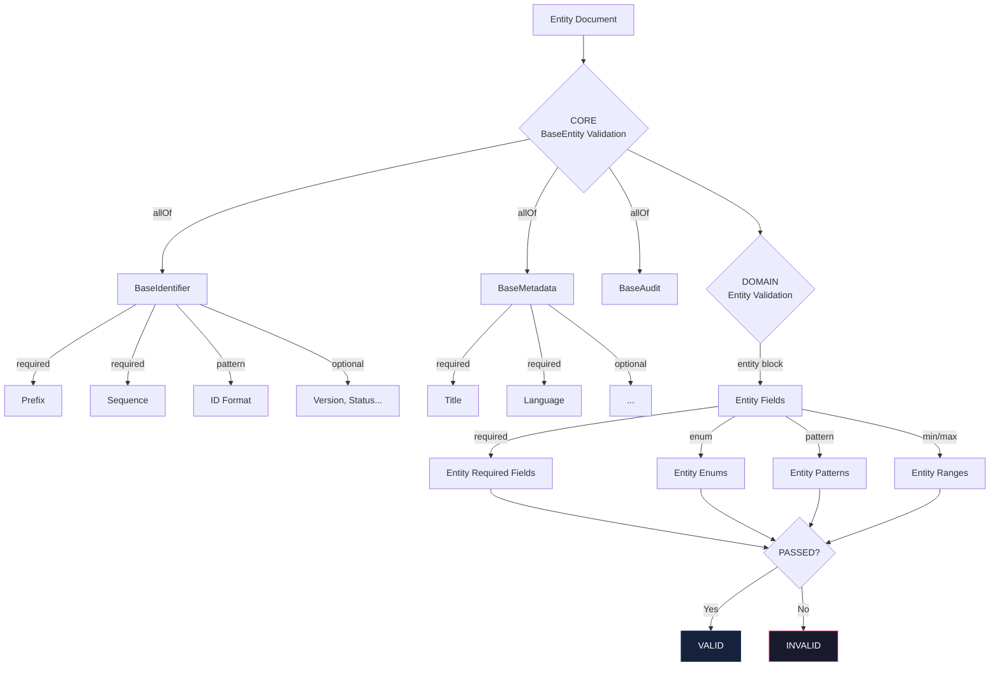

# Domain Schema Diagrams

## 1. Domain Schema Hierarchy

```mermaid
graph TB
    subgraph "Core Layer"
        BE[BaseEntity.schema.json<br/>schemas/core/]
    end

    subgraph "Domain Layer"
        Char[Character.schema.json]
        Book[Book.schema.json]
        Chap[Chapter.schema.json]
        Scene[Scene.schema.json]
        Dial[Dialogue.schema.json]
        World[World.schema.json]
        TL[Timeline.schema.json]
        TLE[TimelineEvent.schema.json]
        Loc[Location.schema.json]
        Country[Country.schema.json]
        Kingdom[Kingdom.schema.json]
        City[City.schema.json]
        Org[Organization.schema.json]
        Fam[Family.schema.json]
        Magic[Magic.schema.json]
        Spell[Spell.schema.json]
        Abil[Ability.schema.json]
        Item[Item.schema.json]
        Wpn[Weapon.schema.json]
        Armor[Armor.schema.json]
        Art[Artifact.schema.json]
        Quest[Quest.schema.json]
        Miss[Mission.schema.json]
        Lang[Language.schema.json]
        Rel[Religion.schema.json]
        Cult[Culture.schema.json]
        Spec[Species.schema.json]
        Race[Race.schema.json]
        Veh[Vehicle.schema.json]
        Tech[Technology.schema.json]
        Doc[Document.schema.json]
        Map[Map.schema.json]
        Rule[Rule.schema.json]
        Can[Canon.schema.json]
        Mem[Memory.schema.json]
    end

    BE -. allOf $ref .-> Char
    BE -. allOf $ref .-> Book
    BE -. allOf $ref .-> Chap
    BE -. allOf $ref .-> Scene
    BE -. allOf $ref .-> Dial
    BE -. allOf $ref .-> World
    BE -. allOf $ref .-> TL
    BE -. allOf $ref .-> TLE
    BE -. allOf $ref .-> Loc
    BE -. allOf $ref .-> Country
    BE -. allOf $ref .-> Kingdom
    BE -. allOf $ref .-> City
    BE -. allOf $ref .-> Org
    BE -. allOf $ref .-> Fam
    BE -. allOf $ref .-> Magic
    BE -. allOf $ref .-> Spell
    BE -. allOf $ref .-> Abil
    BE -. allOf $ref .-> Item
    BE -. allOf $ref .-> Wpn
    BE -. allOf $ref .-> Armor
    BE -. allOf $ref .-> Art
    BE -. allOf $ref .-> Quest
    BE -. allOf $ref .-> Miss
    BE -. allOf $ref .-> Lang
    BE -. allOf $ref .-> Rel
    BE -. allOf $ref .-> Cult
    BE -. allOf $ref .-> Spec
    BE -. allOf $ref .-> Race
    BE -. allOf $ref .-> Veh
    BE -. allOf $ref .-> Tech
    BE -. allOf $ref .-> Doc
    BE -. allOf $ref .-> Map
    BE -. allOf $ref .-> Rule
    BE -. allOf $ref .-> Can
    BE -. allOf $ref .-> Mem
```

## 2. Cross-Entity Reference Graph

```mermaid
graph LR
    Char[Character] -->|books| Book[Book]
    Char -->|scenes| Scene[Scene]
    Char -->|location| Loc[Location]
    Char -->|abilities| Abil[Ability]
    Char -->|inventory| Item[Item]
    Char -->|relationships| Org[Organization]
    Char -->|relationships| Fam[Family]
    Char -->|memory| Mem[Memory]

    Book -->|chapters| Chap[Chapter]
    Book -->|scenes| Scene
    Chap -->|scenes| Scene

    Scene -->|characters| Char
    Scene -->|dialogue| Dial[Dialogue]
    Scene -->|location| Loc

    World -->|locations| Loc
    World -->|countries| Country[Country]
    World -->|cultures| Cult[Culture]
    World -->|magic| Magic[Magic]
    World -->|technology| Tech[Technology]

    Country -->|cities| City[City]
    Country -->|kingdoms| Kingdom[Kingdom]

    Item -->|weapon| Wpn[Weapon]
    Item -->|armor| Armor[Armor]
    Item -->|artifact| Art[Artifact]

    Quest -->|missions| Miss[Mission]
    Quest -->|characters| Char

    Magic -->|spells| Spell[Spell]

    TL[Timeline] -->|events| TLE[TimelineEvent]
```

## 3. Schema Dependency Graph

```mermaid
graph TD
    subgraph "Core Schemas"
        BE[BaseEntity.schema.json]
        BI[BaseIdentifier.schema.json]
        BM[BaseMetadata.schema.json]
        BA[BaseAudit.schema.json]
    end

    subgraph "Domain Schemas"
        CS[Character.schema.json]
        BS[Book.schema.json]
    end

    subgraph "Cross-Schema $ref"
        CS -->|allOf| BE
        BS -->|allOf| BE
    end

    subgraph "Entity Field References"
        CS -->|entity.abilities| AS[Ability.schema.json]
        CS -->|entity.currentLocation| LS[Location.schema.json]
        CS -->|entity.books| BS
        BS -->|entity.chapters| CHS[Chapter.schema.json]
        BS -->|entity.scenes| SS[Scene.schema.json]
    end
```

## 4. Validation Flow

```mermaid
flowchart TD
    DOC[Entity Document] --> CORE{CORE<br/>BaseEntity Validation}
    CORE -->|allOf| ID[BaseIdentifier]
    CORE -->|allOf| MD[BaseMetadata]
    CORE -->|allOf| AU[BaseAudit]
    ID -->|required| R1[Prefix]
    ID -->|required| R2[Sequence]
    ID -->|pattern| R3[ID Format]
    MD -->|required| R4[Title]
    MD -->|required| R5[Language]

    ID -->|optional| O1[Version, Status...]
    MD -->|optional| O2[...]

    CORE --> DOMAIN{DOMAIN<br/>Entity Validation}
    DOMAIN -->|entity block| EF[Entity Fields]
    EF -->|required| ER[Entity Required Fields]
    EF -->|enum| EENUM[Entity Enums]
    EF -->|pattern| EPAT[Entity Patterns]
    EF -->|min/max| ERNG[Entity Ranges]

    ER --> PASSED{PASSED?}
    EENUM --> PASSED
    EPAT --> PASSED
    ERNG --> PASSED

    PASSED -->|Yes| VALID[VALID]
    PASSED -->|No| INVALID[INVALID]

    style VALID fill:#16213e,stroke:#0f3460,color:#fff
    style INVALID fill:#1a1a2e,stroke:#e94560,color:#fff
```
