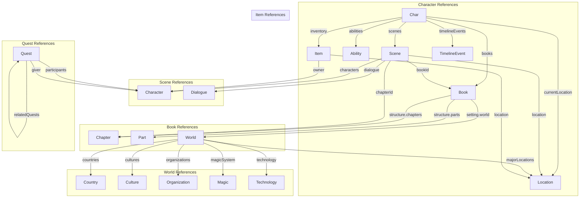

# Domain Reference Model

## Reference Types

Every domain schema uses string-typed references to refer to other entities:

| Reference Type | Format | Target Schema |
|----------------|--------|---------------|
| Single entity reference | `"string"` (entity ID) | Any domain schema |
| Array of references | `"array"` of `"string"` | Multiple domain schemas |
| Structured reference | `"object"` with id/type | Composite reference |

## Entity Reference Map

## Future Enhancement

In a future phase, reference fields will be constrained using JSON Schema:
- Pattern matching for ID format: `"pattern": "^[a-z]+_[0-9]{6,}$"`
- Dynamic $ref to entity type schemas
- Cross-schema reference validation via custom keywords
