# Domain Schema Framework

## Purpose

Machine-readable JSON Schema (Draft 2020-12) definitions for every Storynaram domain entity. Every schema inherits from the Core Schema Framework via `allOf` with `$ref` to BaseEntity. Entity-specific fields live under an `entity` property block.

## Design Principles

- **100% reuse of Core Schemas** — Every schema uses `allOf: [{ "$ref": "../core/BaseEntity.schema.json" }]`
- **No core field duplication** — identifier, metadata, audit, and all other base blocks come from Core Schemas
- **Entity-specific isolation** — All domain fields are scoped under the `entity` property
- **Draft 2020-12** — Uses latest JSON Schema features

## Schema Catalog

| # | Schema | Entity Type | Entity Required Fields |
|---|--------|-------------|----------------------|
| 1 | Character | character | appearance, biography, personality |
| 2 | Book | book | — |
| 3 | Chapter | chapter | bookId, number |
| 4 | Scene | scene | location, timelinePosition |
| 5 | Dialogue | dialogue | speakers, lines |
| 6 | World | world | — |
| 7 | Timeline | timeline | — |
| 8 | TimelineEvent | timeline-event | date, timelineId |
| 9 | Location | location | type |
| 10 | Country | country | worldId |
| 11 | Kingdom | kingdom | worldId |
| 12 | City | city | worldId |
| 13 | Organization | organization | type |
| 14 | Family | family | — |
| 15 | Magic | magic | type |
| 16 | Spell | spell | magicId |
| 17 | Ability | ability | — |
| 18 | Item | item | category |
| 19 | Weapon | weapon | type |
| 20 | Armor | armor | type |
| 21 | Artifact | artifact | type |
| 22 | Quest | quest | type |
| 23 | Mission | mission | questId |
| 24 | Language | language | — |
| 25 | Religion | religion | — |
| 26 | Culture | culture | — |
| 27 | Species | species | — |
| 28 | Race | race | — |
| 29 | Vehicle | vehicle | type |
| 30 | Technology | technology | — |
| 31 | Document | document | type |
| 32 | Map | map | — |
| 33 | Rule | rule | type, scope |
| 34 | Canon | canon | type |
| 35 | Memory | memory | type, ownerId |

## Schema Hierarchy

```mermaid
graph TB
    BE[BaseEntity.schema.json] --> Char[Character.schema.json]
    BE --> Book[Book.schema.json]
    BE --> Scene[Scene.schema.json]
    BE --> World[World.schema.json]
    BE --> Org[Organization.schema.json]
    BE --> Item[Item.schema.json]
    BE --> TL[Timeline.schema.json]
    BE --> Loc[Location.schema.json]
    BE --> Magic[Magic.schema.json]
    BE --> Quest[Quest.schema.json]
    Char --> Spell[Spell.schema.json]
    Char --> Ability[Ability.schema.json]
    World --> Country[Country.schema.json]
    World --> Culture[Culture.schema.json]
    World --> Kingdom[Kingdom.schema.json]
    World --> City[City.schema.json]
    World --> Language[Language.schema.json]
    World --> Religion[Religion.schema.json]
    World --> Species[Species.schema.json]
    Item --> Weapon[Weapon.schema.json]
    Item --> Armor[Armor.schema.json]
    Item --> Artifact[Artifact.schema.json]
    Quest --> Mission[Mission.schema.json]
    TL --> TLE[TimelineEvent.schema.json]
    BE --> Min35[... 35 total]

    style BE fill:#1a1a2e,stroke:#e94560,color:#fff
```

