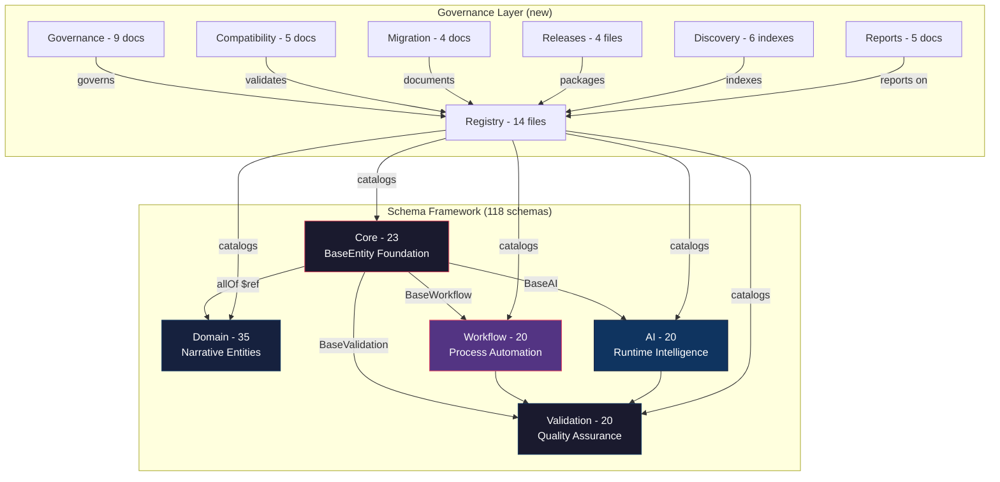
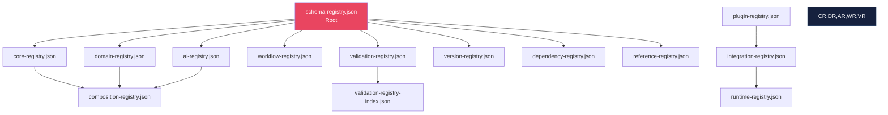
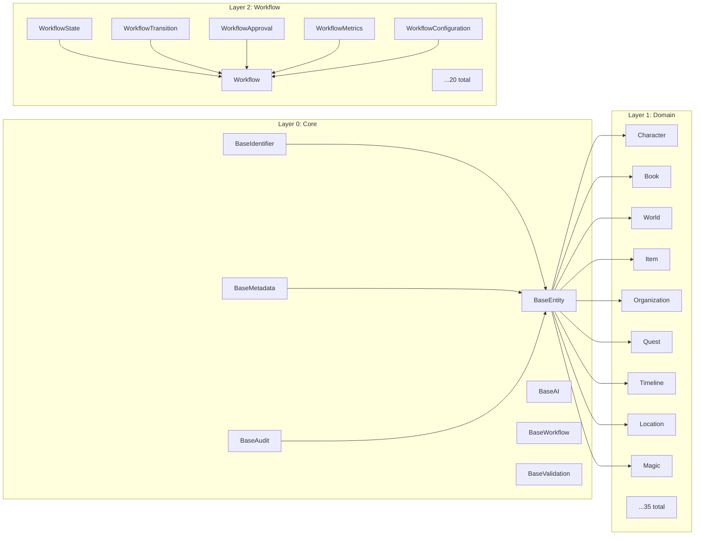
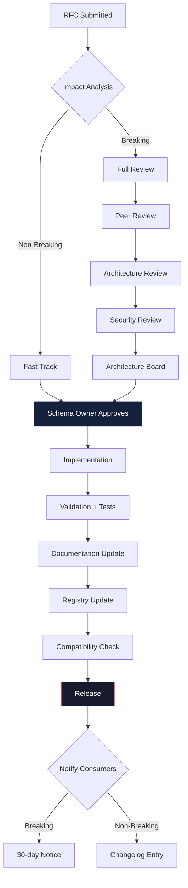
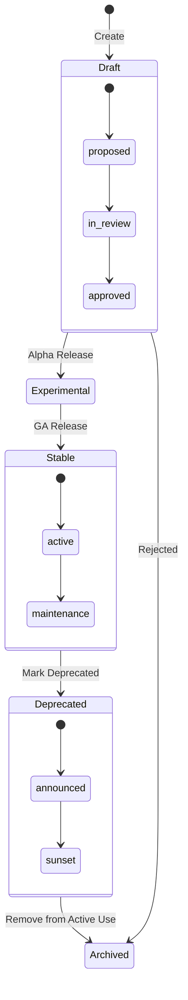
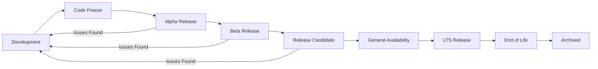
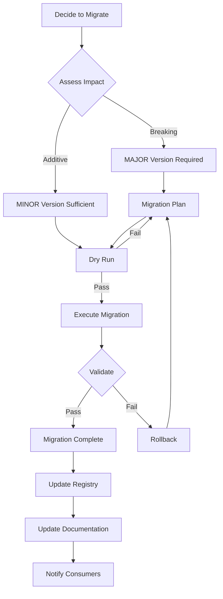
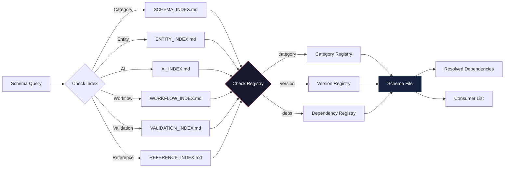

# Schema Registry & Governance Diagrams

## 1. Complete Schema Ecosystem

## 2. Registry Relationships

## 3. Dependency Graph

## 4. Governance Workflow

## 5. Schema Lifecycle

## 6. Release Pipeline

## 7. Migration Flow

## 8. Discovery Flow

