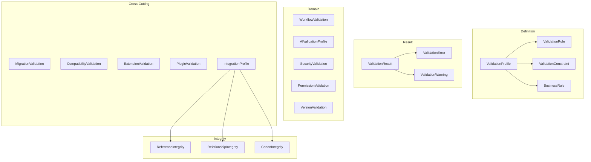

# Validation Schema Framework

## Purpose

Machine-readable JSON Schema (Draft 2020-12) definitions for the Storynaram Validation Engine. These schemas define contracts for rules, constraints, profiles, results, integrity checks, and cross-layer integration validation.

## Design Principles

- **Standalone schemas** — Validation schemas do NOT extend BaseEntity. They represent validation logic and results for all layers.
- **$defs pattern** — Reusable sub-types for error records, constraints, and integrity configurations
- **All optional** — Root properties are optional for progressive construction
- **Severity model** — 5-tier severity (critical, high, medium, low, info) with recovery strategies
- **Draft 2020-12** — Full use of if/then/else, dependentSchemas, patternProperties

## Schema Catalog

| # | Schema | Domain |
|---|--------|--------|
| 1 | ValidationRule | Core rule definition (scope, severity, category, field, condition) |
| 2 | ValidationProfile | Rule group for entity types with mode/priority |
| 3 | ValidationResult | Validation run outcome with pass/fail, score, summary |
| 4 | ValidationError | Detailed error record (severity, value, expected, recovery) |
| 5 | ValidationWarning | Non-blocking alert with suggestion |
| 6 | ValidationConstraint | Structural/behavioral constraint (required, unique, immutable, etc.) |
| 7 | BusinessRule | Domain-specific business logic validation |
| 8 | ReferenceIntegrity | Orphan/dangling/cycle detection in references |
| 9 | RelationshipIntegrity | Cardinality, bidirectionality, symmetry validation |
| 10 | CanonIntegrity | Consistency and contradiction detection in canon |
| 11 | WorkflowValidation | State machine, transition coverage, deadlock detection |
| 12 | AIValidationProfile | Hallucination, canon compliance, factual accuracy checks |
| 13 | SecurityValidation | Classification, encryption, access control, compliance |
| 14 | PermissionValidation | Roles, ownership, groups, inheritance, restrictions |
| 15 | VersionValidation | Semver, compatibility range, migration path, breaking changes |
| 16 | MigrationValidation | Field mappings, transforms, data loss, rollback readiness |
| 17 | CompatibilityValidation | Forward/backward compatibility, breaking analysis |
| 18 | ExtensionValidation | Custom fields, schema extensions, override conflicts |
| 19 | PluginValidation | Dependencies, sandboxing, resource limits, hooks |
| 20 | IntegrationProfile | Cross-layer integration validation |

## Core Schema Reuse

`BaseValidation.schema.json` (core) provides entity-level validation rules via `BaseEntity.validation`. The standalone validation schemas extend this by providing the full validation definition language for the Validation Engine.

## Schema Hierarchy

