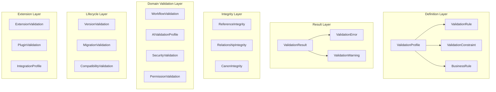
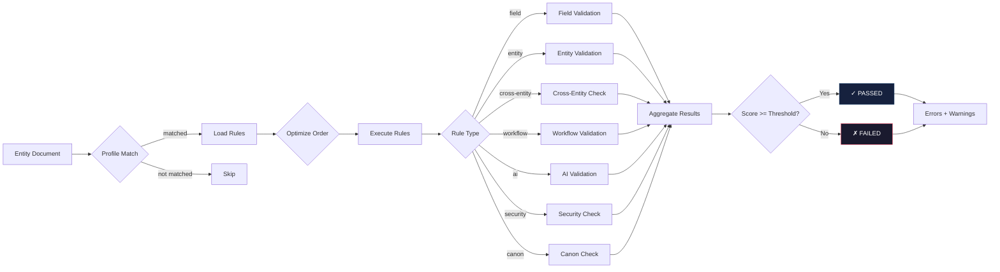
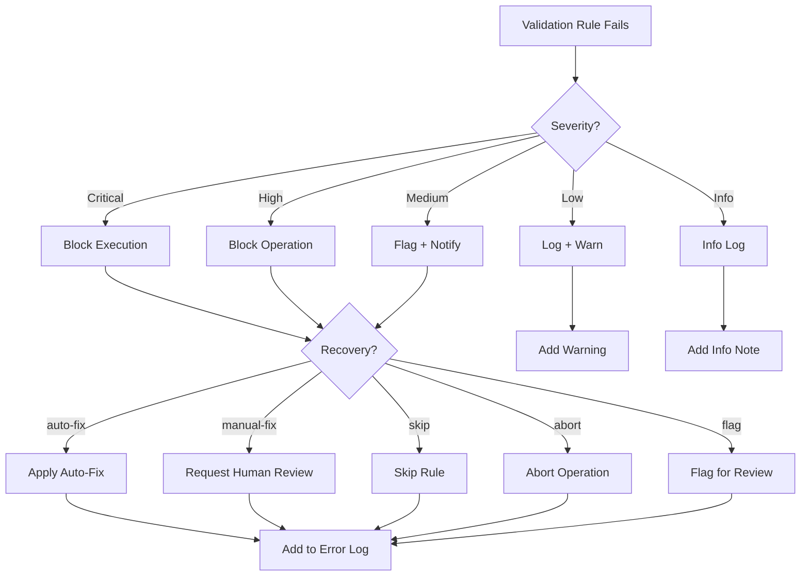
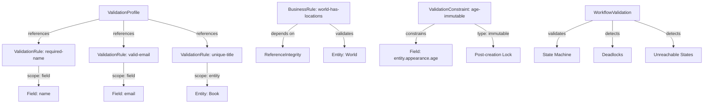
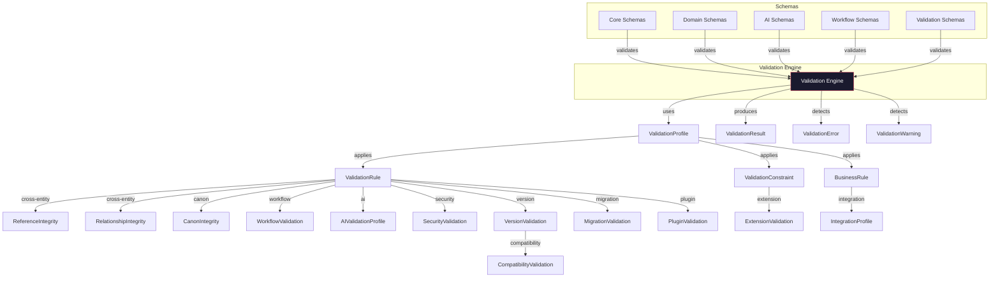

# Validation Schema Diagrams

## 1. Validation Hierarchy

```mermaid
graph TB
    subgraph "Definition Layer"
        VR[ValidationRule]
        VC[ValidationConstraint]
        BR[BusinessRule]
        VP[ValidationProfile]
    end

    subgraph "Result Layer"
        RES[ValidationResult]
        ERR[ValidationError]
        WARN[ValidationWarning]
    end

    subgraph "Integrity Layer"
        RI[ReferenceIntegrity]
        RELI[RelationshipIntegrity]
        CI[CanonIntegrity]
    end

    subgraph "Domain Validation Layer"
        WV[WorkflowValidation]
        AIV[AIValidationProfile]
        SV[SecurityValidation]
        PEM[PermissionValidation]
    end

    subgraph "Lifecycle Layer"
        VV[VersionValidation]
        MV[MigrationValidation]
        CV[CompatibilityValidation]
    end

    subgraph "Extension Layer"
        EV[ExtensionValidation]
        PLV[PluginValidation]
        IP[IntegrationProfile]
    end

    VP --> VR
    VP --> VC
    VP --> BR
    RES --> ERR
    RES --> WARN
```

## 2. Validation Pipeline

```mermaid
flowchart LR
    START[Entity Document] --> PROF{Profile Match}
    PROF -->|matched| RULES[Load Rules]
    PROF -->|not matched| SKIP[Skip]

    RULES --> OPT{Optimize Order}
    OPT --> EXEC[Execute Rules]

    EXEC --> CHECK{Rule Type}
    CHECK -->|field| FIELD[Field Validation]
    CHECK -->|entity| ENTITY[Entity Validation]
    CHECK -->|cross-entity| CROSS[Cross-Entity Check]
    CHECK -->|workflow| WF[Workflow Validation]
    CHECK -->|ai| AI[AI Validation]
    CHECK -->|security| SEC[Security Check]
    CHECK -->|canon| CAN[Canon Check]

    FIELD --> AGG
    ENTITY --> AGG
    CROSS --> AGG
    WF --> AGG
    AI --> AGG
    SEC --> AGG
    CAN --> AGG

    AGG[Aggregate Results] --> SCORE{Score >= Threshold?}
    SCORE -->|Yes| PASS[✓ PASSED]
    SCORE -->|No| FAIL[✗ FAILED]

    PASS --> ERRORS[Errors + Warnings]
    FAIL --> ERRORS

    style PASS fill:#16213e,stroke:#0f3460,color:#fff
    style FAIL fill:#1a1a2e,stroke:#e94560,color:#fff
```

## 3. Error Flow

```mermaid
flowchart TD
    RULE[Validation Rule Fails] --> SEV{Severity?}

    SEV -->|Critical| CRITICAL[Block Execution]
    SEV -->|High| HIGH[Block Operation]
    SEV -->|Medium| MEDIUM[Flag + Notify]
    SEV -->|Low| LOW[Log + Warn]
    SEV -->|Info| INFO[Info Log]

    CRITICAL --> RECOVERY{Recovery?}
    HIGH --> RECOVERY
    MEDIUM --> RECOVERY

    RECOVERY -->|auto-fix| FIX[Apply Auto-Fix]
    RECOVERY -->|manual-fix| HUMAN[Request Human Review]
    RECOVERY -->|skip| SKIP[Skip Rule]
    RECOVERY -->|abort| ABORT[Abort Operation]
    RECOVERY -->|flag| FLAG[Flag for Review]

    FIX --> RESULT[Add to Error Log]
    HUMAN --> RESULT
    SKIP --> RESULT
    ABORT --> RESULT
    FLAG --> RESULT

    LOW --> LOG[Add Warning]
    INFO --> LOG2[Add Info Note]
```

## 4. Rule Dependency Graph

```mermaid
graph TD
    VP[ValidationProfile] -->|references| VR1[ValidationRule: required-name]
    VP -->|references| VR2[ValidationRule: valid-email]
    VP -->|references| VR3[ValidationRule: unique-title]

    VR1 -->|scope: field| F1[Field: name]
    VR2 -->|scope: field| F2[Field: email]
    VR3 -->|scope: entity| E1[Entity: Book]

    BR[BusinessRule: world-has-locations] -->|depends on| RI[ReferenceIntegrity]
    BR -->|validates| E2[Entity: World]

    VC[ValidationConstraint: age-immutable] -->|constrains| F3[Field: entity.appearance.age]
    VC -->|type: immutable| IMM[Post-creation Lock]

    WV[WorkflowValidation] -->|validates| SM[State Machine]
    WV -->|detects| DEAD[Deadlocks]
    WV -->|detects| UNREACH[Unreachable States]
```

## 5. Cross-Schema Validation Graph

```mermaid
graph TB
    subgraph "Schemas"
        CORE[Core Schemas]
        DOMAIN[Domain Schemas]
        AI[AI Schemas]
        WF[Workflow Schemas]
        VAL[Validation Schemas]
    end

    subgraph "Validation Engine"
        VE[Validation Engine]
    end

    CORE -->|validates| VE
    DOMAIN -->|validates| VE
    AI -->|validates| VE
    WF -->|validates| VE
    VAL -->|validates| VE

    VE -->|uses| VP[ValidationProfile]
    VE -->|produces| RES[ValidationResult]
    VE -->|detects| ERR[ValidationError]
    VE -->|detects| WARN[ValidationWarning]

    VP -->|applies| VR[ValidationRule]
    VP -->|applies| VC[ValidationConstraint]
    VP -->|applies| BR[BusinessRule]

    VR -->|cross-entity| RI[ReferenceIntegrity]
    VR -->|cross-entity| RELI[RelationshipIntegrity]
    VR -->|canon| CI[CanonIntegrity]
    VR -->|workflow| WV[WorkflowValidation]
    VR -->|ai| AIV[AIValidationProfile]
    VR -->|security| SV[SecurityValidation]
    VR -->|version| VV[VersionValidation]
    VR -->|migration| MV[MigrationValidation]
    VR -->|plugin| PLV[PluginValidation]

    VC -->|extension| EV[ExtensionValidation]
    BR -->|integration| IP[IntegrationProfile]
    VV -->|compatibility| CV[CompatibilityValidation]

    style VE fill:#1a1a2e,stroke:#e94560,color:#fff
```
