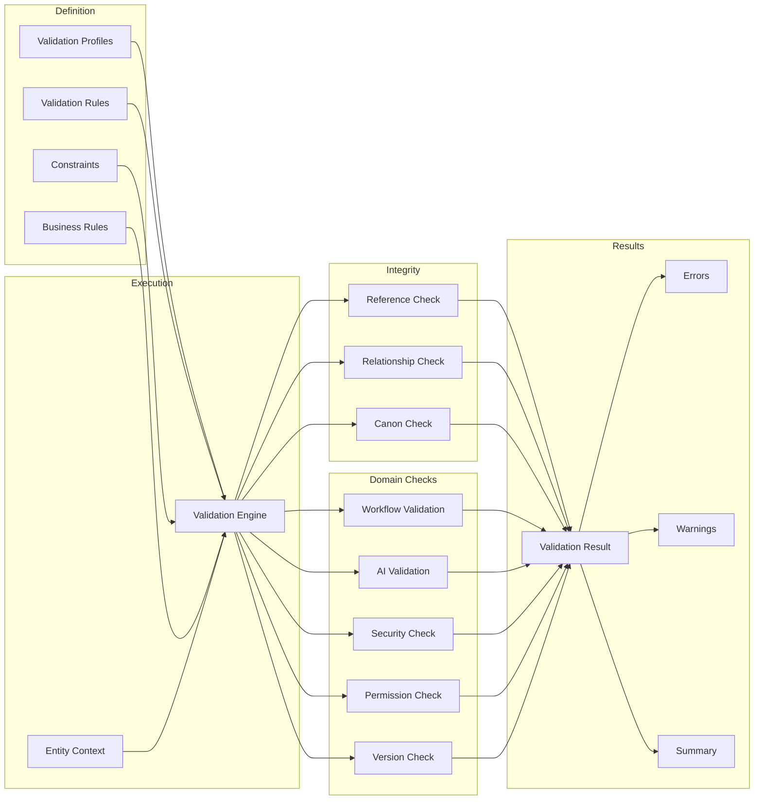

# Validation Reference Model

## Validation Pipeline

## Cross-Schema Validation Coverage

| Schema | Core | Domain | AI | Workflow | Validation |
|--------|:----:|:------:|:--:|:--------:|:----------:|
| ValidationRule | ✓ | ✓ | ✓ | ✓ | - |
| ValidationProfile | ✓ | ✓ | ✓ | ✓ | - |
| ValidationResult | ✓ | ✓ | ✓ | ✓ | ✓ |
| ReferenceIntegrity | - | ✓ | ✓ | - | ✓ |
| RelationshipIntegrity | - | ✓ | - | - | ✓ |
| CanonIntegrity | - | ✓ | ✓ | - | ✓ |
| WorkflowValidation | - | - | - | ✓ | ✓ |
| AIValidationProfile | - | - | ✓ | - | ✓ |
| SecurityValidation | ✓ | - | - | - | ✓ |
| PermissionValidation | ✓ | ✓ | - | - | ✓ |
| VersionValidation | ✓ | ✓ | ✓ | ✓ | ✓ |
| ExtensionValidation | ✓ | ✓ | ✓ | ✓ | ✓ |
| PluginValidation | - | - | ✓ | ✓ | ✓ |
| IntegrationProfile | ✓ | ✓ | ✓ | ✓ | ✓ |
