# Workflow Schema Framework

## Purpose

Machine-readable JSON Schema (Draft 2020-12) definitions for the Storynaram Workflow Engine. These schemas define the contracts for state machines, transitions, triggers, actions, approvals, notifications, queues, audit trails, and workflow configuration.

## Design Principles

- **Composite root** — `Workflow.schema.json` references all 19 sub-schemas via `$ref`, forming a complete workflow definition
- **Standalone schemas** — Workflow schemas do NOT extend BaseEntity. They represent process definitions and runtime state.
- **$defs pattern** — Reusable sub-types defined in `$defs` to avoid duplication
- **All optional** — Every root-level property is optional for progressive definition
- **Draft 2020-12** — Uses latest JSON Schema features including if/then/else, dependentSchemas

## Schema Catalog

| # | Schema | Function |
|---|--------|----------|
| 1 | Workflow | Root — orchestrates all sub-schemas |
| 2 | WorkflowState | State definitions (initial, intermediate, final, error, terminal) |
| 3 | WorkflowTransition | Transition rules (from, to, guards, auto-transition) |
| 4 | WorkflowTrigger | Trigger definitions (manual, automatic, event-based, cron) |
| 5 | WorkflowCondition | Condition expression DSL |
| 6 | WorkflowAction | Action definitions (10 types) |
| 7 | WorkflowApproval | Approval chains (single, multi-stage, parallel, hybrid) |
| 8 | WorkflowReview | Review workflows (peer, editorial, technical, AI) |
| 9 | WorkflowAssignment | Task assignment and routing |
| 10 | WorkflowNotification | Multi-channel notifications |
| 11 | WorkflowEvent | Domain event definitions |
| 12 | WorkflowCheckpoint | State snapshots for recovery |
| 13 | WorkflowRollback | Compensating rollback strategies |
| 14 | WorkflowRetry | Exponential backoff retry policies |
| 15 | WorkflowSchedule | Cron-based scheduling |
| 16 | WorkflowTimer | Delay, interval, and timeout timers |
| 17 | WorkflowQueue | Priority, FIFO, and delayed queues |
| 18 | WorkflowAudit | Immutable audit trail |
| 19 | WorkflowMetrics | Performance counters and histograms |
| 20 | WorkflowConfiguration | Global timeout, concurrency, error handling |

## Core Schema Reuse

Workflow schemas reference `BaseWorkflow.schema.json` (core) via `BaseEntity.workflow`, which provides:
- Workflow definitions per entity (stages, triggers)
- Assignment records
- Automation rules

The standalone workflow schemas extend this by providing the full workflow definition language.

## Schema Hierarchy

```mermaid
graph TB
    WF[Workflow.schema.json] --> State[WorkflowState]
    WF --> Trans[WorkflowTransition]
    WF --> Trig[WorkflowTrigger]
    WF --> Cond[WorkflowCondition]
    WF --> Action[WorkflowAction]
    WF --> Approval[WorkflowApproval]
    WF --> Review[WorkflowReview]
    WF --> Assign[WorkflowAssignment]
    WF --> Notif[WorkflowNotification]
    WF --> Event[WorkflowEvent]
    WF --> CP[WorkflowCheckpoint]
    WF --> RB[WorkflowRollback]
    WF --> Retry[WorkflowRetry]
    WF --> Sched[WorkflowSchedule]
    WF --> Timer[WorkflowTimer]
    WF --> Queue[WorkflowQueue]
    WF --> Audit[WorkflowAudit]
    WF --> Metrics[WorkflowMetrics]
    WF --> Config[WorkflowConfiguration]

    style WF fill:#1a1a2e,stroke:#e94560,color:#fff
```

