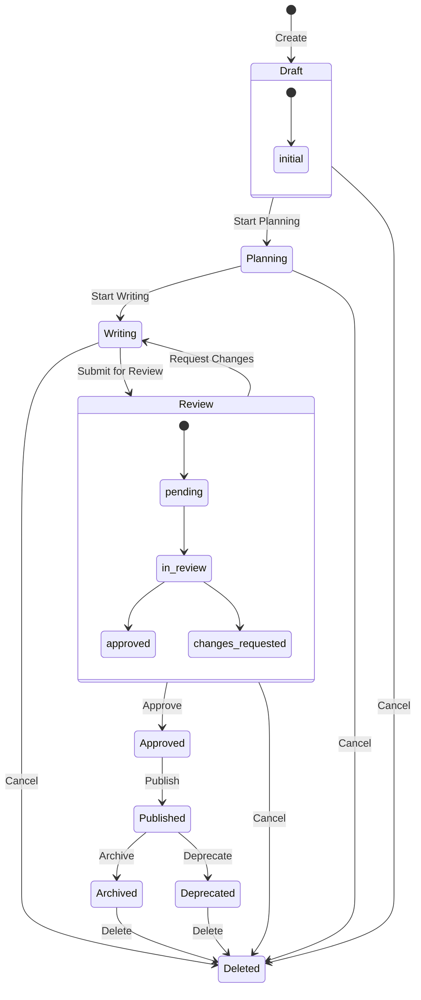
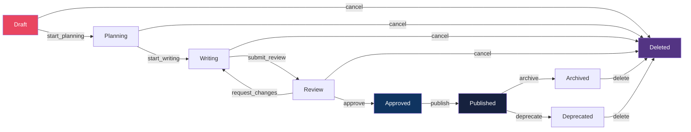
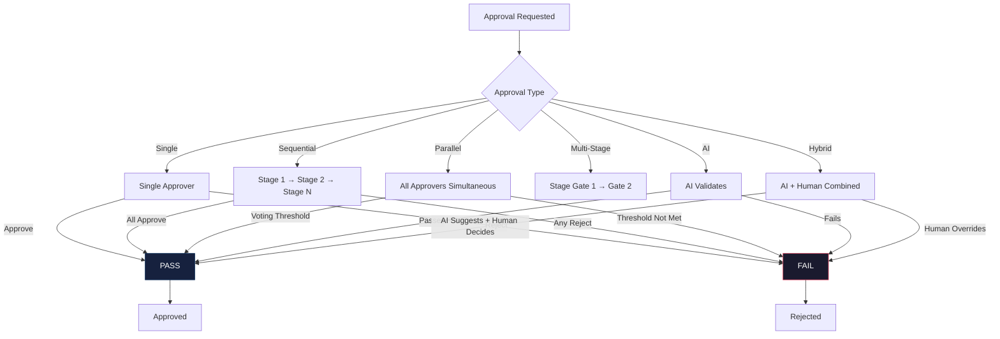
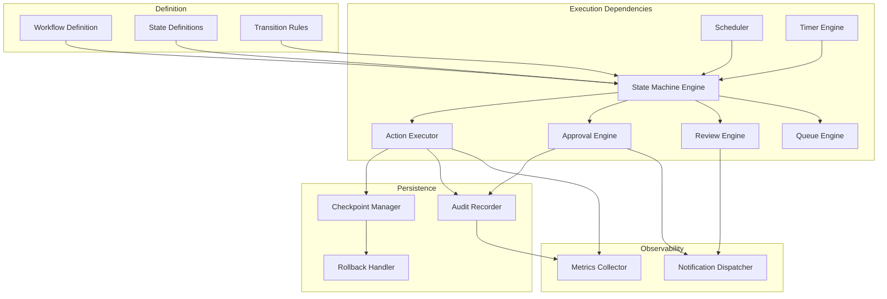
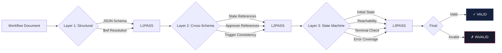

# Workflow Schema Diagrams

## 1. Workflow Schema Hierarchy

```mermaid
graph TB
    WF[Workflow.schema.json] --> State[WorkflowState]
    WF --> Trans[WorkflowTransition]
    WF --> Trig[WorkflowTrigger]
    WF --> Cond[WorkflowCondition]
    WF --> Action[WorkflowAction]
    WF --> Approval[WorkflowApproval]
    WF --> Review[WorkflowReview]
    WF --> Assign[WorkflowAssignment]
    WF --> Notif[WorkflowNotification]
    WF --> Event[WorkflowEvent]
    WF --> CP[WorkflowCheckpoint]
    WF --> RB[WorkflowRollback]
    WF --> Retry[WorkflowRetry]
    WF --> Sched[WorkflowSchedule]
    WF --> Timer[WorkflowTimer]
    WF --> Queue[WorkflowQueue]
    WF --> Audit[WorkflowAudit]
    WF --> Metrics[WorkflowMetrics]
    WF --> Config[WorkflowConfiguration]

    style WF fill:#1a1a2e,stroke:#e94560,color:#fff
    style State,Trans,Trig fill:#16213e,stroke:#0f3460,color:#fff
    style Action,Approval,Review fill:#16213e,stroke:#0f3460,color:#fff
    style Audit,Metrics,Config fill:#16213e,stroke:#0f3460,color:#fff
```

## 2. Workflow State Machine

## 3. Workflow Transition Graph

## 4. Approval Flow

## 5. Workflow Dependency Graph

## 6. Validation Pipeline

