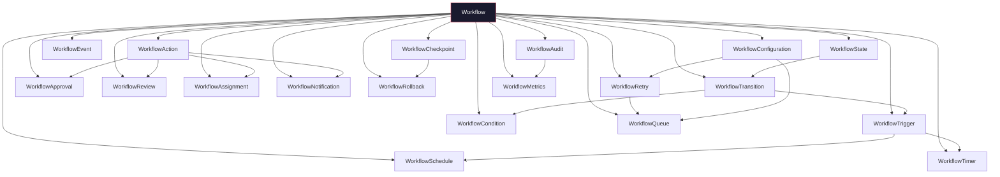
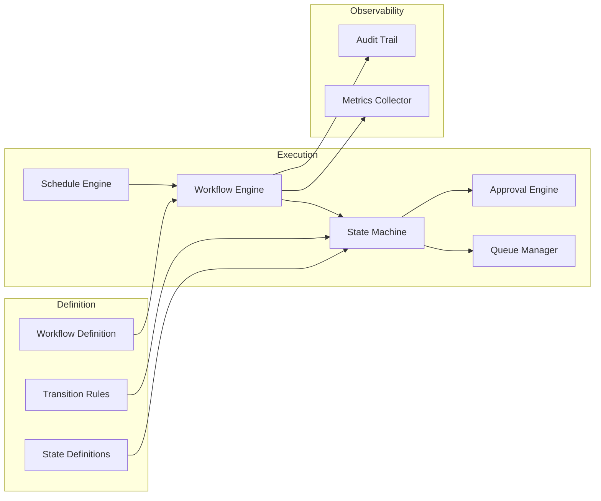

# Workflow Reference Model

## Schema Composition

## Data Flow

## Core-to-Workflow Mapping

| Core Schema | Workflow Schema | Relationship |
|-------------|----------------|-------------|
| BaseEntity.workflow | Workflow | Entity-level workflow assignments |
| BaseLifecycle | WorkflowState, WorkflowTransition | Entity lifecycle as workflow |
| BaseStatus | WorkflowState.status | Status enum alignment |
| BaseWorkflow.workflows[] | Workflow | Core defines per-entity workflow list |
| BaseWorkflow.assignments[] | WorkflowAssignment | Core tracks active assignments |
