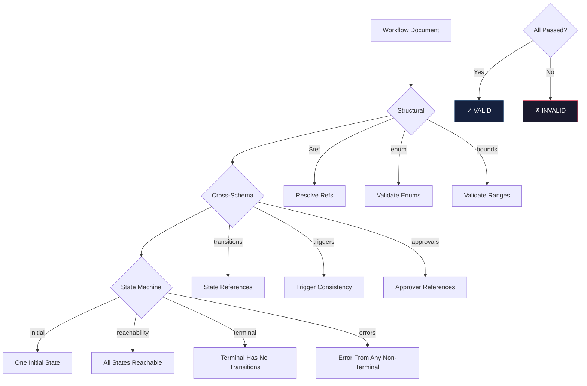

# Workflow Validation Guide

## Validation Layers

### Layer 1: Structural Schema Validation

Enforces Draft 2020-12 compliance:
- All `$ref` targets resolve
- No circular `$ref` chains
- Enum values are valid
- Numeric bounds respected
- Required fields present

### Layer 2: Cross-Schema Validation

Runtime validation:
- Transition `from`/`to` values reference defined states
- Trigger `type` is consistent with trigger-specific fields (cron for time-based)
- Approval stage approvers reference defined approvers
- Checkpoint IDs referenced by rollback exist
- Queue priority levels are unique
- Schedule constraints valid for constraint type

### Layer 3: State Machine Validation

- Exactly one initial state
- No orphan states (unreachable from initial)
- Terminal states have no outgoing transitions
- Error states accessible from all non-terminal states
- No deadlocks in transition graph

## Validation Flow

## Common Failures

| Error | Likely Cause | Fix |
|-------|-------------|-----|
| Transition from 'x' to 'y' but 'x' undefined | State name mismatch | Match state.name exactly |
| No initial state defined | initialState missing | Set initialState to a valid state name |
| Terminal state has outgoing transitions | Terminal defined as intermediate | Set state type to terminal or add no transitions |
| Trigger type 'cron' but no cron field | Wrong trigger type | Add cron or change trigger type |
| Approval requiredCount > approvers | Too high requirement | Reduce requiredCount or add approvers |
