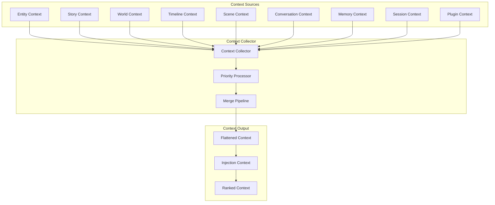
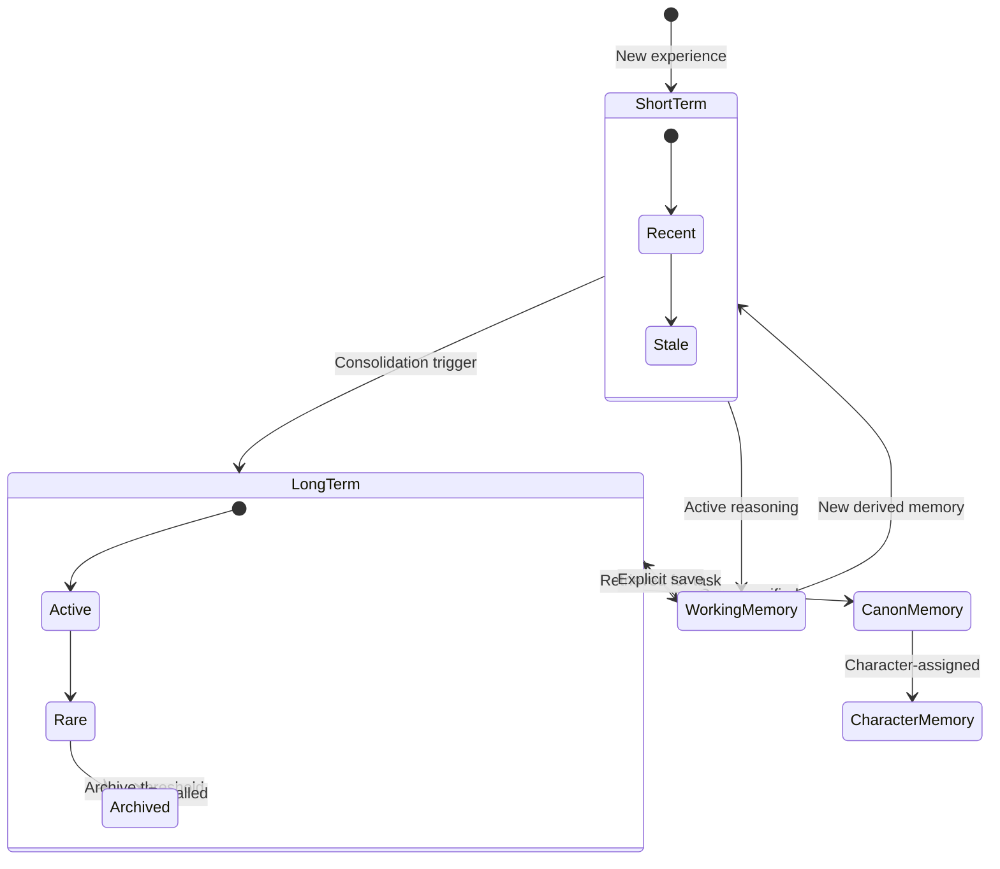
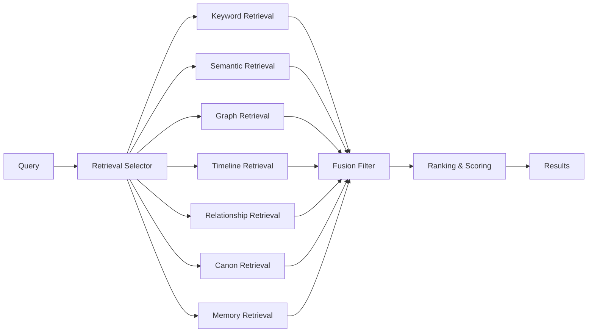
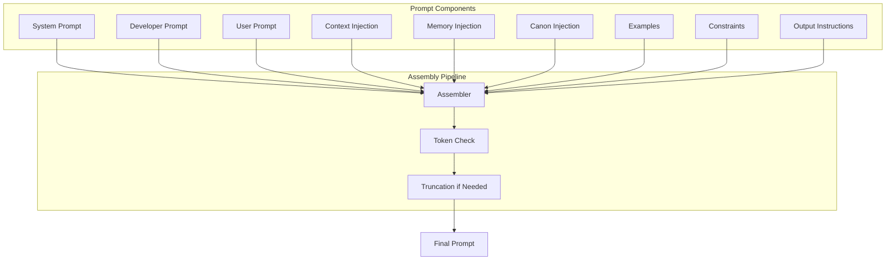
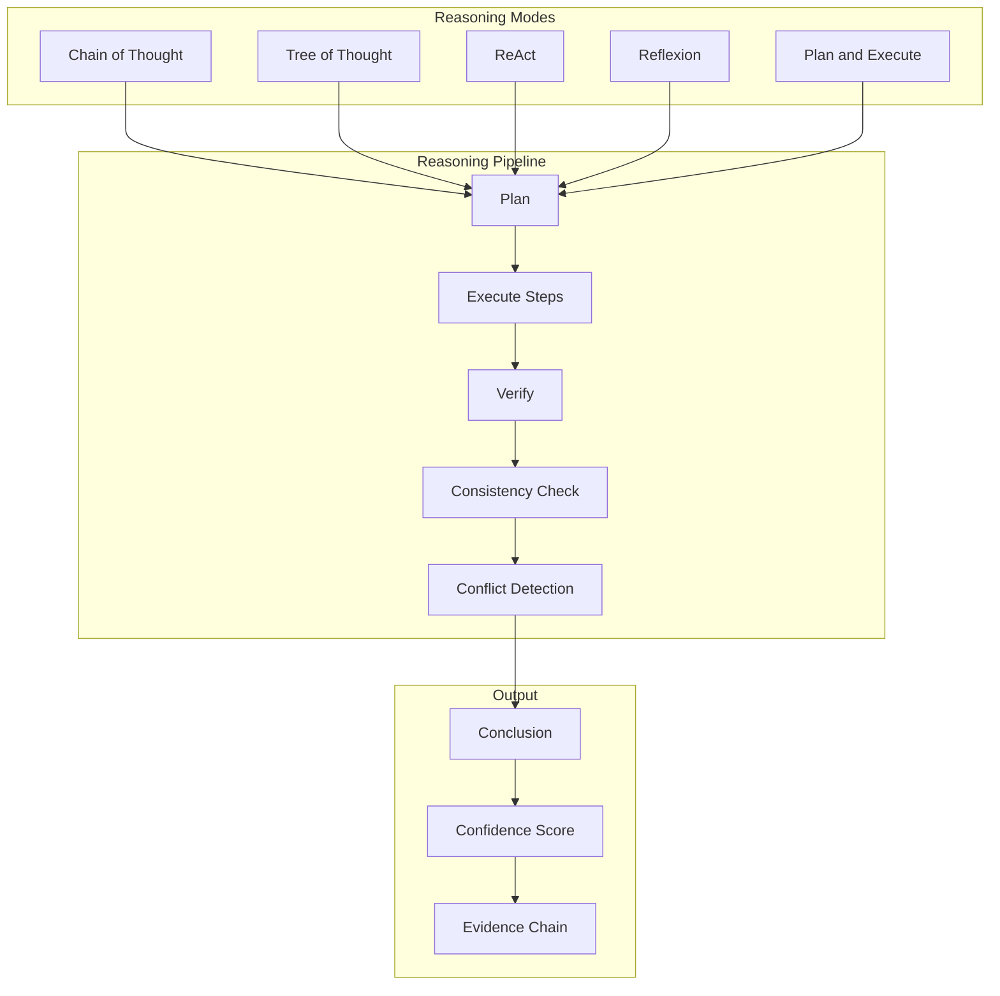

# AI Pipeline Architecture

## 1. Complete Runtime Pipeline

```mermaid
flowchart TD
    subgraph "Phase 1: Selection"
        A1[Identify Entity] --> A2[Load Entity Document]
        A2 --> A3[Determine Request Type]
    end

    subgraph "Phase 2: Context Collection"
        B1[Gather Entity Context]
        B2[Gather Story Context]
        B3[Gather World Context]
        B4[Gather Timeline Context]
        B5[Gather Scene Context]
        B6[Gather Session Context]
    end

    subgraph "Phase 3: Memory Retrieval"
        C1[Short-term Memory]
        C2[Long-term Memory]
        C3[Canon Memory]
        C4[Character Memory]
        C5[World Memory]
        C6[Conversation Memory]
    end

    subgraph "Phase 4: Canon Verification"
        D1[Load Canon Rules]
        D2[Check Factual Consistency]
        D3[Flag Violations]
        D4[Resolve Conflicts]
    end

    subgraph "Phase 5: Relationship Expansion"
        E1[One-Hop Relationships]
        E2[Multi-Hop Traversal]
        E3[Graph Expansion]
        E4[Weighted Scoring]
    end

    subgraph "Phase 6: Prompt Assembly"
        F1[System Prompt]
        F2[Context Injection]
        F3[Memory Injection]
        F4[Canon Injection]
        F5[Examples]
        F6[Constraints]
        F7[Output Instructions]
    end

    subgraph "Phase 7: Reasoning"
        G1[Plan Generation]
        G2[Step Execution]
        G3[Verification]
        G4[Consistency Check]
    end

    subgraph "Phase 8: Validation"
        H1[Canon Compliance]
        H2[Constraint Check]
        H3[Format Validation]
        H4[Factual Accuracy]
        H5[Hallucination Detection]
    end

    subgraph "Phase 9: Response"
        I1[Format Response]
        I2[Apply Output Constraints]
        I3[Return Result]
    end

    subgraph "Phase 10: Memory Update"
        J1[Store Short-term Memory]
        J2[Consolidate if Needed]
        J3[Update Access Counters]
        J4[Trigger Archival if Full]
    end

    A3 --> B1
    B1 --> B2 --> B3 --> B4 --> B5 --> B6
    B6 --> C1 --> C2 --> C3 --> C4 --> C5 --> C6
    C6 --> D1 --> D2 --> D3 --> D4
    D4 --> E1 --> E2 --> E3 --> E4
    E4 --> F1 --> F2 --> F3 --> F4 --> F5 --> F6 --> F7
    F7 --> G1 --> G2 --> G3 --> G4
    G4 --> H1 --> H2 --> H3 --> H4 --> H5
    H5 --> I1 --> I2 --> I3
    I3 --> J1 --> J2 --> J3 --> J4
```

## 2. Context Flow

```mermaid
graph TB
    subgraph "Context Sources"
        EC[Entity Context]
        SC[Story Context]
        WC[World Context]
        TC[Timeline Context]
        SNC[Scene Context]
        CNC[Conversation Context]
        MC[Memory Context]
        SSC[Session Context]
        PC[Plugin Context]
    end

    subgraph "Context Collector"
        CC[Context Collector]
        PP[Priority Processor]
        MP[Merge Pipeline]
    end

    subgraph "Context Output"
        FC[Flattened Context]
        IC[Injection Context]
        RC[Ranked Context]
    end

    EC --> CC
    SC --> CC
    WC --> CC
    TC --> CC
    SNC --> CC
    CNC --> CC
    MC --> CC
    SSC --> CC
    PC --> CC
    CC --> PP
    PP --> MP
    MP --> FC
    FC --> IC
    IC --> RC
```

## 3. Memory Flow

```mermaid
stateDiagram-v2
    [*] --> ShortTerm : New experience
    ShortTerm --> LongTerm : Consolidation trigger
    LongTerm --> Archived : Archive threshold
    Archived --> LongTerm : Recalled
    LongTerm --> CanonMemory : Canon verified
    CanonMemory --> CharacterMemory : Character-assigned
    ShortTerm --> WorkingMemory : Active reasoning
    LongTerm --> WorkingMemory : Retrieved for task
    WorkingMemory --> ShortTerm : New derived memory
    WorkingMemory --> LongTerm : Explicit save

    state ShortTerm {
        [*] --> Recent
        Recent --> Stale
    }

    state LongTerm {
        [*] --> Active
        Active --> Rare
        Rare --> Archived
    }
```

## 4. Retrieval Flow

```mermaid
graph LR
    Q[Query] --> RS[Retrieval Selector]
    RS --> KR[Keyword Retrieval]
    RS --> SR[Semantic Retrieval]
    RS --> GR[Graph Retrieval]
    RS --> TR[Timeline Retrieval]
    RS --> RR[Relationship Retrieval]
    RS --> CR[Canon Retrieval]
    RS --> MR[Memory Retrieval]

    KR --> FF[Fusion Filter]
    SR --> FF
    GR --> FF
    TR --> FF
    RR --> FF
    CR --> FF
    MR --> FF

    FF --> RG[Ranking & Scoring]
    RG --> RT[Results]
```

## 5. Prompt Assembly

```mermaid
graph TB
    subgraph "Prompt Components"
        SP[System Prompt]
        DP[Developer Prompt]
        UP[User Prompt]
        CI[Context Injection]
        MI[Memory Injection]
        CA[Canon Injection]
        EX[Examples]
        CO[Constraints]
        OI[Output Instructions]
    end

    subgraph "Assembly Pipeline"
        AS[Assembler]
        TK[Token Check]
        TC[Truncation if Needed]
    end

    SP --> AS
    DP --> AS
    UP --> AS
    CI --> AS
    MI --> AS
    CA --> AS
    EX --> AS
    CO --> AS
    OI --> AS
    AS --> TK
    TK --> TC
    TC --> FP[Final Prompt]
```

## 6. Reasoning Flow

```mermaid
graph TB
    subgraph "Reasoning Modes"
        COT[Chain of Thought]
        TOT[Tree of Thought]
        REACT[ReAct]
        REF[Reflexion]
        PAE[Plan and Execute]
    end

    subgraph "Reasoning Pipeline"
        PLAN[Plan]
        EXEC[Execute Steps]
        VERIFY[Verify]
        CHECK[Consistency Check]
        DETECT[Conflict Detection]
    end

    subgraph "Output"
        CONC[Conclusion]
        CONF[Confidence Score]
        EVID[Evidence Chain]
    end

    COT --> PLAN
    TOT --> PLAN
    REACT --> PLAN
    REF --> PLAN
    PAE --> PLAN
    PLAN --> EXEC
    EXEC --> VERIFY
    VERIFY --> CHECK
    CHECK --> DETECT
    DETECT --> CONC
    CONC --> CONF
    CONF --> EVID
```
