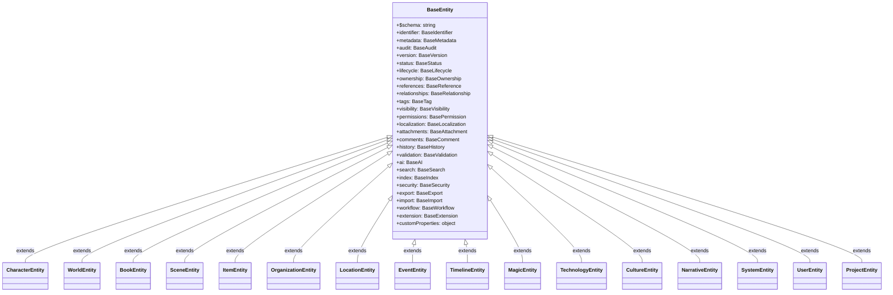
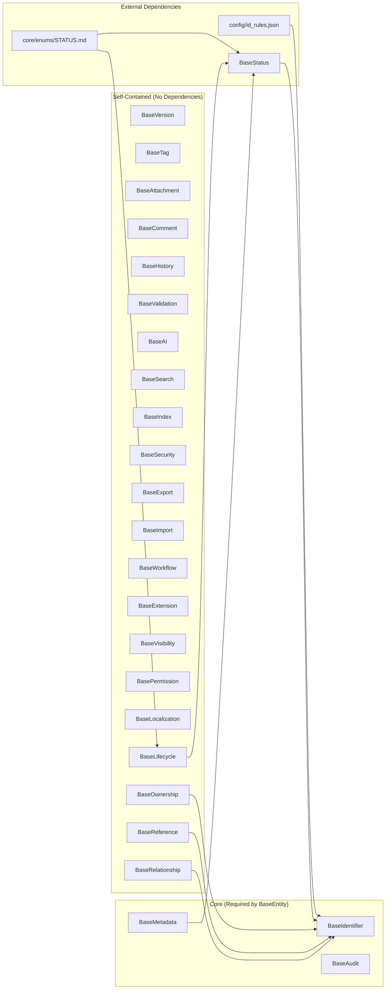
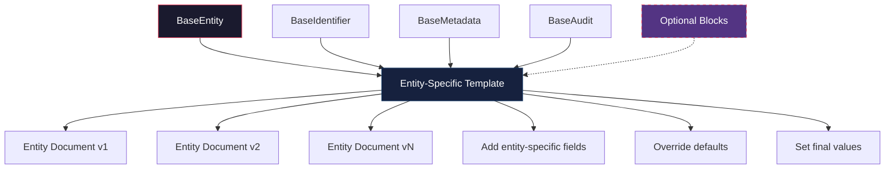

# Base Template Framework — Architecture Diagrams

## 1. Inheritance Hierarchy

```mermaid
classDiagram
    class BaseEntity {
        +$schema: string
        +identifier: BaseIdentifier
        +metadata: BaseMetadata
        +audit: BaseAudit
        +version: BaseVersion
        +status: BaseStatus
        +lifecycle: BaseLifecycle
        +ownership: BaseOwnership
        +references: BaseReference
        +relationships: BaseRelationship
        +tags: BaseTag
        +visibility: BaseVisibility
        +permissions: BasePermission
        +localization: BaseLocalization
        +attachments: BaseAttachment
        +comments: BaseComment
        +history: BaseHistory
        +validation: BaseValidation
        +ai: BaseAI
        +search: BaseSearch
        +index: BaseIndex
        +security: BaseSecurity
        +export: BaseExport
        +import: BaseImport
        +workflow: BaseWorkflow
        +extension: BaseExtension
        +customProperties: object
    }

    BaseEntity <|-- CharacterEntity : extends
    BaseEntity <|-- WorldEntity : extends
    BaseEntity <|-- BookEntity : extends
    BaseEntity <|-- SceneEntity : extends
    BaseEntity <|-- ItemEntity : extends
    BaseEntity <|-- OrganizationEntity : extends
    BaseEntity <|-- LocationEntity : extends
    BaseEntity <|-- EventEntity : extends
    BaseEntity <|-- TimelineEntity : extends
    BaseEntity <|-- MagicEntity : extends
    BaseEntity <|-- TechnologyEntity : extends
    BaseEntity <|-- CultureEntity : extends
    BaseEntity <|-- NarrativeEntity : extends
    BaseEntity <|-- SystemEntity : extends
    BaseEntity <|-- UserEntity : extends
    BaseEntity <|-- ProjectEntity : extends
```

## 2. Composition Model

```mermaid
graph TB
    BE[BaseEntity] --> ID[BaseIdentifier<br/>identity core]
    BE --> MD[BaseMetadata<br/>descriptive core]
    BE --> AU[BaseAudit<br/>provenance core]
    BE --> VE[BaseVersion<br/>versioning]
    BE --> ST[BaseStatus<br/>state machine]
    BE --> LC[BaseLifecycle<br/>lifecycle]
    BE --> OW[BaseOwnership<br/>ownership]
    BE --> RF[BaseReference<br/>cross-references]
    BE --> RL[BaseRelationship<br/>typed relationships]
    BE --> TG[BaseTag<br/>classification]
    BE --> VS[BaseVisibility<br/>publication]
    BE --> PM[BasePermission<br/>access control]
    BE --> LZ[BaseLocalization<br/>translation]
    BE --> AT[BaseAttachment<br/>assets]
    BE --> CM[BaseComment<br/>collaboration]
    BE --> HY[BaseHistory<br/>event log]
    BE --> VL[BaseValidation<br/>validation rules]
    BE --> AI[BaseAI<br/>AI metadata]
    BE --> SR[BaseSearch<br/>search config]
    BE --> IX[BaseIndex<br/>DB indexes]
    BE --> SC[BaseSecurity<br/>security config]
    BE --> EX[BaseExport<br/>export config]
    BE --> IM[BaseImport<br/>import config]
    BE --> WF[BaseWorkflow<br/>workflow engine]
    BE --> XT[BaseExtension<br/>plugin system]
    BE --> CP[customProperties<br/>escape hatch]

    style BE fill:#1a1a2e,stroke:#e94560,stroke-width:3px,color:#fff
    style ID fill:#16213e,stroke:#0f3460,color:#fff
    style MD fill:#16213e,stroke:#0f3460,color:#fff
    style AU fill:#16213e,stroke:#0f3460,color:#fff
    style CP fill:#533483,stroke:#e94560,stroke-dasharray:5,color:#fff
```

## 3. Template Dependency Graph

```mermaid
graph LR
    subgraph "Core (Required by BaseEntity)"
        ID[BaseIdentifier]
        MD[BaseMetadata]
        AU[BaseAudit]
    end

    subgraph "Self-Contained (No Dependencies)"
        VE[BaseVersion]
        TG[BaseTag]
        AT[BaseAttachment]
        CM[BaseComment]
        HY[BaseHistory]
        VL[BaseValidation]
        AI[BaseAI]
        SR[BaseSearch]
        IX[BaseIndex]
        SC[BaseSecurity]
        EX[BaseExport]
        IM[BaseImport]
        WF[BaseWorkflow]
        XT[BaseExtension]
        VS[BaseVisibility]
        PM[BasePermission]
        LZ[BaseLocalization]
        LC[BaseLifecycle]
        OW[BaseOwnership]
        RF[BaseReference]
        RL[BaseRelationship]
    end

    subgraph "External Dependencies"
        ER[config/id_rules.json] --> ID
        ES[core/enums/STATUS.md] --> ST
        ES --> LC
    end

    ST[BaseStatus] --> ID
    LC --> ST
    OW --> ID
    RF --> ID
    RL --> ID
    MD --> ST
```

## 4. Entity Type Template Pattern

```mermaid
flowchart TD
    A[BaseEntity] --> B[Entity-Specific Template]
    B --> C[Entity Document v1]
    B --> D[Entity Document v2]
    B --> E[Entity Document vN]

    F[BaseIdentifier] --> B
    G[BaseMetadata] --> B
    H[BaseAudit] --> B
    I[Optional Blocks] -.-> B

    B --> J[Add entity-specific fields]
    B --> K[Override defaults]
    B --> L[Set final values]

    style A fill:#1a1a2e,stroke:#e94560,color:#fff
    style B fill:#16213e,stroke:#0f3460,color:#fff
    style I fill:#533483,stroke:#e94560,stroke-dasharray:5,color:#fff
```
