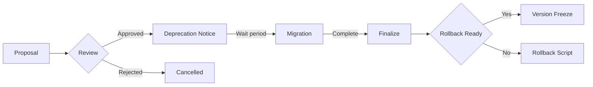

# Change Management

## Change Process



## Deprecation Policy

| Phase | Duration | Action |
|-------|----------|--------|
| `active` | Indefinite | Full support |
| `deprecated` | 2 minor versions | Warning logged, still works |
| `sunset` | 1 minor version | Error unless explicit opt-in |
| `removed` | — | Error: `MissingDependency` |

Deprecation clock starts on the **first release** containing the deprecation notice.

## Migration Path

1. Deprecation notice published in changelog and registry.
2. Automatic migration: system attempts to upgrade affected templates.
3. Manual migration: template author modifies templates to remove deprecated usage.
4. Migration report generated showing all affected templates and their status.

## Breaking Change Notifications

| Channel | Audience | Timing |
|---------|----------|--------|
| Registry announcement | All consumers | 1 major version before |
| Changelog entry | Developers | On release |
| Pipeline warning | Runtime users | On composition |
| Email notification | Registered template owners | On deprecation start |

## Rollback Procedures

| Scenario | Action |
|----------|--------|
| Composition fails after update | Revert to previous template version |
| Migration introduces bugs | Restore pre-migration cache |
| Breaking change missed | Roll back registry version |

All rollbacks require a `rollback_reason` log entry.

## Version Freeze Process

1. Declare a version freeze for a specific namespace.
2. No changes allowed in that namespace without freeze exception.
3. Freeze exceptions require approval from 2 reviewers.
4. Freeze is lifted after the target release is stable.

## Changelog Format

All template changes must be documented:

```yaml
- version: "2.0.0"
  date: 2026-07-17
  summary: "Added required field 'level' to player template"
  type: breaking
  migration: "Set level: 1 for all existing entities"
  deprecation: null
```
