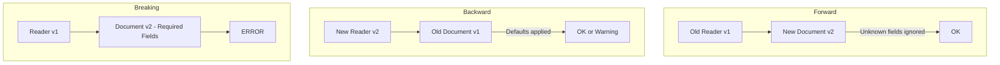

# Compatibility Rules

## Forward Compatibility

**Old reader, new document**: A reader built for template v1.x can read entity documents produced with v2.x templates.

| Scenario | Behavior |
|----------|----------|
| Unknown field present | Ignored (skipped) |
| Unknown required field | Treated as optional |
| New extension data present | Ignored |
| New plugin data present | Ignored |

## Backward Compatibility

**New reader, old document**: A reader built for template v2.x can read entity documents produced with v1.x templates.

| Scenario | Behavior |
|----------|----------|
| Missing new field | Filled with default |
| Missing new required field | Error unless default exists |
| Old field removed | Warning logged |

## Breaking vs Non-Breaking Changes

| Change | Type | Impact |
|--------|------|--------|
| Adding optional field | Non-breaking | Safe |
| Adding required field | **Breaking** | Breaks old entities |
| Removing a field | **Breaking** | Forward-incompatible |
| Renaming a field | **Breaking** | Both directions |
| Changing field type | **Breaking** | Validation fails |
| Relaxing constraints | Non-breaking | Safe |
| Tightening constraints | **Breaking** | Old entities may fail |

## Compatibility Matrix

## Version Range Compatibility Table

| Reader | Document | Version Delta | Compatible? |
|--------|----------|---------------|-------------|
| 1.x | 1.x | Same major | Yes |
| 1.x | 2.x | Major +1 | Forward: maybe |
| 2.x | 1.x | Major -1 | Backward: maybe |
| 1.2.x | 1.3.x | Minor +1 | Yes |
| 1.3.x | 1.2.x | Minor -1 | Yes |
